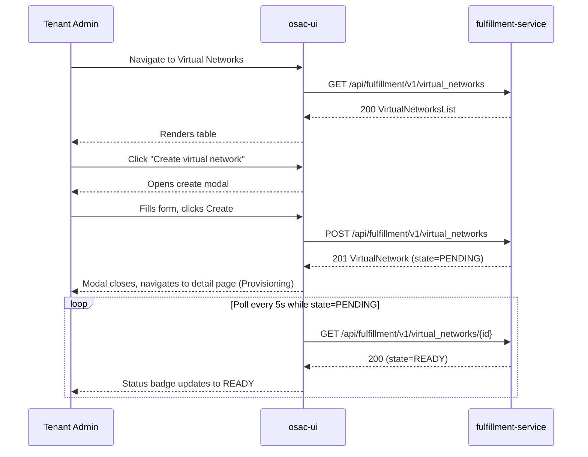

# OSAC Tenant UI: Networking Section

## Summary

This enhancement adds a **Networking** section to the OSAC Tenant UI (`osac-ui`) that allows Tenant Admins and Tenant Users to view and manage their tenant's networking resources — VirtualNetworks, Subnets, SecurityGroups, and PublicIPs — using the existing public fulfillment-service API. It also integrates network configuration inline into the VMaaS VM creation wizard. No new API resources, proto messages, or database tables are introduced; the implementation is a UI-only addition that consumes the existing public gRPC-transcoded REST API. See [PRD](prd.md) for detailed requirements.

## Motivation

OSAC tenants currently provision compute instances (VMs, bare-metal, clusters) but have no dedicated UI surface to inspect or manage the underlying network topology. Networking objects — VirtualNetworks, Subnets, SecurityGroups, and PublicIPs — must be managed via the `osac` CLI or raw API calls. This gap creates operational friction: Tenant Admins cannot easily visualise CIDR assignments, firewall rules, or public-IP allocation without shell access. Additionally, when creating VMs through the VMaaS wizard, users have no integrated way to create or select networking resources inline, increasing time-to-first-VM for new tenants.

The fulfillment-service public API already exposes full CRUD for all required networking resource types (`VirtualNetworks`, `Subnets`, `SecurityGroups`, `PublicIPs`) and read-only access to `PublicIPPools`. The UI needs only to consume these endpoints through the Keycloak-authenticated session already used by every other Tenant UI section.

This design follows the established OSAC UI patterns: React 19 + PatternFly 6, protobuf-generated TypeScript types from `libs/types/src/osac/public/v1/`, TanStack Query hooks in `libs/ui-components/src/api/v1/`, Connect-ES for gRPC-Web client integration, per-resource list/detail pages with tabs and modal forms, and Keycloak bearer-token auth.

### Goals

- Deliver a **Networking** top-level navigation section in the Tenant UI covering: VirtualNetworks, SecurityGroups, PublicIPs. Subnets are managed from the VirtualNetwork detail page, not as a top-level sidebar entry.
- Provide **list and detail views** for VirtualNetworks, SecurityGroups, and PublicIPs, and **create / delete** forms where the public API permits (plus update for SecurityGroups).
- Expose PublicIPPools as a **read-only reference** so Tenant Users can select a pool when allocating a PublicIP.
- Add a **Network Configuration step** to the VMaaS VM creation wizard, including inline VirtualNetwork creation.
- Reuse the existing PatternFly 6 component library, TanStack Query hooks, Connect-ES client, and the established authenticated-fetch pattern.
- Keep the UI fully **declarative** — all mutations go through existing REST endpoints with no imperative or out-of-band calls.
- Enforce that immutable fields (CIDRs, `virtual_network`, `pool`) are rendered read-only after object creation.

### Non-Goals

- No new fulfillment-service API endpoints, proto messages, database tables, or controllers. [PRD: Out of Scope]
- No NATGateway management UI (future scope). [PRD §2.2]
- No NetworkClass management UI — NetworkClass is platform-assigned and not exposed to tenant users. [PRD §2.2, FR-3, §5]
- No private-API fields (`region`, `implementation_strategy`, `hub`) exposed in the UI. [PRD: Out of Scope]
- No topology/graph visualisation of the network (deferred). [PRD §2.2]
- No auto-scaling, quota enforcement UI, or bulk operations. [PRD: Out of Scope]
- No changes to Keycloak roles or OPA policies — existing tenant isolation applies. [PRD: Out of Scope]
- No Prometheus metrics, alerting, or Grafana dashboards for UI behaviour. [PRD: Out of Scope]
- No PublicIPPool CRUD operations — pools are provider-managed and read-only for tenants. [PRD §2.2]
- No BaremetalInstance or Cluster networking (out of scope for VMaaS phase). [PRD §2.2]
- No multi-NIC support (future phase). [PRD §2.2]
- No pagination on list pages — tracked as a separate Jira to implement holistically across all list pages. [PRD NFR-9]

## Proposal

The Networking section is a new top-level navigation entry in the OSAC Tenant UI sidebar. It contains three resource sub-pages (Subnets are managed from the VirtualNetwork detail page, not as a sidebar item):

| Sub-page | API resource | CRUD in UI |
|---|---|---|
| Virtual Networks | `VirtualNetworks` | List, Get, Create, Update (display_name/description/labels), Delete |
| Security Groups | `SecurityGroups` | List, Get, Create, Update (ingress/egress rules), Delete |
| Public IPs | `PublicIPs` | List, Get, Allocate (Create), Attach, Detach, Release (Delete) |

Subnets are managed exclusively from the **Subnets tab** on the VirtualNetwork detail page (Create, Delete). PublicIPPools appear only as a reference selector when allocating a PublicIP.

All pages follow the established Tenant UI pattern:
1. A **list page** with a PatternFly `Table` or `DataList`, a toolbar with filter/search, and empty states with illustrations.
2. A **detail page** (full page with breadcrumb navigation and tabs) or a **side drawer** for secondary resources.
3. A **create modal** for new objects, with inline validation (Create button always enabled; errors shown after blur or on submit attempt).
4. **Delete confirmation dialogs** with dependency warnings where relevant.
5. **ResourceStatusLabel** component with resource-specific wrappers for status badges.
6. **TanStack Query** hooks for all data fetching, with `refetchOnWindowFocus: true` and optimistic updates for deletes.
7. **5-second auto-refresh** for resources in transitional states.

### Implementation Details/Notes/Constraints

#### Proto → TypeScript field mapping

Protobuf-generated types are sourced from `libs/types/src/osac/public/v1/`. The table below maps key proto fields to expected TypeScript field names post-generation for the primary networking resource types:

| Proto field | Expected TypeScript field | UI usage |
|---|---|---|
| `metadata.name` | `metadata.name` | Display in table, form input |
| `metadata.display_name` | `metadata.displayName` | Editable in update form |
| `metadata.description` | `metadata.description` | Editable in update form |
| `metadata.tenant` | `metadata.tenant` | Read-only, not displayed |
| `metadata.labels` | `metadata.labels` | Key-value label editor |
| `metadata.creation_timestamp` | `metadata.creationTimestamp` | Display in detail view |
| `metadata.version` | `metadata.version` | Sent with `lock: true` for optimistic locking |
| `spec.ipv4_cidr` | `spec.ipv4Cidr` | Read-only after creation |
| `spec.ipv6_cidr` | `spec.ipv6Cidr` | Read-only after creation |
| `spec.virtual_network` | `spec.virtualNetwork` | Reference selector on create, read-only after |
| `spec.ingress` | `spec.ingress` | Repeatable rule editor |
| `spec.egress` | `spec.egress` | Repeatable rule editor |
| `spec.pool` | `spec.pool` | Pool selector on PublicIP allocate |
| `status.state` | `status.state` | Status badge (ResourceStatusLabel) |
| `status.message` | `status.message` | Collapsible alert on detail page for FAILED state |
| `status.address` | `status.address` | PublicIP: displayed after ALLOCATED/AVAILABLE |
| `status.attached` | `status.attached` | PublicIP: shown as boolean badge |
| `status.available` | `status.available` | PublicIPPool selector: pool availability hint |

#### TanStack Query hooks

All data fetching uses TanStack Query hooks created in `libs/ui-components/src/api/v1/`. Required hooks include:

| Hook | API call |
|---|---|
| `useVirtualNetworks` | `GET /api/fulfillment/v1/virtual_networks` |
| `useVirtualNetwork` | `GET /api/fulfillment/v1/virtual_networks/{id}` |
| `useCreateVirtualNetwork` | `POST /api/fulfillment/v1/virtual_networks` |
| `useUpdateVirtualNetwork` | `PATCH /api/fulfillment/v1/virtual_networks/{id}` |
| `useDeleteVirtualNetwork` | `DELETE /api/fulfillment/v1/virtual_networks/{id}` |
| `useSubnets` | `GET /api/fulfillment/v1/subnets?filter=spec.virtual_network.id=="{id}"` |
| `useCreateSubnet` | `POST /api/fulfillment/v1/subnets` |
| `useDeleteSubnet` | `DELETE /api/fulfillment/v1/subnets/{id}` |
| `useSecurityGroups` | `GET /api/fulfillment/v1/security_groups` |
| `useSecurityGroup` | `GET /api/fulfillment/v1/security_groups/{id}` |
| `useCreateSecurityGroup` | `POST /api/fulfillment/v1/security_groups` |
| `useUpdateSecurityGroup` | `PATCH /api/fulfillment/v1/security_groups/{id}` |
| `useDeleteSecurityGroup` | `DELETE /api/fulfillment/v1/security_groups/{id}` |
| `usePublicIPs` | `GET /api/fulfillment/v1/public_ips` |
| `usePublicIP` | `GET /api/fulfillment/v1/public_ips/{id}` |
| `useAllocatePublicIP` | `POST /api/fulfillment/v1/public_ips` |
| `useReleasePublicIP` | `DELETE /api/fulfillment/v1/public_ips/{id}` |
| `usePublicIPAttachments` | `GET /api/fulfillment/v1/public_ip_attachments` |
| `useCreatePublicIPAttachment` | `POST /api/fulfillment/v1/public_ip_attachments` |
| `useDeletePublicIPAttachment` | `DELETE /api/fulfillment/v1/public_ip_attachments/{id}` |
| `usePublicIPPools` | `GET /api/fulfillment/v1/public_ip_pools` |

All hooks set `refetchOnWindowFocus: true`. Hooks for list pages set `refetchInterval` to 5000 ms when any resource in the list is in a transitional state (`PENDING`, `DELETING`, `PROVISIONING`); interval is cleared when all resources reach terminal states.

#### File structure

```
libs/ui-components/src/
  pages/networking/
    VirtualNetworksPage.tsx
    VirtualNetworkDetailPage.tsx
    SecurityGroupsPage.tsx
    SecurityGroupDetailPage.tsx
    PublicIPsPage.tsx
  components/networking/
    VirtualNetworkCreateModal.tsx
    VirtualNetworkEditModal.tsx
    SubnetCreateModal.tsx
    SecurityGroupCreateModal.tsx
    SecurityGroupRuleEditor.tsx
    PublicIPAllocateModal.tsx
    PublicIPAttachPanel.tsx
    VirtualNetworkStatusLabel.tsx
    SecurityGroupStatusLabel.tsx
    PublicIPStatusLabel.tsx
    SubnetStatusLabel.tsx
  api/v1/
    virtualNetworks.ts
    subnets.ts
    securityGroups.ts
    publicIPs.ts
    publicIPPools.ts
    publicIPAttachments.ts
```

#### Routing structure

```
/networking                              → redirect to /networking/virtual-networks
/networking/virtual-networks             → VirtualNetworks list page
/networking/virtual-networks/:id         → VirtualNetwork detail page (tabbed: Subnets, Security Groups, Details)
/networking/security-groups              → SecurityGroups list page
/networking/security-groups/:id          → SecurityGroup detail page (tabbed: Inbound Rules, Outbound Rules, Details)
/networking/public-ips                   → PublicIPs list page
```

#### VirtualNetwork detail page structure

The VirtualNetwork detail page at `/networking/virtual-networks/:id` includes:
- **Breadcrumb:** Networking > Virtual Networks > {VN name}
- **Page title:** VN `metadata.name`
- **Header:** Status badge (`VirtualNetworkStatusLabel`), IPv4 CIDR and IPv6 CIDR (if configured) as key properties, **Delete** action button (disabled during transitional states)
- **Tabs:**
  - **Subnets** (default): Table of subnets belonging to this VN (columns: Name, CIDR, Status). "Create Subnet" action button. Row-level Delete action. Clicking a subnet name opens a side drawer showing subnet metadata and attached compute instances.
  - **Security Groups**: Table of SecurityGroups scoped to this VN (columns: Name, Inbound Rules count, Outbound Rules count, Status). "Create Security Group" action button (pre-populates VN in the create modal). Row-level links to SG detail page.
  - **Details**: Full spec fields (CIDRs, creation timestamp, labels, description).

#### SecurityGroup detail page structure

The SecurityGroup detail page at `/networking/security-groups/:id` includes:
- **Breadcrumb:** Networking > Security Groups > {SG name}
- **Page title:** SG `metadata.name`
- **Header:** Status badge (`SecurityGroupStatusLabel`), Virtual Network reference (link to VN detail), **Delete** action button (disabled during transitional states)
- **Tabs:**
  - **Inbound Rules** (default): Table of rules (columns: Protocol, Port Range, Source CIDR, Description). "Add Rule" action. Row-level Edit and Delete actions.
  - **Outbound Rules**: Same structure as Inbound Rules tab.
  - **Details**: Full spec fields (VN reference, creation timestamp, labels, description).

#### Immutability enforcement

Fields marked immutable in the proto (CIDRs, `virtual_network`, `pool`) are rendered as read-only `<TextInput readOnly>` elements (PatternFly) in edit forms. The UI does NOT send these fields in `update_mask` on PATCH requests. [Codebase: fulfillment-service/internal/servers/cidr_validation.go]

#### SecurityGroup rule editor component

The ingress/egress rule editor is a reusable PatternFly `ActionList`-based component:
- Each rule row: Protocol dropdown (TCP/UDP/ICMP/ALL), Port Range text input (single field, disabled for ICMP/ALL), Source/Destination CIDR input, Description input, Delete row button.
- Validation: Port Range is required when Protocol is TCP or UDP; at least one CIDR must be set per rule.
- Maximum rules per direction: confirmed with fulfillment-service team before implementation (see Open Questions).

#### PublicIPPool selector

When allocating a PublicIP, the Pool selector fetches `GET /api/fulfillment/v1/public_ip_pools` and renders each pool as:
```
<pool.metadata.name> (<ip_family>) — Available: <status.available> IPs
```
Pools with `status.available == 0` are shown but disabled in the dropdown with a "(no addresses available)" suffix. If no pools are available, an informational banner is shown: "No IP pools available. Contact your provider to provision IP address pools."

#### Pagination

Pagination is out of scope for this feature per PRD NFR-9. Networking list pages follow the same non-paginated pattern as existing OSAC UI list tables. Pagination will be tracked as a separate Jira to implement holistically for all list pages.

#### Form validation pattern

All create and edit forms follow the PRD-mandated validation pattern (FR-4, FR-10, FR-17, FR-21):
- The Create/Submit button remains **always enabled**.
- Validation errors are shown inline below each field **after blur or on submit attempt**.
- On submit with invalid fields, all validation errors are highlighted and an inline validation alert is shown at the top of the form.
- Server-side errors are surfaced as PatternFly inline alerts with field-level error rendering where gRPC field violations are present.

#### Status badges

Resource state is displayed using the `ResourceStatusLabel` component with resource-specific wrappers:

| Wrapper | States handled |
|---|---|
| `VirtualNetworkStatusLabel` | PENDING→InProgress (blue, spinner), READY→Success (green), FAILED→Danger (red), DELETING→InProgress (blue, spinner) |
| `SecurityGroupStatusLabel` | Same state mapping as VirtualNetworkStatusLabel |
| `PublicIPStatusLabel` | AVAILABLE→Success (green), ATTACHED→Info (blue), PENDING→InProgress (blue, spinner), FAILED→Danger (red) |
| `SubnetStatusLabel` | Same state mapping as VirtualNetworkStatusLabel |

All `ResourceStatusLabel` wrappers handle `aria-label` automatically per NFR-5.

#### Transitional state behavior

While a resource is in a transitional state (`PENDING`, `DELETING`, `PROVISIONING`):
- A spinner is shown next to the status badge.
- The **Delete** action button is disabled.
- The list auto-refreshes every **5 seconds** until all resources reach terminal states (READY, FAILED, AVAILABLE, ATTACHED).
- A **Refresh** button in the toolbar allows manual refresh at any time.

#### Failed resource behavior

For resources in FAILED state (FR-41):
- The detail page shows the `status.message` in a **collapsible alert** (PatternFly `Alert` with `isExpandable`).
- **Retry** and **Delete** action buttons are displayed in the alert.
- Retry re-submits the original POST to the same endpoint. The UI does not persist intermediate state — users must re-enter form data if the retry also fails.

#### Optimistic updates

Delete operations use TanStack Query's optimistic update pattern: the row is immediately grayed out on delete confirmation before the server response arrives. If the server returns an error, the row is restored and an error alert is shown.

#### Empty states

All list pages show a PatternFly `EmptyState` when no resources exist:

| Page | Heading | Description | CTA |
|---|---|---|---|
| Virtual Networks | "No virtual networks yet" | "Create a virtual network to get started with networking." | "Create virtual network" |
| Security Groups | "No security groups yet" | "Create a security group to manage firewall rules for your virtual networks." | "Create security group" |
| Public IPs | "No public IPs allocated" | "Allocate a public IP to expose your resources to external traffic." | "Allocate IP" |
| Subnets tab | "No subnets yet" | "Create a subnet within this virtual network." | "Create subnet" |
| Security Groups tab | "No security groups yet" | "Create a security group scoped to this virtual network." | "Create security group" |

#### Deletion dependency pre-checks

Before rendering the delete confirmation dialog for a VirtualNetwork, the UI fetches subnet and security group counts via:
- `GET /api/fulfillment/v1/subnets?filter=spec.virtual_network.id=="{id}"`
- `GET /api/fulfillment/v1/security_groups?filter=spec.virtual_network.id=="{id}"`

If child resources exist, the dialog lists them and advises the user to delete them first. Server-side Z0003 enforcement is authoritative; client-side pre-checks are advisory UX only. [Codebase: fulfillment-service/internal/servers/ — `translateError` maps Z0003 → FAILED_PRECONDITION]

#### API client usage

All API calls use Connect-ES for gRPC-Web client integration and protobuf-generated types from `libs/types/src/osac/public/v1/`. Every request includes the Keycloak bearer token obtained from the auth context hook. [Assumption] The API base URL and auth context are provided by the same environment configuration used by the existing Compute and Cluster pages.

### Workflow Description

#### Actor definitions

- **Tenant Admin** — a user with the `tenant-admin` Keycloak role. Can create, update, and delete all networking resources within their tenant.
- **Tenant User** — a user with the `tenant-user` Keycloak role. Can list and view networking resources. Cannot create, update, or delete.

[Assumption] Role-gating in the UI mirrors the existing pattern used for ComputeInstance and ClusterOrder pages: the "Create" and "Delete" buttons are hidden (not merely disabled) for Tenant Users based on the decoded Keycloak token role claim.

#### Workflow 1: Tenant Admin views all Virtual Networks

**Starting state:** Tenant Admin is logged into the Tenant UI. At least one VirtualNetwork exists for the tenant.

1. Admin clicks **Networking → Virtual Networks** in the sidebar.
2. The UI invokes `useVirtualNetworks` hook which calls `GET /api/fulfillment/v1/virtual_networks` with the tenant's bearer token.
3. The fulfillment-service applies the tenant filter (Keycloak token's `tenant` claim) and returns all VirtualNetworks.
4. The UI renders a PatternFly Table with columns: **Name** (link to detail page), **IPv4 CIDR**, **Subnets count**, **Status** (`VirtualNetworkStatusLabel`).
5. Admin clicks a VN name to navigate to the VirtualNetwork detail page.

#### Workflow 2: Tenant Admin creates a VirtualNetwork

**Starting state:** Admin is on the Virtual Networks list page.

1. Admin clicks **Create virtual network**.
2. A modal opens with form fields:
   - **Name** (required, DNS-label, max 63 chars, pattern `^[a-z0-9][a-z0-9-]*[a-z0-9]$`)
   - **Display Name** (optional, max 63 chars)
   - **Description** (optional, max 256 chars)
   - **IPv4 CIDR** (required; /16 to /24 range; free-text with CIDR format helper text)
   - **IPv6 CIDR** (optional; CIDR format helper text)
   - **Labels** (optional, key-value editor)
   - NetworkClass is **not exposed** — it is assigned automatically by the platform.
3. The Create button remains **enabled**. Validation errors appear inline below each field after blur or on submit attempt:
   - Name matches DNS-label pattern.
   - IPv4 CIDR is provided (required).
   - IPv4 CIDR is valid CIDR notation within /16 to /24 range.
   - IPv6 CIDR, if provided, is valid CIDR notation.
4. Admin clicks **Create**. On submit with invalid fields, all validation errors are highlighted and an inline validation alert is shown at the top of the modal.
5. On valid submit, the UI calls `useCreateVirtualNetwork` which issues `POST /api/fulfillment/v1/virtual_networks`.
6. On success (201), the modal closes and the UI navigates to the VirtualNetwork detail page showing the new VN with `PENDING` / Provisioning status.
7. On error, the modal displays the gRPC status message inline.

**Error sub-flow — duplicate name:**
Server returns `ALREADY_EXISTS`. Modal displays: "A Virtual Network with this name already exists."

**Error sub-flow — invalid CIDR:**
Server returns `INVALID_ARGUMENT` with field-level details. Modal highlights the offending field.

#### Workflow 3: Tenant Admin updates a VirtualNetwork

**Starting state:** Admin is viewing the VirtualNetwork detail page (Details tab).

1. Admin clicks **Edit**.
2. An edit modal opens. Mutable fields are editable:
   - `metadata.display_name`, `metadata.description`, `metadata.labels`
   - CIDRs are **IMMUTABLE** and rendered as read-only `<TextInput readOnly>` elements.
3. Admin saves. The UI calls `useUpdateVirtualNetwork` which issues `PATCH /api/fulfillment/v1/virtual_networks/{id}` with `update_mask` containing only the changed metadata fields.
4. On success the detail page refreshes.

**Error sub-flow — concurrent modification:**
Server returns `ABORTED`. The UI shows: "This resource was modified by another user. Please reload and try again."

#### Workflow 4: Tenant Admin deletes a VirtualNetwork

1. Admin clicks **Delete** on the VirtualNetwork detail page header or list row.
2. The UI performs pre-flight checks (fetches subnet and security group counts for this VN).
3. If child resources exist, the dialog shows: "This Virtual Network has dependent Subnets and/or Security Groups. Delete all Subnets and Security Groups first before deleting this Virtual Network." Delete button is disabled.
4. If no child resources exist, confirmation dialog: "Deleting this Virtual Network cannot be undone."
5. Admin confirms. The UI calls `useDeleteVirtualNetwork` which issues `DELETE /api/fulfillment/v1/virtual_networks/{id}`. Row is immediately grayed out (optimistic update).
6. If the server returns `FAILED_PRECONDITION` (Z0003), the UI shows: "Cannot delete: dependent resources exist. Delete all Subnets and Security Groups first."

#### Workflow 5: Tenant Admin creates a Subnet (from VirtualNetwork detail page)

1. Admin navigates to a VirtualNetwork detail page and clicks the **Subnets** tab.
2. Admin clicks **Create subnet**.
3. Modal fields (parent VN is pre-selected and displayed as context, showing the parent VN's CIDR):
   - **Name** (required, DNS-label)
   - **CIDR** (required; must be within parent VN CIDR; must not overlap existing subnets; existing subnet CIDRs shown as context below the field)
4. The Create button remains enabled. Validation errors appear after blur or on submit attempt.
5. Admin submits. `POST /api/fulfillment/v1/subnets`.
6. On success, the Subnets tab table refreshes with the new Subnet in `PENDING` state.

**Note:** Subnets have no PATCH endpoint; only Create and Delete are supported. [PRD FR-44]

**Error sub-flow — CIDR not a subset:**
Server returns `INVALID_ARGUMENT`. UI highlights the CIDR field: "CIDR must be within the parent Virtual Network's CIDR range."

#### Workflow 5a: Tenant Admin deletes a Subnet

1. Admin clicks **Delete** on a Subnet row in the Subnets tab.
2. If the subnet has attached compute instances, the server returns `FAILED_PRECONDITION`. UI shows: "Cannot delete this Subnet while it has attached compute instances. Remove or migrate all instances from this subnet first."
3. If no compute instances are attached, confirmation dialog: "Deleting this Subnet cannot be undone."
4. Admin confirms. `DELETE /api/fulfillment/v1/subnets/{id}`. Row is immediately grayed out (optimistic update).

#### Workflow 6: Tenant Admin creates/updates a SecurityGroup

**Create (from list page or VirtualNetwork detail Security Groups tab):**
1. Admin clicks **Create security group**.
2. Form fields:
   - **Virtual Network** (required, dropdown of tenant VNs; pre-selected if triggered from VN detail Security Groups tab)
   - **Name** (required, DNS-label)
   - **Inbound Rules** (expandable section) — repeatable rule editor: Protocol (TCP/UDP/ICMP/ALL), Port Range (text input, disabled for ICMP/ALL), Source CIDR, Description.
   - **Outbound Rules** (expandable section) — same structure.
3. Create button remains enabled. Validation errors shown after blur or on submit attempt.
4. `POST /api/fulfillment/v1/security_groups`.

**Update (from SecurityGroup detail page):**
1. Admin navigates to SecurityGroup detail page, Inbound Rules or Outbound Rules tab.
2. Admin clicks **Add Rule** or row-level **Edit** / **Delete** actions.
3. Rule edits replace the full rule set: `PATCH /api/fulfillment/v1/security_groups/{id}` with `update_mask: ["spec.ingress"]` or `["spec.egress"]`.
4. `spec.virtual_network` is immutable and rendered read-only throughout.

**Delete SecurityGroup:**
1. Admin clicks **Delete** from the SecurityGroup detail page header or list row.
2. If the SecurityGroup is attached to compute instances, the server returns `FAILED_PRECONDITION`. UI shows: "Cannot delete this Security Group while it is attached to compute instances. Remove it from all instances first."
3. If no compute instances are attached, confirmation dialog proceeds.
4. `DELETE /api/fulfillment/v1/security_groups/{id}`. Row is immediately grayed out (optimistic update).

#### Workflow 7: Tenant Admin allocates a PublicIP

1. Admin navigates to **Networking → Public IPs** → **Allocate IP**.
2. Form fields:
   - **Name** (required)
   - **Pool** (required, searchable dropdown populated from `GET /api/fulfillment/v1/public_ip_pools`, showing `metadata.name`, `spec.ip_family`, and `status.available` count; pools with `status.available == 0` are shown but disabled)
3. Create button remains enabled. Validation errors shown after blur or on submit attempt.
4. `POST /api/fulfillment/v1/public_ips`.
5. On success, modal closes and list shows new PublicIP. `status.address` is displayed once the state reaches `AVAILABLE`.

**Error sub-flow — pool exhausted:**
Server returns `FAILED_PRECONDITION`. UI shows: "The selected pool has no available addresses. Choose a different pool or contact your Cloud Infrastructure Admin."

#### Workflow 8: Tenant Admin attaches a PublicIP to a VM

**Starting state:** Admin is on the PublicIPs list page. A PublicIP in `AVAILABLE` (unattached) state exists.

1. Admin clicks **Attach** on an `AVAILABLE` PublicIP row.
2. A side panel opens showing a searchable table of eligible ComputeInstances (VMs) for the tenant.
3. Admin selects a VM and clicks **Attach**.
4. The UI calls `useCreatePublicIPAttachment` which issues `POST /api/fulfillment/v1/public_ip_attachments` with the PublicIP and selected VM references.
5. On success, the side panel closes and the PublicIPs list shows the IP as `ATTACHED` with the VM name in the **Attached To** column.

**Error sub-flow — IP already attached:**
Server returns `ALREADY_EXISTS`. UI shows: "This Public IP is already attached to another resource."

#### Workflow 9: Tenant Admin detaches a PublicIP from a VM

**Starting state:** Admin is on the PublicIPs list page. A PublicIP in `ATTACHED` state exists.

1. Admin clicks **Detach** on an `ATTACHED` PublicIP row.
2. Confirmation modal: "Detaching this Public IP will cause the VM to lose external connectivity on this IP address. This action cannot be undone."
3. Admin confirms. The UI calls `useDeletePublicIPAttachment` which issues `DELETE /api/fulfillment/v1/public_ip_attachments/{id}`.
4. Row is immediately grayed out (optimistic update). On success, the PublicIP transitions back to `AVAILABLE`.

#### Workflow 10: Tenant Admin releases a PublicIP

1. Admin clicks **Release** on an `AVAILABLE` (unattached) PublicIP row.
2. Confirmation dialog: "Releasing this Public IP will return it to the pool. This action cannot be undone."
3. Admin confirms. `DELETE /api/fulfillment/v1/public_ips/{id}`. Row is immediately grayed out (optimistic update).
4. If the PublicIP is currently attached, the server returns `FAILED_PRECONDITION`. UI shows: "Cannot release a Public IP that is currently attached. Detach it first."

#### Workflow 11: State polling / progressive status updates

All resource list and detail pages use TanStack Query with `refetchInterval` set to **5 seconds** while any resource is in a transitional state (`PENDING`, `DELETING`, `PROVISIONING`). The interval is cleared when all resources reach terminal states. Auto-refetch on window focus is enabled (`refetchOnWindowFocus: true`).



#### Workflow 12: VMaaS Wizard — Network Configuration step

**Starting state:** Tenant Admin is creating a VM via the VMaaS wizard at `/vms/create/:catalogItemId`.

The wizard includes a **Network Configuration** step after basic VM settings, with two sections:

**Network Attachment section:**
- **Virtual Network** (required dropdown): Shows all tenant VNs with name and CIDR. Includes a "Create new VN" link.
  - Smart default: If the tenant has exactly one VN, it is auto-selected.
- **Subnet** (required dropdown, filtered to selected VN): Shows CIDR for each subnet.
  - Smart default: If the selected VN has exactly one subnet, it is auto-selected.
- **Security Groups** (optional multi-select with chips, scoped to selected VN): Shows rule count summary per SG.
  - Smart default: If the selected VN has exactly one SG, it is pre-checked.
  - If no SGs are selected, a warning is shown: "No security groups selected. Your VM will have no firewall rules."
- Note: Subnet and SecurityGroup selection controls already exist in `VmNetworkingStep`; only inline VirtualNetwork creation is added by this feature.

**Public IP section:**
- **Allocate Public IP** (checkbox):
  - Smart default: Pre-checked if the tenant has no existing PublicIPs.
- **IP Family** (dropdown: IPv4 / IPv6, shown only when checkbox is checked):
  - Smart default: Defaults to IPv4.
  - When checked, a PublicIP is automatically allocated from an available pool based on the selected IP family and attached during VM creation.

**Wizard validation:**
- VirtualNetwork is required; VM creation is blocked without network attachment.
- Subnet is required.
- Warning shown if no Security Groups selected (not a blocker).

**Empty state (no VNs exist):**
When the wizard reaches the Network Configuration step and the tenant has no VNs, a prominent message is shown: "You need to create a virtual network before provisioning a VM" with a "Create Virtual Network" button.

#### Workflow 13: Tenant Admin creates a VN inline from the VMaaS wizard

**Starting state:** Admin is on the Network Configuration step of the VMaaS wizard.

1. Admin clicks **Create new VN** link in the Virtual Network dropdown.
2. The **Create VN modal overlays the wizard** (wizard state is preserved).
3. Admin fills in the Create VN form (same modal as Workflow 2) and clicks **Create**.
4. On success, the modal closes. TanStack Query cache is invalidated for `useVirtualNetworks`. The new VN is **auto-selected** in the wizard's Virtual Network dropdown.
5. If the new VN has no subnets yet, the Subnet dropdown shows an empty state prompting the user to create a subnet.

### API Extensions

This enhancement introduces **no new API extensions**. It consumes the existing public REST API exposed by the fulfillment-service. All required networking resource types are already fully implemented at the proto, server, controller, and database layers. No CRDs, admission webhooks, aggregated API servers, or finalizers are added or modified.

The complete set of API endpoints consumed by this UI:

| Resource | Endpoints |
|---|---|
| VirtualNetworks | GET /api/fulfillment/v1/virtual_networks, GET /api/fulfillment/v1/virtual_networks/{id}, POST /api/fulfillment/v1/virtual_networks, PATCH /api/fulfillment/v1/virtual_networks/{id}, DELETE /api/fulfillment/v1/virtual_networks/{id} |
| Subnets | GET /api/fulfillment/v1/subnets (with filter), GET /api/fulfillment/v1/subnets/{id}, POST /api/fulfillment/v1/subnets, DELETE /api/fulfillment/v1/subnets/{id} |
| SecurityGroups | GET /api/fulfillment/v1/security_groups, GET /api/fulfillment/v1/security_groups/{id}, POST /api/fulfillment/v1/security_groups, PATCH /api/fulfillment/v1/security_groups/{id}, DELETE /api/fulfillment/v1/security_groups/{id} |
| PublicIPs | GET /api/fulfillment/v1/public_ips, GET /api/fulfillment/v1/public_ips/{id}, POST /api/fulfillment/v1/public_ips, DELETE /api/fulfillment/v1/public_ips/{id} |
| PublicIPAttachments | GET /api/fulfillment/v1/public_ip_attachments, POST /api/fulfillment/v1/public_ip_attachments, DELETE /api/fulfillment/v1/public_ip_attachments/{id} |
| PublicIPPools | GET /api/fulfillment/v1/public_ip_pools (read-only) |

### Security Considerations

#### Authentication

All API calls from the Networking UI pages use the existing Keycloak OIDC bearer token, identical to all other Tenant UI pages. No new authentication flows are introduced.

#### Tenant isolation

The fulfillment-service enforces tenant isolation at the server layer: every List and Get call filters results to the authenticated user's tenant (derived from the Keycloak token's `tenant` claim). The UI inherits this isolation transparently. OPA policies (existing) enforce that a tenant can only create, read, update, and delete resources in their own namespace. [Codebase: fulfillment-service/internal/servers/]

#### Input validation

Client-side validation (DNS-label name, CIDR format, /16 to /24 range) is a UX convenience only. The fulfillment-service performs authoritative server-side validation via protovalidate and server-layer CIDR checks. All error messages from the server are surfaced in the UI as PatternFly inline alerts. [Codebase: fulfillment-service/internal/servers/cidr_validation.go]

#### Sensitive data

PublicIP `status.address` values are displayed in the UI. These are IP addresses, not credentials. No secrets, tokens, or passwords are introduced by this feature. PublicIPPool CIDR ranges (`spec.cidrs`) are private-API-only fields and are NOT exposed through the public API or rendered in the UI. The UI only sees `spec.ip_family` and `status.available` from pools.

#### RBAC gate

[Assumption] Tenant User role (`tenant-user`) is allowed to perform List and Get operations only. Create, Update, Attach, Detach, and Delete buttons are conditionally rendered based on the `tenant-admin` role claim in the decoded Keycloak token.

### Failure Handling and Recovery

#### fulfillment-service unavailable

- **What happens:** All API calls fail with a network error or 503.
- **User observes:** PatternFly inline `Danger` alert: "Unable to load networking resources. The service may be temporarily unavailable. Please try again."
- **Recovery:** User retries manually using the Refresh button in the toolbar. Create/update forms remain open so the user does not lose their input.

#### Resource in transitional state

- **What happens:** User attempts to delete a resource in `PENDING` or `DELETING` state.
- **User observes:** Delete button is disabled while resource is in transitional state. Spinner shown next to status badge.
- **Recovery:** User waits for the resource to reach a terminal state.

#### Delete rejected due to dependent children (Z0003)

- **What happens:** `DELETE /api/fulfillment/v1/virtual_networks/{id}` → server returns `FAILED_PRECONDITION` (Z0003 translated by `translateError`).
- **User observes:** Error alert: "Cannot delete: dependent resources exist. Delete all Subnets and Security Groups first."
- **Recovery:** User navigates to VN detail page, deletes child Subnets and Security Groups from their respective tabs, then retries VirtualNetwork deletion.

#### Delete rejected due to attached instances (Subnet / SecurityGroup)

- **What happens:** DELETE on a Subnet or SecurityGroup that has attached compute instances.
- **User observes:** Error alert: "Cannot delete this [Subnet/Security Group] while it has attached compute instances. Remove or migrate all instances first."
- **Recovery:** User removes or migrates instances, then retries deletion.

#### Delete rejected due to attached PublicIP

- **What happens:** `DELETE /api/fulfillment/v1/public_ips/{id}` while PublicIP is attached.
- **User observes:** Error alert: "Cannot release a Public IP that is currently attached. Detach it first."
- **Recovery:** User detaches the PublicIP first, then retries release.

#### Optimistic locking conflict (ABORTED)

- **What happens:** Two Tenant Admins edit the same SecurityGroup simultaneously. Second save hits `ABORTED`.
- **User observes:** Error alert in the edit modal: "This resource was modified by another user. Reload the page to get the latest version and try again."
- **Recovery:** User closes the modal, the list/detail auto-refreshes (TanStack Query `refetchOnWindowFocus`), user re-opens edit with the current version.

#### Invalid form submission (INVALID_ARGUMENT)

- **What happens:** User submits a form with an invalid CIDR or name that bypasses client-side validation.
- **User observes:** Server returns `INVALID_ARGUMENT` with field-level violation messages. UI renders these as inline field errors below the relevant inputs using PatternFly `FormHelperText` with `isError`.
- **Recovery:** User corrects the indicated fields and resubmits.

#### ALREADY_EXISTS on create

- **What happens:** `POST` returns `ALREADY_EXISTS`.
- **User observes:** Inline alert at the top of the create modal: "A resource with this name already exists in your tenant."
- **Recovery:** User changes the name.

#### Pool exhausted (FAILED_PRECONDITION on PublicIP allocate)

- **What happens:** `POST /api/fulfillment/v1/public_ips` → pool has no available addresses.
- **User observes:** Error alert: "The selected pool has no available addresses. Choose a different pool or contact your Cloud Infrastructure Admin."
- **Recovery:** User selects another pool.

#### Token expiry mid-session

- **What happens:** Keycloak token expires while user is interacting with the Networking section.
- **User observes:** API calls return 401. [Assumption] The existing Keycloak refresh-token mechanism silently refreshes the token. If refresh also fails, the user is redirected to the login page.
- **Recovery:** Re-authentication; URL state allows the user to return to their previous Networking sub-page.

#### Failed resource (FAILED state)

- **What happens:** A resource enters `FAILED` state after provisioning failure.
- **User observes:** ResourceStatusLabel shows Danger (red). Detail page shows `status.message` in a collapsible PatternFly `Alert` with `isExpandable`. **Retry** and **Delete** action buttons are shown in the alert.
- **Recovery:** User clicks Retry (re-submits original POST) or Delete to remove the failed resource. If Retry fails, user must re-enter form data.

### RBAC / Tenancy

No new RBAC roles or Keycloak realms are introduced. The Networking UI section is governed by the same two existing roles:

| Role | Allowed operations |
|---|---|
| `tenant-admin` | List, Get, Create, Update, Attach, Detach, Delete all networking resources |
| `tenant-user` | List and Get all networking resources (read-only) |

All API-level enforcement is performed by the fulfillment-service and OPA policies. The UI reflects these permissions by conditionally rendering action buttons based on the decoded Keycloak token role claim.

Tenant scoping: all networking resources carry `metadata.tenant` set by the fulfillment-service on create (from the authenticated user's token). The UI never sets or overrides the `tenant` field. [Codebase: fulfillment-service/internal/servers/virtual_networks_server.go]

### Observability and Monitoring

No new observability changes. Existing monitoring mechanisms apply. The fulfillment-service already emits structured logs and (where configured) metrics for every API call including the networking endpoints consumed by this UI.

### Risks and Mitigations

| Risk | Likelihood | Impact | Mitigation |
|---|---|---|---|
| UI displays stale state for long-provisioning resources | Medium | Low | 5-second polling for resources in transitional states; spinner next to status badge clearly indicates transitional state |
| SecurityGroup rule editor complexity leads to user error | Medium | Medium | Protocol-aware Port Range field disabling; server-side validation is authoritative |
| PublicIP pool availability changes between form open and submit | Low | Low | Server rejects with `FAILED_PRECONDITION`; UI surfaces error message and allows user to pick another pool |
| Client-side CEL filter expressions for dependency pre-checks may not match server implementations | Low | Low | Pre-checks are advisory only; server-side Z0003 enforcement is authoritative; error messages guide recovery |
| TanStack Query cache invalidation after inline VN creation in wizard may not propagate immediately | Medium | Medium | Explicitly invalidate `useVirtualNetworks` query after successful creation; test round-trip flow thoroughly |
| VMaaS wizard state management complexity with inline VN creation modal overlay | Medium | Medium | Modal preserves wizard state; no navigation away from wizard; test all state transitions |

Security review: The Networking section introduces no new privilege escalation paths, no new secrets handling, and no new inter-service communication. The existing OPA + Keycloak review process covers this feature.

### Drawbacks

- **Three new top-level pages plus VMaaS wizard integration increase UI surface area.** Each component requires its own component, routing, and test coverage. The tradeoff is justified by the operational need for Tenant Admins to manage networking without CLI access and for new tenants to provision VMs without context-switching.
- **5-second polling is not push-based.** Users may see stale state for up to 5 seconds after a resource transitions. A WebSocket or server-sent-events approach would provide live updates but is out of scope.
- **Client-side CIDR validation may diverge from server-side.** Treat client-side validation as advisory; server-side errors are always surfaced.
- **No pagination on list pages.** Per PRD NFR-9, pagination is deferred. Large resource counts may cause performance issues; see Risks 7.3 in the PRD.

## Alternatives (Not Implemented)

### Alternative 1: Inline Networking within Compute Instance forms only

**Description:** Expose networking fields only within the ComputeInstance create/edit forms rather than as a dedicated top-level section.

**Rejection rationale:** This does not address the Tenant Admin's need to manage network topology independently of compute instances. VirtualNetworks, Subnets, and SecurityGroups have lifecycle and operational significance beyond their role as compute-instance parameters. [PRD §2.1]

### Alternative 2: Read-only networking dashboard (no create/update/delete)

**Description:** Implement only list and detail views; defer mutation operations to a future ticket.

**Rejection rationale:** Read-only views significantly reduce the feature's value since Tenant Admins currently rely on the CLI for mutations. The API already supports full CRUD; the cost of omitting mutation UI is a worse user experience.

### Alternative 3: Single combined "Networking" list page with mixed resource types

**Description:** Show all networking resources in a single unified list with a "Type" column.

**Rejection rationale:** Mixed-type lists with heterogeneous schema create a poor UX. Separate sub-pages per resource type follow PatternFly guidance and are consistent with the existing OSAC UI structure.

### Alternative 4: Subnets as a top-level sidebar entry

**Description:** Give Subnets their own sidebar entry and list page in addition to the VN detail tab.

**Rejection rationale:** PRD FR-13 explicitly requires Subnets to be managed exclusively from the VirtualNetwork detail page. A top-level Subnets page would decouple Subnets from their parent VN context and violate the PRD scope.

## Open Questions

1. **Sidebar navigation label:** Should the top-level navigation item be labelled "Networking" or "Networks"? [Assumption] "Networking" is used in this EP; confirm with UX. [PRD FR-29]
2. **Maximum SecurityGroup rules:** Is there a server-enforced limit on the number of ingress/egress rules per SecurityGroup? Confirm with fulfillment-service team before setting a client-side maximum. [PRD FR-18]
3. **PublicIPPool CEL filter for availability:** Confirm that filtering on `status.available` via CEL is supported in the fulfillment-service filter implementation before implementing the pool selector. [PRD FR-25]
4. **VirtualNetwork CIDR default population:** When a user is creating a VN, should any default CIDR be pre-populated (e.g., `10.0.0.0/16`)? Confirm with product. [PRD FR-3]
5. **"Create new VN" inline overlay implementation:** Should the inline VN creation from the wizard be an inline modal overlay (Option A, preserving wizard state), a drawer within the wizard step (Option C), or another pattern? PRD §8.1 notes this is unresolved. Confirm with UX team before implementation. [PRD FR-33, §8.1]
6. **Exact error message strings:** What are the exact error message strings for validation failures? Should these follow a standard template or be defined per-field? Confirm with UX team and Technical Writer. [PRD §8.4]

## Test Plan

### Unit Tests

- **VirtualNetwork create form validation:**
  - Rejects empty name.
  - Rejects name exceeding 63 characters.
  - Rejects name with uppercase letters or spaces (DNS-label pattern).
  - Rejects empty IPv4 CIDR (required field).
  - Rejects IPv4 CIDR outside /16 to /24 range.
  - Accepts valid IPv4 CIDR (`10.0.0.0/16`).
  - Accepts valid optional IPv6 CIDR (`fd00::/48`).
  - Create button remains enabled with invalid fields; errors shown on submit attempt.

- **SecurityGroup rule editor:**
  - Port Range field is disabled when Protocol is ICMP or ALL.
  - Port Range field is enabled and required when Protocol is TCP or UDP.
  - Requires at least one CIDR per rule.
  - Adds and removes rule rows correctly.

- **Subnet create form validation:**
  - Parent VN CIDR shown as context.
  - Existing subnet CIDRs shown to help user select non-overlapping range.
  - Create button remains enabled; errors shown on submit attempt.

- **Immutable field rendering:**
  - VirtualNetwork edit modal renders `ipv4_cidr`, `ipv6_cidr` as read-only inputs.
  - Subnet detail renders `virtual_network`, `cidr` as read-only.
  - PublicIP detail renders `pool` as read-only.

- **Status badge components:**
  - `VirtualNetworkStatusLabel` renders InProgress (blue, spinner) for PENDING and DELETING.
  - `VirtualNetworkStatusLabel` renders Success (green) for READY.
  - `VirtualNetworkStatusLabel` renders Danger (red) for FAILED.
  - `PublicIPStatusLabel` renders Success (green) for AVAILABLE.
  - `PublicIPStatusLabel` renders Info (blue) for ATTACHED.

- **Transitional state behavior:**
  - Delete button is disabled when resource is in PENDING state.
  - Spinner is shown next to status badge for PENDING and DELETING states.

- **Role-based button visibility:**
  - Create, Edit, Attach, Detach, Delete buttons are not rendered when Keycloak role is `tenant-user`.
  - Create, Edit, Attach, Detach, Delete buttons are rendered when Keycloak role is `tenant-admin`.

- **Error message rendering:**
  - `ALREADY_EXISTS` error → correct inline alert for VirtualNetwork creation.
  - `FAILED_PRECONDITION` error → correct inline alert for delete-with-dependents.
  - `ABORTED` error → correct inline alert in edit modal.
  - `INVALID_ARGUMENT` error → field-level error rendering on create/edit forms.

- **PublicIP pool selector:**
  - Pools with `status.available == 0` are rendered as disabled options.
  - Pool display format includes name, IP family, and available count.

- **Empty state rendering:**
  - Each list page and Subnets tab shows correct heading, description, and CTA when no resources exist.

- **Optimistic delete:**
  - Row is grayed out immediately on delete confirmation before server response.
  - Row is restored on server error.

- **Failed resource alert:**
  - Collapsible alert is shown on detail page for FAILED resources.
  - Retry and Delete buttons are present in the alert.

- **VMaaS wizard smart defaults:**
  - Single VN auto-selected when tenant has exactly one VN.
  - Single Subnet auto-selected when selected VN has exactly one Subnet.
  - Single SG pre-checked when selected VN has exactly one SG.
  - "Allocate Public IP" pre-checked and IP Family defaults to IPv4 when tenant has no PublicIPs.
  - Warning shown when no SGs selected.
  - VM creation blocked when no VN selected.
  - "No VNs exist" empty state shown with "Create Virtual Network" button.

### Integration Tests

Test scenarios exercising the `osac-ui` against a live or mocked fulfillment-service API in a kind cluster:

- **VirtualNetwork list page** loads and displays existing VirtualNetworks scoped to the authenticated tenant; VirtualNetworks from another tenant are not shown.
- **VirtualNetwork creation** via the UI results in a new VirtualNetwork appearing on the detail page with `PENDING` state, transitioning to `READY` after controller reconciliation.
- **VirtualNetwork update** via the UI edit modal updates `display_name` and `labels` but not immutable fields.
- **VirtualNetwork delete** with existing Subnets returns `FAILED_PRECONDITION` with correct error message.
- **VirtualNetwork delete** after Subnets removed succeeds.
- **Subnet create** from the Subnets tab with a parent VN reference results in a `PENDING` Subnet.
- **Subnet delete** blocked when compute instance is attached; succeeds after instance removed.
- **SecurityGroup create** from list page and from VN detail page Security Groups tab; VN pre-selected in latter case.
- **SecurityGroup update** replaces ingress rules and persists via PATCH.
- **SecurityGroup delete** blocked when attached to compute instance; succeeds after detached.
- **PublicIP allocation** from the UI selects a pool and creates a PublicIP; `status.address` appears once AVAILABLE.
- **PublicIP attach** from the UI opens side panel with VM list; selection creates PublicIPAttachment; IP shown as ATTACHED.
- **PublicIP detach** confirmation modal shown; on confirm, IP returns to AVAILABLE state.
- **PublicIP release** blocked if currently attached; succeeds if AVAILABLE.
- **5-second polling** — resource created in PENDING state is shown as READY in the list/detail after server reconciliation without page reload.
- **Tenant User read-only** — Create, Edit, Attach, Detach, Delete buttons not rendered for `tenant-user` role.
- **TanStack Query cache invalidation** — after inline VN creation from wizard, new VN appears auto-selected in wizard dropdown.

### E2E Tests

Reference: `osac-test-infra` pytest patterns.

- **Full networking provisioning flow:** Tenant Admin logs in → creates VirtualNetwork → creates Subnet from VN detail page → creates SecurityGroup with inbound rule → allocates PublicIP → attaches PublicIP to a ComputeInstance → verifies PublicIP `status.attached == true` and VM name shown in Attached To column.
- **Tenant isolation:** Two tenants each create a VirtualNetwork with the same name. Tenant A cannot see Tenant B's VirtualNetwork in the Networking UI.
- **Tenant User read-only access:** Tenant User logs in → navigates to Virtual Networks → verifies no Create/Edit/Delete buttons are rendered → verifies list is populated.
- **SecurityGroup rule update:** Tenant Admin adds an inbound rule via the rule editor → saves → verifies rule appears in the Inbound Rules tab.
- **Delete cascade prompt:** Tenant Admin attempts to delete a VirtualNetwork with a Subnet → UI shows dependency warning with Delete button disabled → Admin deletes Subnet from Subnets tab → Admin retries VirtualNetwork delete → succeeds.
- **VMaaS wizard — new tenant flow:** New tenant with no VNs reaches Network Configuration step → sees "You need to create a virtual network" message → clicks "Create Virtual Network" → creates VN inline (modal overlay, wizard state preserved) → new VN auto-selected → creates Subnet from wizard → continues to VM creation.
- **VMaaS wizard — returning tenant smart defaults:** Tenant with one VN, one Subnet, one SG reaches Network Configuration step → all three auto-selected → Public IP section shown with "Allocate Public IP" pre-checked (if no existing PublicIPs) → wizard proceeds.
- **VMaaS wizard — validation blocking:** Tenant attempts to proceed past Network Configuration step without VN → blocked with validation error.

**Tricky test areas:**
- CIDR validation edge cases (canonical vs. non-canonical notation, /16 to /24 boundary).
- Dual-stack (both IPv4 and IPv6 CIDRs) VirtualNetwork creation.
- Concurrent edit conflict (`ABORTED`) requiring two concurrent browser sessions.
- PublicIPPool availability changes between page load and form submit.
- TanStack Query cache invalidation timing after inline VN creation in wizard.

## Graduation Criteria

### Dev Preview

- VirtualNetworks list page and tabbed detail page (Subnets tab, Security Groups tab, Details tab) render correctly.
- Create forms functional for VirtualNetwork, Subnet, SecurityGroup, PublicIP allocation.
- PublicIP Attach and Detach workflows functional.
- Delete operations functional with confirmation dialogs and dependency guards.
- Empty states rendered on all list pages.
- Unit tests covering form validation, status badge components, and role-based button visibility pass.
- Manual verification by the OSAC UX team on PatternFly component usage.

### Tech Preview

- All integration tests pass against a kind cluster running the fulfillment-service.
- RBAC enforcement (Tenant User read-only) verified by integration tests.
- 5-second polling and progressive status updates verified end-to-end.
- Failed resource collapsible alert with Retry and Delete verified.
- Optimistic delete (row grayed out) verified.
- VMaaS wizard Network Configuration step integrated and functional.
- Inline VN creation from wizard with TanStack Query cache invalidation verified.
- Smart defaults in wizard verified for all cases (single VN, single Subnet, single SG, no PublicIPs).
- Error handling for all enumerated failure modes verified manually and in tests.
- Documentation in `openshift-docs` updated: Networking section usage guide for Tenant Admins.

### GA

- All E2E tests in `osac-test-infra` pass.
- Tenant isolation verified by E2E test.
- No `[Assumption]`-marked open questions remain unresolved.
- UX review signed off by OSAC UX lead.
- Security review completed (no new authentication or authorization paths introduced).
- Accessibility verified: all form inputs have labels, status badges have aria-labels, table row actions are keyboard-navigable, modal focus is trapped, status changes announced via aria-live regions.

## Upgrade / Downgrade Strategy

This enhancement is UI-only. The fulfillment-service API it consumes is already stable and versioned. No database migrations, CRD changes, or controller changes are introduced.

**Upgrade:** Deploying a new `osac-ui` image that includes the Networking section has no impact on existing tenants or running workloads. Existing networking resources (VirtualNetworks, Subnets, etc.) created via CLI or API prior to this UI release are immediately visible in the new Networking section with no migration required.

**Downgrade:** Rolling back to a previous `osac-ui` image that lacks the Networking section removes the UI surface but has no impact on existing networking resources — they remain fully functional and accessible via the `osac` CLI and direct API calls.

**Version skew:** The UI communicates only with the public fulfillment-service API. If the fulfillment-service is upgraded independently, the UI continues to work as long as the public API remains backward-compatible (additive changes only). Removing or renaming existing public API fields would require a coordinated UI update.

## Version Skew Strategy

The Networking UI section consumes only the public REST API (`/api/fulfillment/v1/`). The public API is versioned (`v1`) and governed by the OSAC API stability policy. The UI is tolerant of additive API changes (new optional fields returned by the server are ignored by the TypeScript client). Breaking changes (field removals, type changes) in `v1` are prohibited by OSAC policy without a major version bump.

If the `osac-ui` is deployed against an older fulfillment-service that does not yet include a particular networking resource (unlikely given all required types are already implemented), the affected list page will render an empty state rather than an error page. [Assumption] TanStack Query's error handling wraps service-level 404 responses as empty lists.

## Support Procedures

### Detecting failure modes

| Symptom | Where to look | Likely cause |
|---|---|---|
| Networking list page shows spinner indefinitely | Browser DevTools → Network tab (check API response) / fulfillment-service pod logs | Service unavailable, or Keycloak token expired |
| "Unable to load" alert on Networking pages | Browser console → check 4xx/5xx on `/api/fulfillment/v1/virtual_networks` | Auth issue (401) or service down (503) |
| Create modal shows server error on submit | Browser DevTools → request payload + response body | Validation failure (INVALID_ARGUMENT), duplicate name (ALREADY_EXISTS) |
| Delete fails with "dependent resources" error | UI alert + fulfillment-service logs for Z0003 trigger | Child Subnets/SecurityGroups still exist |
| Delete fails with "attached compute instances" error | UI alert | Subnet or SecurityGroup still attached to compute instances |
| PublicIP stuck in PENDING | PublicIP `status.message` in list/detail + osac-operator controller logs | AAP job failure or pool exhaustion at provisioning time |
| VMaaS wizard VN dropdown not showing newly created VN | Browser DevTools → check TanStack Query cache invalidation | Cache invalidation not triggered after inline VN creation |

### Disabling the Networking UI section

The Networking section is a frontend-only feature. It can be disabled by:
1. Reverting the `osac-ui` deployment to a prior image version that does not include the Networking routes.
2. Optionally, removing the sidebar navigation entry via a feature-flag mechanism [Assumption: if a feature-flag system exists in `osac-ui`].

**Consequences of disabling:**
- Existing networking resources are unaffected; they remain accessible via the `osac` CLI and direct API calls.
- No running workloads are disrupted.
- Tenant Admins revert to CLI-based networking management.
- VMaaS wizard reverts to the previous NetworkAttachmentFields component without inline VN creation.

### Resuming after disable

Re-enabling the Networking UI section requires no data migration. All networking resources previously created (via UI or CLI) are immediately visible in the restored UI.

## Infrastructure Needed

No new infrastructure is required. The Networking section is a purely frontend addition to the existing `osac-ui` project, consuming the already-deployed fulfillment-service public API. No new repositories, CI jobs, or testing infrastructure beyond the existing `osac-test-infra` E2E test suite are needed.