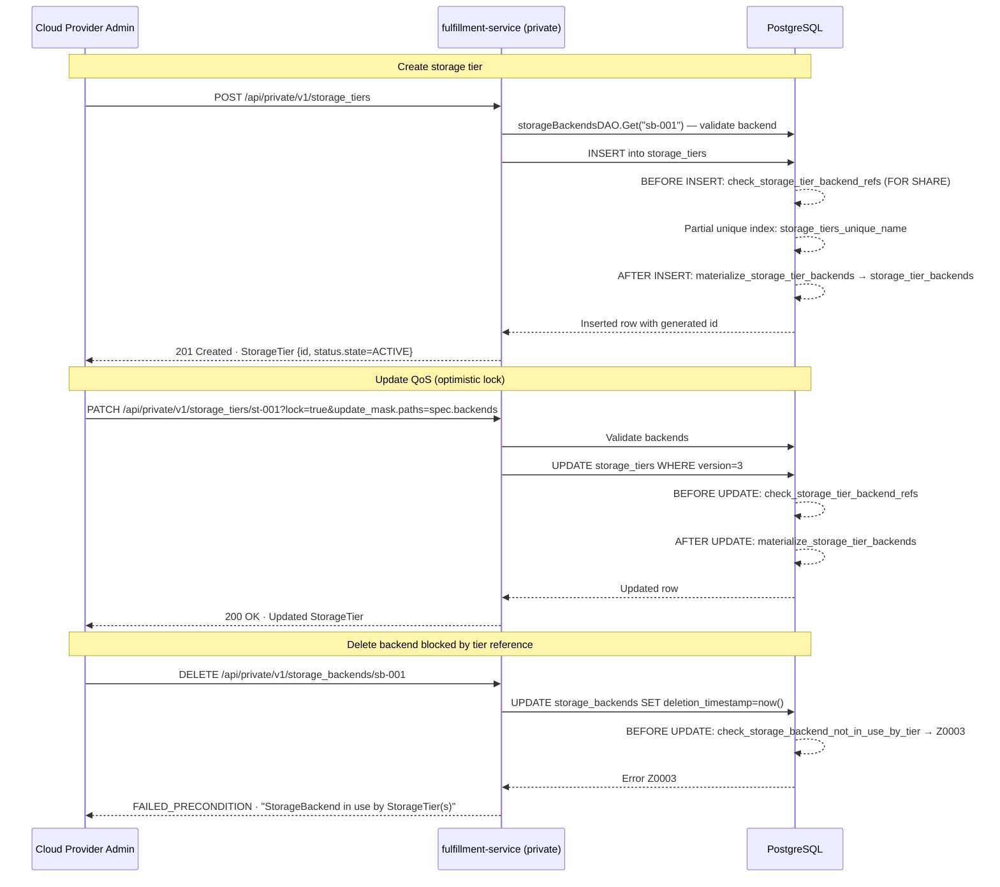

# StorageTier API

## Summary

This enhancement introduces the `StorageTiers` gRPC service under `osac.private.v1`, enabling Cloud Provider Admins to define named, API-managed storage tier offerings backed by registered `StorageBackend` resources with typed, provider-neutral QoS properties. The entity is DB-backed with no Kubernetes CRD and no reconciler, following the established `NetworkClass` pattern. See [PRD](prd.md) for detailed requirements.

## Motivation

OSAC currently configures storage tiers through the `STORAGE_TIERS` environment variable and the `osac.openshift.io/storage-tier` label convention on Kubernetes `StorageClass` objects. The `osac-operator` can already discover tiers by filtering `StorageClass` resources by that label [Codebase: `osac-operator/internal/controller/storage_tier_resolution.go`], so basic discovery works. The gaps are: (1) no structured QoS metadata is captured, (2) no referential relationship to registered `StorageBackend` entities exists, and (3) no API-managed catalog is queryable by internal services before any `StorageClass` is created.

`StorageBackend` (OSAC-1111) registers infrastructure — endpoints, credentials, provider type. The missing layer is a tier definition that binds a named offering (e.g., "fast", "standard", "archive") to one or more registered backends with per-backend QoS properties. `StorageTier` fills this gap by providing an API-managed catalog that downstream workflows — specifically Tenant Storage Onboarding (OSAC-23) — consume to determine which `StorageClass` resources to create and what QoS policies to apply.

### Goals

- Reuse the existing `GenericServer`, `GenericDAO`, and database migration patterns to minimize implementation risk. [PRD: In Scope item 5]
- Store QoS properties as typed proto fields (not untyped JSON) for schema evolution and compile-time safety. [PRD: NFR-2]
- Enforce referential integrity between `StorageTier` and `StorageBackend` at the database layer using trigger functions, matching the established `VirtualNetwork`/`Subnet` pattern. [PRD: FR-7, FR-10]
- Support forward-compatible multi-backend tiers: `spec.backends` is `repeated` but v0.1 validates exactly one entry. [PRD: FR-3, Assumption 4]
- Register `Signal` RPC to support future OSAC Storage Controller consumption without a service contract change. [PRD: FR-1]

### Non-Goals

- **Tenant-facing public API** — tenants discover assigned tiers through the Tenant resource status. A public read-only catalog may be added in a future enhancement (OSAC-3014). [PRD: Non-Goal 2.3]
- **Kubernetes CRD or operator controller** — `StorageTier` is DB-backed only, consistent with `StorageBackend` and `NetworkClass`. [PRD: Non-Goal 2.3]
- **Automatic StorageClass creation or refresh on QoS change** — responsibility of the OSAC Storage Controller (OSAC-23). [PRD: Non-Goal 2.3, NFR-3]
- **Multi-backend selection logic** — which backend within a tier serves a given tenant is deferred to OSAC-23 onboarding flow. [PRD: Assumption 3]
- **Provider-specific QoS validation** — values are stored as declared; validation against provider capabilities is a future enhancement. [PRD: Non-Goal 2.3]
- **Quota enforcement per tier** — storage observability and enforcement roadmap. [PRD: Non-Goal 2.3]
- **`DEPRECATED` state for StorageTier** — deferred to a later milestone. [PRD: FR-9]

## Proposal

`StorageTier` is a new private API resource in the `fulfillment-service`. The implementation consists of:

1. **Two new proto files**: `storage_tier_type.proto` (message definitions) and `storage_tiers_service.proto` (full CRUD + Signal service with REST transcoding).
2. **One new server**: `private_storage_tiers_server.go` implementing the `PrivateStorageTiersServer` builder pattern, embedding `GenericServer[*privatev1.StorageTier]` with custom validation overrides on `Create` and `Update`.
3. **Three database migrations**: `75_create_storage_tiers_tables.up.sql`, `76_add_storage_tier_ref_triggers.up.sql`, and `77_restructure_storage_tier_spec_status.up.sql` (restructures flat JSONB → `spec`/`status`).
4. **A cross-repo trigger on `storage_backends`**: a `BEFORE UPDATE` trigger added to the `storage_backends` table (OSAC-1111) that blocks backend soft-deletion when active `StorageTier` records reference it.
5. **Registration** in `start_grpc_server_cmd.go` and a one-line addition to `generic_server.go`'s `setPayload()` switch.
6. **osac-operator consumers** (`storage_tier_definitions.go`, `storage_tier_resolution.go`) that read tier definitions via the fulfillment-service gRPC API.

`StorageTier` follows the `NetworkClass` pattern [Codebase: `fulfillment-service/internal/servers/private_network_classes_server.go`]: no async reconciliation, no finalizer lifecycle, no CRD. The resource is platform-scoped — all tiers are accessible to any authenticated Cloud Provider Admin regardless of tenant context.

### Workflow Description

**Actors:**
- **Cloud Provider Admin** — creates, updates, deletes, and lists `StorageTier` definitions via the private gRPC/REST API.
- **Cloud Infrastructure Admin** — registers `StorageBackend` entities (OSAC-1111) that `StorageTier` references.

**Preconditions:** At least one `StorageBackend` (OSAC-1111) exists in active state.

#### Workflow 1: Create a StorageTier

Starting state: `StorageBackend` with ID `sb-001` (protocol `BLOCK`, VAST provider) is registered and active.

1. Cloud Provider Admin sends `POST /api/private/v1/storage_tiers` with body:
   ```json
   {
     "metadata": { "name": "fast" },
     "spec": {
       "description": "High-throughput block storage for latency-sensitive workloads",
       "backends": [{
         "backend_id": "sb-001",
         "protocol": "STORAGE_PROTOCOL_BLOCK",
         "max_read_bandwidth_mbs": 2000,
         "max_write_bandwidth_mbs": 1000,
         "quota_bytes": 10995116277760,
         "encryption_enabled": true
       }]
     }
   }
   ```
2. `PrivateStorageTiersServer.Create` validates:
   - `metadata.name` is non-empty → `INVALID_ARGUMENT` if missing.
   - `spec.backends` has exactly one entry (v0.1 constraint) → `INVALID_ARGUMENT` if zero or >1.
   - Each `backend_id` is looked up via `storageBackendsDAO.Get(ctx, backendID)` → `NOT_FOUND` with the invalid ID if any backend does not exist.
   - `protocol` is not `STORAGE_PROTOCOL_UNSPECIFIED` → `INVALID_ARGUMENT`.
   - `max_read_bandwidth_mbs` and `max_write_bandwidth_mbs`: a value of `0` is stored as-is and interpreted as "no limit enforced" (see Implementation Details for full semantics). A negative value is rejected as `INVALID_ARGUMENT`.
3. Server sets `status.state = STORAGE_TIER_STATE_ACTIVE`. Clears any client-supplied `id` (server-generated).
4. `GenericDAO.Create` inserts the row. PostgreSQL evaluates:
   - `check_storage_tier_backend_refs` (BEFORE INSERT trigger): re-validates backend existence with `FOR SHARE` locking → raises `Z0002` if backend was deleted between step 2 and the DB write.
   - `storage_tiers_unique_name` (partial unique index): raises `unique_violation` if an active tier with the same name already exists → DAO translates to `ALREADY_EXISTS`.
   - `materialize_storage_tier_backends` (AFTER INSERT trigger): populates `storage_tier_backends` helper table.
5. Server returns `201 Created` HTTP / gRPC `OK` with the complete `StorageTier` object including the server-generated `id` and `metadata.version`.

#### Workflow 2: List StorageTiers

1. Cloud Provider Admin sends `GET /api/private/v1/storage_tiers?limit=10&offset=0&filter=this.status.state==1`.
2. `GenericDAO.List` translates the CEL filter to SQL predicates, applies `deletion_timestamp = 'epoch'` implicitly (soft-deleted tiers are excluded), and returns paginated results.
3. Response includes `size` (items returned), `total` (total matching items), and `items`.

#### Workflow 3: Update QoS Properties (Partial Update)

1. Cloud Provider Admin sends `PATCH /api/private/v1/storage_tiers/st-001?lock=true&update_mask.paths=spec.backends` with body:
   ```json
   {
     "id": "st-001",
     "metadata": { "version": "3" },
     "spec": {
       "backends": [{ "backend_id": "sb-001", "max_read_bandwidth_mbs": 3000 }]
     }
   }
   ```

   > **REST binding note:** The `Update` RPC maps `body: "object"` (the `StorageTier` message), so the `update_mask` and `lock` fields of `StorageTiersUpdateRequest` are passed as query parameters. `update_mask.paths` is repeated and may appear multiple times (e.g., `update_mask.paths=spec.backends&update_mask.paths=spec.description`). `lock` is a boolean query parameter (`lock=true`). gRPC callers populate these directly in the `StorageTiersUpdateRequest` message.

2. `PrivateStorageTiersServer.Update` validates:
   - `metadata.name` is not in the update mask or is unchanged → `INVALID_ARGUMENT` if name change is attempted.
   - If `spec.backends` is in the mask (or mask is absent for full update): re-validates all `backend_id` values.
3. With `lock=true`, the DAO compares `metadata.version` against the DB row's current version → `ABORTED` on mismatch.
4. `GenericDAO.Update` applies the field mask merge and writes the row. Triggers re-run (`check_storage_tier_backend_refs`, `materialize_storage_tier_backends`).
5. Returns the updated `StorageTier` (`200 OK` HTTP).

#### Workflow 4: Delete a StorageTier

**Success path (no tenant references):**
1. Cloud Provider Admin sends `DELETE /api/private/v1/storage_tiers/st-001`.
2. `GenericDAO.Delete` sets `deletion_timestamp = now()` (soft delete). No tenant-reference check exists until OSAC-2872 ships; the delete proceeds unconditionally at this point.
3. Subsequent `List` calls exclude the tier. Subsequent `Get` returns `NOT_FOUND`.

**Failure path (backend referenced by tier, admin attempts backend delete):**
1. Cloud Infrastructure Admin sends `DELETE /api/private/v1/storage_backends/sb-001`.
2. `GenericDAO.Delete` sets `deletion_timestamp = now()` on `storage_backends`.
3. `check_storage_backend_not_in_use_by_tier` (BEFORE UPDATE trigger on `storage_backends`) queries `storage_tier_backends` → finds `st-001` → raises `Z0003`.
4. DAO translates `Z0003` → gRPC `FAILED_PRECONDITION` with message: `"cannot delete StorageBackend 'sb-001': 1 StorageTier(s) still reference it"`.



### API Extensions

**New gRPC service:** `osac.private.v1.StorageTiers` with 6 RPCs. No public service, no CRDs, no admission webhooks, no conversion webhooks, no finalizer lifecycle.

**Modification to existing service:** The `StorageBackends` service (OSAC-1111) delete path gains a database-level guard (trigger) that prevents deletion while active `StorageTier` records reference the backend. No change to the Go server or proto of `StorageBackends` is required — the trigger enforces integrity transparently.

**Impact when service is unavailable:** Cloud Provider Admins cannot manage tier definitions. Tiers already persisted in the database remain readable by the OSAC Storage Controller through direct gRPC calls; a `NOT_FOUND` or `UNAVAILABLE` from the API during controller reconciliation is handled as a non-fatal warning event. No impact on running tenant workloads.

## UX Alignment

N/A — No `osac-ux/libs/ui-components/src/api/v1/storage_tier.ts` file exists at the time of writing. `StorageTier` is a Cloud Provider Admin resource managed through the CLI or direct API calls; no Web Console UI surface is planned for this enhancement.

### Implementation Details/Notes/Constraints

#### Proto Schema

**`proto/private/osac/private/v1/storage_common_type.proto`** (already exists, shared with `StorageBackend`):

```protobuf
syntax = "proto3";
package osac.private.v1;

enum StorageProtocol {
  STORAGE_PROTOCOL_UNSPECIFIED = 0;
  STORAGE_PROTOCOL_NFS         = 1;
  STORAGE_PROTOCOL_BLOCK       = 2;
}
```

**`proto/private/osac/private/v1/storage_tier_type.proto`** [Codebase: `fulfillment-service/proto/private/osac/private/v1/storage_tier_type.proto`]:

```protobuf
syntax = "proto3";
package osac.private.v1;

import "osac/private/v1/metadata_type.proto";
import "osac/private/v1/storage_common_type.proto";

enum StorageTierState {
  STORAGE_TIER_STATE_UNSPECIFIED = 0;
  STORAGE_TIER_STATE_ACTIVE      = 1;
  // STORAGE_TIER_STATE_DEPRECATED = 2; reserved for future use (PRD: FR-9)
  reserved 2;
  reserved "STORAGE_TIER_STATE_DEPRECATED";
}

// Association of a StorageBackend within a StorageTier.
message BackendAssociation {
  string          backend_id              = 1; // ID of the registered StorageBackend
  StorageProtocol protocol                = 2; // Storage protocol for this association
  // max_read_bandwidth_mbs: maximum read bandwidth in MB/s.
  // A value of 0 means "no limit enforced" and is stored and passed to downstream
  // systems (e.g., AAP) as-is. Negative values are rejected with INVALID_ARGUMENT.
  optional int32  max_read_bandwidth_mbs  = 3;
  // max_write_bandwidth_mbs: maximum write bandwidth in MB/s.
  // Same zero/unset semantics as max_read_bandwidth_mbs.
  optional int32  max_write_bandwidth_mbs = 4;
  // quota_bytes: quota in bytes per the PRD NFR-2 unit specification.
  // int64 provides headroom to ~9 exabytes (2^63 bytes). Stored and passed
  // to downstream systems in bytes. A value of 0 means "no quota enforced."
  // Note: earlier drafts used quota_gib (GiB); quota_bytes matches PRD NFR-2.
  int64           quota_bytes             = 5;
  bool            encryption_enabled      = 6; // Data-at-rest encryption
}

// Platform-scoped storage tier managed by Cloud Provider Admins.
// Follows the spec/status sub-object shape. No CRD; no reconciler.
message StorageTier {
  string            id       = 1;
  Metadata          metadata = 2;
  StorageTierSpec   spec     = 3;
  StorageTierStatus status   = 4;
}

// Admin-configurable desired state.
message StorageTierSpec {
  string                     description = 1;
  repeated BackendAssociation backends    = 2;
}

// System-set operational state.
message StorageTierStatus {
  StorageTierState state   = 1;
  optional string  message = 2;
}
```

Design notes:
- `metadata.name` carries the human-readable tier name (e.g., `"fast"`, `"standard"`). It is immutable after creation — enforced in the server's `Update` method by comparing `metadata.name` against the persisted value, and at the DB layer by the `check_immutable_columns` trigger on the materialized `name` column (see Database Migrations). [PRD: FR-8]
- **`quota_bytes` (previously `quota_gib` in early drafts):** PRD NFR-2 specifies quota as "integer, bytes." The field is named `quota_bytes` and stored in bytes to match the PRD specification. `int64` handles petabyte-scale values (2^63 bytes ≈ 9 exabytes). The AAP payload passes this value directly as `quota_bytes` with no conversion required. The earlier draft name `quota_gib` has been corrected to align with PRD NFR-2.
- `max_read_bandwidth_mbs` and `max_write_bandwidth_mbs` are declared `optional int32` so that an explicitly unset field is distinguishable from a zero value. A value of `0` (when explicitly set) is stored as-is and interpreted as "no limit enforced." Negative values are rejected by server validation with `INVALID_ARGUMENT`. This is documented in field comments above.
- `spec.backends` is `repeated` for forward compatibility with multi-backend tiers, but v0.1 restricts to exactly one entry at the server layer. [Assumption] The DB schema and proto are already multi-backend capable.
- `status` is a separate sub-message (not a flat field) to match the standard OSAC object shape. The original design draft had a flat `state` field; migration 77 restructured the JSONB to `spec`/`status`. [Codebase: `database/migrations/77_restructure_storage_tier_spec_status.up.sql`]
- `StorageTierState` reserves field number 2 and the name `STORAGE_TIER_STATE_DEPRECATED` to prevent accidental reuse in future proto updates. [PRD: FR-9]

**`proto/private/osac/private/v1/storage_tiers_service.proto`** [Codebase: `fulfillment-service/proto/private/osac/private/v1/storage_tiers_service.proto`]:

```protobuf
syntax = "proto3";
package osac.private.v1;

import "google/api/annotations.proto";
import "google/protobuf/field_mask.proto";
import "osac/private/v1/storage_tier_type.proto";

message StorageTiersListRequest {
  optional int32  offset = 1; // 0-indexed first result
  optional int32  limit  = 2; // Maximum results to return
  optional string filter = 3; // CEL expression; `this` = StorageTier
  optional string order  = 4; // SQL-like: "spec.description desc"
}

message StorageTiersListResponse {
  int32                size  = 1; // Items returned
  int32                total = 2; // Total matching (ignoring limit)
  repeated StorageTier items = 3;
}

message StorageTiersGetRequest    { string      id     = 1; }
message StorageTiersGetResponse   { StorageTier object = 1; }
message StorageTiersCreateRequest { StorageTier object = 1; }
message StorageTiersCreateResponse{ StorageTier object = 1; }

// StorageTiersUpdateRequest carries the object in the request body.
// When called via REST (grpc-gateway), `update_mask` and `lock` are passed
// as query parameters (not in the body), because `body: "object"` in the
// HTTP annotation maps only the StorageTier message to the request body.
// Example REST call:
//   PATCH /api/private/v1/storage_tiers/st-001?lock=true&update_mask.paths=spec.backends
// Multiple paths: update_mask.paths=spec.backends&update_mask.paths=spec.description
message StorageTiersUpdateRequest {
  StorageTier              object      = 1;
  google.protobuf.FieldMask update_mask = 2;
  bool                     lock        = 3; // Optimistic concurrency guard
}
message StorageTiersUpdateResponse { StorageTier object = 1; }

message StorageTiersDeleteRequest  { string id = 1; }
message StorageTiersDeleteResponse {}

// Signal is present for generic server infrastructure compatibility.
// Not implemented for StorageTier (no async reconciliation).
// Signal intentionally has no HTTP annotation: it is infrastructure-only
// and is not intended to be callable via the REST gateway.
message StorageTiersSignalRequest  { string id = 1; }
message StorageTiersSignalResponse {}

service StorageTiers {
  rpc List(StorageTiersListRequest)     returns (StorageTiersListResponse) {
    option (google.api.http) = {get: "/api/private/v1/storage_tiers"};
  }
  rpc Get(StorageTiersGetRequest)       returns (StorageTiersGetResponse) {
    option (google.api.http) = {
      get: "/api/private/v1/storage_tiers/{id}"
      response_body: "object"
    };
  }
  rpc Create(StorageTiersCreateRequest) returns (StorageTiersCreateResponse) {
    option (google.api.http) = {
      post: "/api/private/v1/storage_tiers"
      body: "object"
      response_body: "object"
    };
  }
  // Update: body maps to `object` (StorageTier). `update_mask` and `lock`
  // are query parameters in the REST binding. See StorageTiersUpdateRequest
  // comment for REST usage details.
  rpc Update(StorageTiersUpdateRequest) returns (StorageTiersUpdateResponse) {
    option (google.api.http) = {
      patch: "/api/private/v1/storage_tiers/{object.id}"
      body: "object"
      response_body: "object"
    };
  }
  rpc Delete(StorageTiersDeleteRequest) returns (StorageTiersDeleteResponse) {
    option (google.api.http) = {delete: "/api/private/v1/storage_tiers/{id}"};
  }
  rpc Signal(StorageTiersSignalRequest) returns (StorageTiersSignalResponse) {}
}
```

#### Server Implementation

**File:** `fulfillment-service/internal/servers/private_storage_tiers_server.go`  
**Pattern:** Matches `private_network_classes_server.go` [Codebase: `fulfillment-service/internal/servers/private_network_classes_server.go`].

```
PrivateStorageTiersServerBuilder
  .SetLogger(logger)
  .SetNotifier(notifier)
  .SetAttributionLogic(attribution)
  .SetTenancyLogic(tenancy)
  .SetMetricsRegisterer(registerer)
  .SetStorageBackendsDAO(storageBackendsDAO)   ← injected for cross-resource validation
  .Build() → PrivateStorageTiersServer
```

The server embeds `GenericServer[*privatev1.StorageTier]`. Method overrides:

**`Create` override logic:**
1. Assert `request.Object.Metadata.GetName() != ""` → `INVALID_ARGUMENT("metadata.name is required")`
2. Assert `len(request.Object.Spec.GetBackends()) == 1` → `INVALID_ARGUMENT("exactly one backend association is required in v0.1")` [Assumption: v0.1 restriction; proto supports >1 for future]
3. Assert `request.Object.Spec.Backends[0].Protocol != STORAGE_PROTOCOL_UNSPECIFIED` → `INVALID_ARGUMENT("protocol must be specified")`
4. Assert that `max_read_bandwidth_mbs` and `max_write_bandwidth_mbs`, if set, are non-negative → `INVALID_ARGUMENT("bandwidth values must be >= 0; use 0 to indicate no limit")`
5. For each `backend_id` in `spec.backends`: call `storageBackendsDAO.Get(ctx, backendID)` → `NOT_FOUND(fmt.Sprintf("StorageBackend %q does not exist", backendID))` if absent.
6. Force `status.state = STORAGE_TIER_STATE_ACTIVE`.
7. Force `metadata.tenant = auth.SharedTenant` (platform-scoped).
8. Clear `id` (server-generated UUID assigned by DAO).
9. Delegate to `GenericServer.Create`.

**`Update` override logic:**
1. Retrieve the persisted tier by `object.id` → `NOT_FOUND` if absent or soft-deleted.
2. If `metadata.name` is set in the request and differs from the persisted name → `INVALID_ARGUMENT("metadata.name is immutable")`.
3. If `update_mask` is absent (full update) OR `spec.backends` is listed in `update_mask.paths`: re-run backend and bandwidth validation (steps 2–5 from Create).
4. If `lock = true`: compare `metadata.version` against persisted version → `ABORTED("conflict: version mismatch; re-fetch and retry")` on mismatch.
5. Delegate to `GenericServer.Update`.

**`Signal` override:** Delegates to `GenericServer.Signal` which returns `UNIMPLEMENTED`. No custom logic. Not callable via REST (no HTTP annotation).

**`generic_server.go` change (cross-cutting):** Add `case *privatev1.StorageTier: event.SetStorageTier(object)` to the `setPayload()` type switch so notification events carry the tier payload. [Codebase: `fulfillment-service/internal/servers/generic_server.go`]

**gRPC registration** (`start_grpc_server_cmd.go`): Construct `PrivateStorageTiersServer` via builder and call `privatev1.RegisterStorageTiersServer(grpcServer, server)`. No public server registration.

#### Database Migrations

Migrations must be applied in order. `StorageBackend` migrations (OSAC-1111) must precede all three of these.

**Schema note on `name` column immutability:** The `storage_tiers` table materializes `name` as a dedicated `TEXT` column (not only in `data` JSONB) for indexing and the unique constraint. The `check_immutable_columns` DB trigger guards this `name` column directly. The Go server additionally guards the JSONB-encoded `metadata.name` at the application layer. Together these two layers ensure name immutability regardless of whether a write arrives through the gRPC server or directly against the database. Any write that updates the `name` column after insert is rejected by the trigger with `Z0001`. Any write through the gRPC API that attempts to change `metadata.name` in the request object is rejected before the DB write. The `GenericDAO` is responsible for keeping the `name` column in sync with `data->>'metadata'->>'name'` on every write; this is the established pattern for all scalar columns materialized for indexing.

**Migration 75 — Core tables** (`75_create_storage_tiers_tables.up.sql`):

```sql
CREATE TABLE storage_tiers (
  id                 TEXT        NOT NULL PRIMARY KEY,
  name               TEXT        NOT NULL DEFAULT '',
  creation_timestamp TIMESTAMPTZ NOT NULL DEFAULT now(),
  deletion_timestamp TIMESTAMPTZ NOT NULL DEFAULT 'epoch',
  finalizers         TEXT[]      NOT NULL DEFAULT '{}',
  creator            TEXT        NOT NULL DEFAULT '',
  tenant             TEXT        NOT NULL DEFAULT '',
  project            TEXT        NOT NULL DEFAULT '',
  labels             JSONB       NOT NULL DEFAULT '{}'::jsonb,
  annotations        JSONB       NOT NULL DEFAULT '{}'::jsonb,
  data               JSONB       NOT NULL,
  version            BIGINT      NOT NULL DEFAULT 0
);

CREATE TABLE archived_storage_tiers (
  id                 TEXT        NOT NULL,
  name               TEXT        NOT NULL DEFAULT '',
  creation_timestamp TIMESTAMPTZ NOT NULL,
  deletion_timestamp TIMESTAMPTZ NOT NULL,
  archival_timestamp TIMESTAMPTZ NOT NULL DEFAULT now(),
  creator            TEXT        NOT NULL DEFAULT '',
  tenant             TEXT        NOT NULL DEFAULT '',
  project            TEXT        NOT NULL DEFAULT '',
  labels             JSONB       NOT NULL DEFAULT '{}'::jsonb,
  annotations        JSONB       NOT NULL DEFAULT '{}'::jsonb,
  data               JSONB       NOT NULL,
  version            BIGINT      NOT NULL DEFAULT 0
);

-- Name uniqueness among active (non-soft-deleted) tiers only.
-- Name reuse after deletion is explicitly supported (PRD: FR-8).
CREATE UNIQUE INDEX storage_tiers_unique_name
  ON storage_tiers (name)
  WHERE deletion_timestamp = 'epoch' AND name != '';

-- Immutability trigger: id, name, tenant, project cannot be changed post-create.
-- Guards the materialized scalar columns directly. The `name` column is always
-- kept in sync with data->metadata->name by GenericDAO on every write.
-- Reuses the existing check_immutable_columns() function from the codebase.
CREATE TRIGGER check_immutable_columns
  BEFORE UPDATE ON storage_tiers
  FOR EACH ROW
  EXECUTE FUNCTION check_immutable_columns('id', 'name', 'tenant', 'project');

-- Supporting indexes.
CREATE INDEX storage_tiers_by_name   ON storage_tiers (name);
CREATE INDEX storage_tiers_by_tenant ON storage_tiers (tenant);
CREATE INDEX storage_tiers_by_label  ON storage_tiers USING GIN (labels);
```

**Migration 76 — Referential integrity triggers** (`76_add_storage_tier_ref_triggers.up.sql`):

Depends on `storage_backends` table (OSAC-1111).

The trigger functions read backend IDs from `NEW.data->'spec'->'backends'` using the key `'backendId'` (camelCase). This is because `GenericDAO` serializes proto messages to JSONB using `protojson.Marshal` (standard proto JSON encoding), which converts snake_case proto field names to camelCase JSON keys per the proto JSON specification. The field `backend_id` in proto therefore becomes `backendId` in JSONB. This convention is consistent across all OSAC entities stored in JSONB columns. An integration test directly inspects the raw JSONB after a `Create` to assert `data->'spec'->'backends'->0->>'backendId'` is non-null, guarding against marshaler changes.

```sql
-- Materialized helper table: backend_id extracted from JSONB for O(1) reverse lookup.
CREATE TABLE storage_tier_backends (
  storage_tier_id TEXT NOT NULL REFERENCES storage_tiers(id) ON DELETE CASCADE,
  backend_id      TEXT NOT NULL,
  PRIMARY KEY (storage_tier_id, backend_id)
);
CREATE INDEX storage_tier_backends_by_backend ON storage_tier_backends (backend_id);

-- Trigger 1: Materialize backend IDs from JSONB on every insert/update of active tiers.
-- Reads backendId (camelCase) as serialized by protojson.Marshal.
CREATE FUNCTION materialize_storage_tier_backends() RETURNS trigger AS $$
DECLARE bid TEXT;
BEGIN
  DELETE FROM storage_tier_backends WHERE storage_tier_id = NEW.id;
  FOR bid IN
    SELECT jsonb_array_elements(NEW.data->'spec'->'backends')->>'backendId'
  LOOP
    INSERT INTO storage_tier_backends (storage_tier_id, backend_id) VALUES (NEW.id, bid);
  END LOOP;
  RETURN NEW;
END;
$$ LANGUAGE plpgsql;

CREATE TRIGGER materialize_storage_tier_backends
  AFTER INSERT OR UPDATE ON storage_tiers
  FOR EACH ROW
  WHEN (NEW.deletion_timestamp = 'epoch')
  EXECUTE FUNCTION materialize_storage_tier_backends();

-- Trigger 2: Validate backend existence before insert/update (TOCTOU-safe via FOR SHARE).
-- Reads backendId (camelCase) as serialized by protojson.Marshal.
CREATE FUNCTION check_storage_tier_backend_refs() RETURNS trigger AS $$
DECLARE bid TEXT; found_id TEXT;
BEGIN
  FOR bid IN
    SELECT jsonb_array_elements(NEW.data->'spec'->'backends')->>'backendId'
  LOOP
    SELECT id INTO found_id FROM storage_backends
      WHERE id = bid AND deletion_timestamp = 'epoch' FOR SHARE;
    IF found_id IS NULL THEN
      RAISE EXCEPTION USING
        errcode = 'Z0002',
        message = format('StorageBackend ''%s'' does not exist or has been deleted', bid);
    END IF;
  END LOOP;
  RETURN NEW;
END;
$$ LANGUAGE plpgsql;

CREATE TRIGGER check_storage_tier_backend_refs
  BEFORE INSERT OR UPDATE ON storage_tiers
  FOR EACH ROW
  WHEN (NEW.deletion_timestamp = 'epoch')
  EXECUTE FUNCTION check_storage_tier_backend_refs();

-- Trigger 3: Block StorageBackend soft-deletion if active StorageTiers reference it.
CREATE FUNCTION check_storage_backend_not_in_use_by_tier() RETURNS trigger AS $$
DECLARE tier_count BIGINT;
BEGIN
  SELECT COUNT(*) INTO tier_count
    FROM storage_tier_backends stb
    JOIN storage_tiers st ON st.id = stb.storage_tier_id
    WHERE stb.backend_id = OLD.id AND st.deletion_timestamp = 'epoch';
  IF tier_count > 0 THEN
    RAISE EXCEPTION USING
      errcode = 'Z0003',
      message = format(
        'cannot delete StorageBackend ''%s'': %s StorageTier(s) still reference it',
        OLD.id, tier_count);
  END IF;
  RETURN NEW;
END;
$$ LANGUAGE plpgsql;

CREATE TRIGGER check_storage_backend_not_in_use_by_tier
  BEFORE UPDATE ON storage_backends
  FOR EACH ROW
  WHEN (OLD.deletion_timestamp = 'epoch' AND NEW.deletion_timestamp != 'epoch')
  EXECUTE FUNCTION check_storage_backend_not_in_use_by_tier();
```

**Migration 77 — JSONB restructure** (`77_restructure_storage_tier_spec_status.up.sql`):

Migrates the flat JSONB schema `{description, backends, state}` to the standard `{spec:{description, backends}, status:{state}}` shape, matching the `StorageTierSpec`/`StorageTierStatus` proto sub-messages. Updates both trigger functions to read from `data->'spec'->'backends'`.

> **Note on deferred trigger:** The tenant-reference trigger (`check_storage_tier_not_in_use`) that prevents deleting a `StorageTier` while tenants reference it is **deferred to a follow-up migration shipping with OSAC-23** (OSAC-2872). The Tenant proto schema for storage tier assignments is not yet finalized. No protection gap exists because no tenant can reference a tier until OSAC-23 ships. [PRD: FR-6]

**Helper table exclusion:** `storage_tier_backends` must be excluded from schema validation in `database_tool.go` (established helper table pattern — same treatment as `virtual_network_subnets` helper table). [Codebase: `fulfillment-service/internal/database/database_tool.go`]

#### CRUD Operation Specifications

**CreateStorageTier**

| Condition | Error code |
|---|---|
| `metadata.name` absent or empty | `INVALID_ARGUMENT` |
| `spec.backends` is empty | `INVALID_ARGUMENT` |
| `spec.backends` has >1 entry (v0.1) | `INVALID_ARGUMENT` |
| `spec.backends[0].protocol` is `UNSPECIFIED` | `INVALID_ARGUMENT` |
| `max_read_bandwidth_mbs` or `max_write_bandwidth_mbs` is negative | `INVALID_ARGUMENT` |
| Any `backend_id` not found (Go-layer check) | `NOT_FOUND` |
| Any `backend_id` not found (DB trigger, concurrent deletion) | `FAILED_PRECONDITION` (Z0002 → translated) |
| Active tier with same name already exists | `ALREADY_EXISTS` |
| Caller lacks admin role | `PERMISSION_DENIED` |
| PostgreSQL unavailable | `UNAVAILABLE` |

**GetStorageTier**

| Condition | Error code |
|---|---|
| `id` not found or tier is soft-deleted | `NOT_FOUND` |
| Caller lacks admin role | `PERMISSION_DENIED` |

**ListStorageTiers**

| Condition | Error code |
|---|---|
| Invalid CEL filter expression | `INVALID_ARGUMENT` |
| Invalid order syntax | `INVALID_ARGUMENT` |
| Negative `offset` or `limit` | `INVALID_ARGUMENT` |

Soft-deleted tiers are always excluded from results. The response always includes `total` (count of all matching active tiers, ignoring `limit`).

**UpdateStorageTier**

| Condition | Error code |
|---|---|
| `object.id` not found or soft-deleted | `NOT_FOUND` |
| `metadata.name` change attempted | `INVALID_ARGUMENT` |
| Any `backend_id` not found | `NOT_FOUND` |
| `max_read_bandwidth_mbs` or `max_write_bandwidth_mbs` is negative | `INVALID_ARGUMENT` |
| `lock = true` and `metadata.version` mismatch | `ABORTED` |
| Any `backend_id` concurrently deleted (DB trigger) | `FAILED_PRECONDITION` (Z0002) |
| Caller lacks admin role | `PERMISSION_DENIED` |

**DeleteStorageTier**

| Condition | Error code |
|---|---|
| `id` not found or already soft-deleted | `NOT_FOUND` |
| Active Tenant references the tier — **not active until OSAC-2872 ships** | `FAILED_PRECONDITION` (Z0003) *(future)* |
| Caller lacks admin role | `PERMISSION_DENIED` |

**DeleteStorageBackend** (cross-resource, OSAC-1111)

| Condition | Error code |
|---|---|
| Active `StorageTier` references the backend (DB trigger) | `FAILED_PRECONDITION` (Z0003) |

**Signal**

Returns `UNIMPLEMENTED`. No implementation logic. Not callable via REST (no HTTP annotation by design).

#### osac-operator Integration

Two controller-side files in `osac-operator` consume `StorageTier` definitions via the fulfillment-service gRPC API [Codebase: `osac-operator/internal/controller/storage_tier_definitions.go`, `osac-operator/internal/controller/storage_tier_resolution.go`]:

- `resolveTierDefinitions()` — lists all active tiers, deduplicates backend IDs, fetches `StorageBackend` details once per unique backend, and assembles `[]provisioning.TierDefinition` for AAP playbook injection.
- `resolveAndInjectTierContext()` — non-fatal wrapper; injects tier data into `context.Context` for AAP calls. If the fulfillment-service is unavailable, logs a warning and continues without tier context (best-effort).
- `missingTierNames()` / `appendMissingTierWarnings()` — detects tiers with no matching `StorageClass` label and emits Kubernetes `Warning` events.
- `groupByTier()` (`storage_tier_resolution.go`) — groups `StorageClass` objects by the `osac.openshift.io/storage-tier` label (lower-cased, validated against `^[a-z0-9]([a-z0-9._-]*[a-z0-9])?$`).

The operator does not write to `StorageTier` — it is read-only from the operator's perspective.

#### AAP Payload Mapping

The `resolveTierDefinitions()` function produces the following `extra_vars` structure for AAP job templates [Codebase: `osac-aap/samples/storage_tier_definitions_payload.json`]:

```json
{
  "storage_tier_definitions": [
    {
      "name": "fast",
      "protocol": "block",
      "provider": "vast",
      "backend_id": "sb-001",
      "qos_limits": {
        "static_limits": {
          "max_reads_bw_mbps": 2000,
          "max_writes_bw_mbps": 1000
        }
      },
      "quota_bytes": 10995116277760
    }
  ],
  "storage_backend_connections": {
    "sb-001": {
      "endpoint": "vast.example.com:443",
      "username": "admin",
      "password": "<injected from StorageBackend secret>"
    }
  }
}
```

The `storageProtocolToString()` helper maps `STORAGE_PROTOCOL_NFS` → `"nfs"` and `STORAGE_PROTOCOL_BLOCK` → `"block"`. `quota_bytes` is passed directly to AAP without conversion.

**`quota_bytes` semantics (resolved):** `quota_bytes` is a **per-tenant quota** — the maximum storage quota enforced by the storage provider for a single tenant's provisioned volume or view. When the OSAC Storage Controller (OSAC-23) provisions tenant storage, it passes this value to the AAP playbook as the VAST view quota scoped to that tenant. It is not a declaration of total tier capacity. Admins set this value to express the maximum quota any single tenant on this tier may consume. A value of `0` means no quota is enforced. This semantics is confirmed by the AAP payload usage and must be documented in the admin guide.

#### Cross-Repository Changes

| Repository | Change |
|---|---|
| `fulfillment-service` | New proto files, server, 3 migrations, CLI table render config, `generic_server.go` `setPayload()` |
| `fulfillment-service` | Trigger on `storage_backends` table (BEFORE UPDATE) — cross-resource guard for OSAC-1111 |
| `osac-operator` | `storage_tier_definitions.go`, `storage_tier_resolution.go` — read-only consumers |
| `osac-aap` | `storage_tier_definitions_payload.json` sample; playbook integration for `storage_tier_definitions` var |
| `osac-installer` | N/A — no new Helm values or Kustomize overlays required [Assumption] |
| `osac-test-infra` | New E2E test scenarios (see Test Plan) |

### Security Considerations

`StorageTier` inherits the `fulfillment-service`'s existing security model without modification:

- **Authentication:** JWT validation via the gRPC interceptor chain. All requests to the private API require a valid Cloud Provider Admin token. [PRD: Assumption 1]
- **Authorization:** OPA policies restrict the private API to admin roles. No new OPA rules are required — the existing admin-only gate covers `osac.private.v1.*` services. [Codebase: `fulfillment-service/internal/authz/opa/`]
- **Input validation:** Backend IDs are validated via `storageBackendsDAO.Get` (existence + active status). QoS numeric fields are typed proto fields with natural proto unmarshaling bounds. Bandwidth fields use `optional int32`; negative values are rejected by server validation. `protocol` is a proto enum — unknown values are rejected by proto unmarshaling before reaching server logic.
- **Data exposure:** `StorageTier` stores no credentials. QoS properties and backend IDs are operational metadata. Credentials live in `StorageBackend` (OSAC-1111) and are never surfaced through the tier API. [PRD: NFR-2]
- **Tenant isolation:** `StorageTier` is platform-scoped. The `metadata.tenant` field is forced to `auth.SharedTenant` on `Create`, preventing tenant-scoped tiers. Tenant isolation for storage is enforced at the tier-assignment layer in OSAC-23, not at the tier-definition layer. [PRD: Assumption 1]
- **SQL injection:** Not applicable. All DB interaction goes through the `GenericDAO` which uses parameterized queries. CEL filters are translated to safe SQL by the established filter translator.

### Failure Handling and Recovery

| Failure Mode | What Happens | System Recovery | User Observation |
|---|---|---|---|
| Go-layer backend validation fails on Create/Update | `storageBackendsDAO.Get` returns error; server returns immediately before DB write | No row inserted/modified | `NOT_FOUND` with the invalid `backend_id`; admin corrects ID and retries |
| Negative bandwidth value on Create/Update | Server validation rejects before DB write | No row inserted/modified | `INVALID_ARGUMENT("bandwidth values must be >= 0")`; admin corrects value and retries |
| DB-layer backend validation fails (Z0002, TOCTOU race) | `check_storage_tier_backend_refs` trigger raises Z0002; transaction rolls back | No partial row written | `FAILED_PRECONDITION`; admin removes the stale backend ID |
| Name uniqueness violation on Create | Partial unique index raises `unique_violation`; DAO translates to `ALREADY_EXISTS` | No row inserted | `ALREADY_EXISTS`; admin picks a different name or deletes the existing tier |
| Optimistic lock conflict on Update (`lock=true`) | DAO compares `metadata.version`; mismatch rejects the write | No row modified | `ABORTED`; admin re-fetches current state, merges changes, retries |
| StorageBackend deletion blocked by tier (Z0003) | `check_storage_backend_not_in_use_by_tier` raises Z0003; backend soft-delete rolls back | Backend remains active | `FAILED_PRECONDITION`; Cloud Infrastructure Admin removes the tier's backend association first |
| StorageTier deletion blocked by tenant (post-OSAC-2872, Z0003) | Deferred trigger raises Z0003; tier soft-delete rolls back | Tier remains active | `FAILED_PRECONDITION`; Cloud Provider Admin unassigns the tier from tenants first |
| Materialization trigger failure | Trigger body raises an exception; the parent INSERT/UPDATE transaction rolls back | No partial state in `storage_tier_backends` | `INTERNAL` or specific code depending on cause; admin retries |
| PostgreSQL unavailable during any RPC | DAO returns connection error; gRPC propagates as `UNAVAILABLE` | No data written; transaction never started | `UNAVAILABLE`; admin retries when DB is restored |
| fulfillment-service unavailable (operator perspective) | `resolveAndInjectTierContext()` catches error; logs `Warning` event; tier context omitted from AAP vars | AAP playbook runs without tier-specific QoS vars | Kubernetes `Warning` event on the resource being reconciled; operator retries on next reconcile cycle |
| Immutable field violation on Update (name, tenant, id) | DB trigger raises Z0001; DAO translates to `INVALID_ARGUMENT` | Row unchanged | `INVALID_ARGUMENT("immutable field modified")`; admin removes the immutable field from the update |

All operations are fully transactional. No partial state is possible: either the full Create/Update/Delete commits or rolls back entirely. There is no async reconciliation loop for `StorageTier` itself, so controller-restart mid-reconciliation is not applicable.

### RBAC / Tenancy

`StorageTier` is platform-scoped, managed exclusively by Cloud Provider Admins via the private API.

- **Platform scoping:** `metadata.tenant` is forced to `auth.SharedTenant` on `Create` by the `tenancyLogic`. This mirrors `NetworkClass` [Codebase: `fulfillment-service/internal/servers/private_network_classes_server.go`].
- **Tenant isolation metadata:** `osac.openshift.io/tenant` annotation is set by `attributionLogic` to the shared platform tenant; `osac.openshift.io/owner-reference` is not applicable (no parent resource in the hierarchy for platform-scoped entities). [Assumption: consistent with NetworkClass treatment]
- **OPA enforcement:** No new OPA policies needed. The existing private API admin-only gate (`osac.private.v1.*`) is sufficient.
- **Tenant visibility:** Tenants do **not** access `StorageTier` directly. They discover their assigned storage tiers via the Tenant resource status, which is populated by the OSAC Storage Controller (OSAC-23). [PRD: Non-Goal 2.3]
- **OSAC-3014 (future):** A public read-only `StorageTier` catalog for tenants may be added. When implemented, it must filter out `spec.backends` fields (backend IDs, provider details, connection parameters) — tenants must see only the tier name, description, and QoS properties. [PRD: Non-Goal 2.3]

### Observability and Monitoring

No new observability changes. Existing monitoring mechanisms apply:

- The gRPC interceptor chain already emits Prometheus metrics for all RPC calls (request count, latency histograms, error rates by code) — these automatically cover `osac.private.v1.StorageTiers/*` RPCs without additional instrumentation.
- Structured logging via `slog` captures `Create`/`Update`/`Delete` operations with resource IDs at `INFO` level; validation failures at `WARN`.
- The notification system (event payloads via `setPayload()`) enables downstream consumers to react to `StorageTier` changes via the event stream.
- Missing-tier warnings are emitted as Kubernetes `Warning` events on the tenant resource during operator reconciliation (from `appendMissingTierWarnings()`).

### Risks and Mitigations

**Trigger ordering dependency on OSAC-1111:** Migration 76 creates a `BEFORE UPDATE` trigger on `storage_backends`. If OSAC-1111 migrations are not applied first, migration 76 fails with a missing table error. **Mitigation:** Migrations are numbered sequentially and applied in order by the migration runner. OSAC-1111 is a declared dependency and must merge and deploy first. [PRD: Section 6]

**Deferred tenant-reference protection:** The trigger that blocks `StorageTier` deletion while tenants reference it ships with OSAC-23. Until then, `DeleteStorageTier` always succeeds even if OSAC-23 assigns tenants to tiers. **Mitigation:** No tenants can reference tiers until OSAC-23 ships. If OSAC-23 ships before the follow-up trigger migration (OSAC-2872), a brief window exists where orphaned tenant-tier references are possible. This must be tracked and closed before OSAC-23 GA. [PRD: FR-6]

**QoS update propagation limits:** Changes to QoS properties that are baked into Kubernetes `StorageClass` parameters (encryption, QoS policy name) require `StorageClass` recreation to take effect for new volumes. Existing volumes are unaffected. **Mitigation:** The OSAC Storage Controller (OSAC-23) is responsible for `StorageClass` lifecycle including parameter-drift detection and recreation. This limitation is documented for operators. [PRD: Risk 7.1]

**Multi-backend JSONB path for trigger extraction:** The JSONB path `data->'spec'->'backends'->>'backendId'` must stay in sync with the proto field name used for JSONB serialization (`protojson.Marshal` camelCase convention). If the proto field is renamed, both trigger functions must be updated. **Mitigation:** The DB trigger test suite (`76_add_storage_tier_ref_triggers_test.go`) fails on any mismatch. An integration test directly inspects the stored JSONB to assert `data->'spec'->'backends'->0->>'backendId'` is non-null after Create. Migration review must verify JSONB paths against the proto encoding. [Assumption]

**v0.1 single-backend restriction visibility:** The restriction is enforced at the Go server layer, not at the proto or DB layer. Clients reading the proto schema see `repeated BackendAssociation` and may attempt multi-backend tiers. **Mitigation:** The gRPC service documentation and generated SDK docs must prominently note the v0.1 restriction.

### Drawbacks

The primary trade-off is adding another DB-backed entity with cross-table referential integrity triggers. This increases migration complexity and requires coordinating two features (OSAC-1110 and OSAC-1111) across a single migration step. The alternative — free-form JSON for QoS with no referential integrity — creates worse problems: schema drift, no compile-time safety, and orphaned references after backend deletion.

The materialized helper table (`storage_tier_backends`) adds a maintenance surface: both trigger functions must be updated if the JSONB encoding of `backends` changes (e.g., proto field rename, serialization format change). This cost is justified by the need for efficient reverse lookups on StorageBackend deletion — a full-table JSONB scan on `storage_tiers` would not scale as tier count grows.

The `spec`/`status` restructure (migration 77) adds a third migration file where a single file could have sufficed if the sub-object shape had been chosen from the start. This is a one-time cost with no ongoing maintenance overhead.

## Alternatives (Not Implemented)

**Free-form JSON for QoS properties (`google.protobuf.Struct` or `map<string, string>`):** Store QoS as an untyped blob rather than typed proto fields. *Pros:* maximum flexibility, no proto changes when adding QoS dimensions. *Cons:* no compile-time type safety, no field-level validation, CEL filtering on nested untyped fields requires custom translator support, no proto schema documentation. **Rejected** because typed proto fields provide better developer experience, catch errors at compile time, and are consistent with how `Disk.size_gib` and other QoS-like fields are modeled across the OSAC API surface.

**Server-side-only referential integrity (no DB triggers):** Validate backend references exclusively in Go server code, without DB-level triggers. *Pros:* simpler migrations, all logic in Go, easier to unit-test in isolation. *Cons:* does not protect against TOCTOU races (concurrent `StorageBackend` soft-delete and `StorageTier` create completing between the Go validation and DB write). **Rejected** because the trigger approach matches the established VirtualNetwork/Subnet pattern [Codebase: `database/migrations/55_add_virtual_network_child_ref_triggers.up.sql`] and provides stronger guarantees, including protection against direct DB writes.

**CRD-backed StorageTier with an operator controller:** Define `StorageTier` as a Kubernetes CRD with a reconciler in `osac-operator`. *Pros:* native Kubernetes semantics, `kubectl` access, standard condition-based status reporting. *Cons:* unnecessary complexity for a catalog entity with no async provisioning lifecycle; would require bidirectional state synchronization between the CRD and the PostgreSQL database; adds a dependency on the operator being running for admin CRUD operations. **Rejected** because `StorageTier` has no reconciliation logic — it is a static catalog entry, not a managed resource with an async lifecycle. Consistent with `StorageBackend` and `NetworkClass`. [PRD: Non-Goal 2.3]

**Keep `STORAGE_TIERS` environment variable:** Continue using env-var-based tier configuration. *Pros:* zero implementation effort, no migration risk. *Cons:* tiers are not queryable via API, no referential integrity with registered backends, no QoS metadata captured, no audit trail, no support for per-tier protocol or encryption properties, and blocks OSAC-23 Tenant Storage Onboarding which requires an API-managed tier catalog. **Rejected** because OSAC-23 requires the fulfillment-service API as the tier source of truth. [PRD: Goal 3]

## Open Questions

1. **Tenant-reference trigger timing (OSAC-2872):** The `check_storage_tier_not_in_use` trigger that blocks `StorageTier` deletion while tenants reference it is deferred to OSAC-23. If OSAC-23 ships without the trigger, there is a window where orphaned tenant-tier references are possible. What is the latest safe point to ship OSAC-2872 relative to OSAC-23 GA?

2. **v0.1 single-backend restriction removal criteria:** The exactly-one-backend restriction is enforced at the Go server layer. What are the conditions for removing this restriction in a future minor release? Is a new API version required, or can the restriction be lifted within `osac.private.v1`?

3. **Public StorageTier catalog (OSAC-3014):** The future public read-only API for tenants must not expose `spec.backends` (backend IDs, provider details). Should the public response strip those fields server-side or define a separate `PublicStorageTier` message? The answer impacts the proto design of OSAC-3014.

## Test Plan

### Unit Tests

Tests are located in `fulfillment-service/internal/servers/private_storage_tiers_server_test.go` (Ginkgo suite) [Codebase: `fulfillment-service/internal/servers/private_storage_tiers_server_test.go`].

- **Create — happy path:** `CreateStorageTier` with valid `metadata.name`, one backend association, and valid `backend_id` returns a tier with `status.state = ACTIVE` and a server-generated `id`.
- **Create — empty name:** Asserts `INVALID_ARGUMENT` when `metadata.name` is absent.
- **Create — empty backends:** Asserts `INVALID_ARGUMENT` when `spec.backends` is empty.
- **Create — multi-backend (v0.1 restriction):** Asserts `INVALID_ARGUMENT` when `spec.backends` has more than one entry.
- **Create — unspecified protocol:** Asserts `INVALID_ARGUMENT` when `spec.backends[0].protocol` is `STORAGE_PROTOCOL_UNSPECIFIED`.
- **Create — negative bandwidth:** Asserts `INVALID_ARGUMENT` when `max_read_bandwidth_mbs` or `max_write_bandwidth_mbs` is negative.
- **Create — zero bandwidth (no limit):** Asserts success when `max_read_bandwidth_mbs` is `0`; value is stored as-is.
- **Create — unknown backend_id:** Asserts `NOT_FOUND` when `storageBackendsDAO.Get` returns not found.
- **Create — name immutability on Update:** Asserts `INVALID_ARGUMENT` when `Update` attempts to change `metadata.name`.
- **Update — optimistic lock conflict:** Asserts `ABORTED` when `lock = true` and `metadata.version` is stale.
- **Update — backend re-validation skipped:** When `update_mask` does not include `spec.backends`, `storageBackendsDAO.Get` is not called.
- **Update — backend re-validation runs:** When `update_mask` includes `spec.backends`, `storageBackendsDAO.Get` is called for all backend IDs.
- **List — pagination:** `offset` and `limit` control result window; `total` reflects full count.
- **List — CEL filter:** `this.status.state == 1` returns only active tiers.
- **List — excludes soft-deleted:** Soft-deleted tiers never appear in List results.
- **Get — not found:** Returns `NOT_FOUND` for unknown or soft-deleted IDs.
- **`setPayload()` coverage:** Asserts that a `*privatev1.StorageTier` is handled by the `setPayload()` type switch and that `event.GetStorageTier()` is non-nil.

### Integration Tests

Tests run against a real PostgreSQL instance in a kind cluster (`ginkgo run it`).

- **Full CRUD lifecycle:** Create → Get → List → Update (QoS change) → Delete; assert state transitions and field values at each step. Verify `List` excludes the tier after deletion. Verify `Get` returns `NOT_FOUND` after deletion.
- **Backend reference validation (DB trigger):** Create a `StorageBackend`, create a `StorageTier` referencing it, soft-delete the backend → assert `FAILED_PRECONDITION` (Z0003).
- **TOCTOU protection:** Concurrently issue `StorageBackend` delete and `StorageTier` create for the same backend ID; assert that the trigger's `FOR SHARE` lock ensures one of the two wins consistently.
- **Name uniqueness:** Create two tiers with identical names → assert `ALREADY_EXISTS` on the second. Delete the first, then create with the same name → assert success (name reuse allowed).
- **Helper table population:** After `Create`, assert `storage_tier_backends` contains one row with the correct `storage_tier_id` and `backend_id`. After `Update` (different backend), assert the old row is removed and the new row is present.
- **Helper table cleanup on soft-delete:** After `Delete`, assert that `storage_tier_backends` rows are removed (via `ON DELETE CASCADE` — the archival process hard-deletes the row).
- **Immutable field rejection (DB trigger):** Direct SQL `UPDATE storage_tiers SET name = 'changed'` raises Z0001.
- **JSONB key casing assertion:** After `Create`, directly query `data->'spec'->'backends'->0->>'backendId'` and assert it is non-null, confirming `protojson.Marshal` camelCase serialization is in use. This test guards against marshaler changes that would silently break the trigger functions.
- **REST transcoding:** Issue all CRUD operations via the REST endpoints (grpc-gateway) and verify the same behavior as gRPC.
- **REST Update with query parameters:** Submit a `PATCH` request with `update_mask.paths=spec.backends&lock=true` as query parameters and `body` as the `StorageTier` object; verify the update is applied with optimistic lock semantics.
- **Optimistic concurrency via REST:** Submit an `Update` with `lock=true` and a stale `metadata.version` → assert `ABORTED`.

### E2E Tests

Tests run against a full OSAC deployment using `osac-test-infra` pytest patterns.

- **Admin tier management lifecycle:** Cloud Provider Admin creates a `StorageBackend` (OSAC-1111), creates a `StorageTier