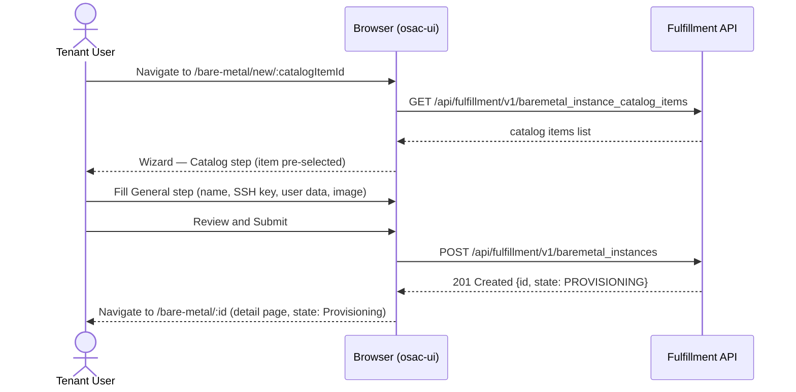

# BareMetal Instance UI

## Summary

This enhancement adds a tenant-facing Bare Metal section to the osac-ui web console, covering a catalog item browser (integrated into the existing Catalog page), a bare metal instance list, a create form (via the existing `CatalogProvisionWizard` adapter pattern), and a detail view with power and restart controls. See [PRD](prd.md) for detailed requirements.

## Motivation

The osac-ui console already supports Virtual Machine and Cluster provisioning. The BareMetalInstance API (see `/enhancements/OSAC-1118-baremetal-instance-api`) adds a third self-service resource type, but the UI has no tenant-facing screens for it. Without a console, tenants must use the gRPC/REST API directly to browse available bare metal offerings, provision instances, monitor lifecycle state, and control power — a workflow that is not viable for the typical Tenant User persona.

The existing `CatalogPage`, `CatalogItemCard`, `CatalogProvisionWizard`, and VM detail patterns are generic enough to extend with minimal duplication. The primary design constraint is reusing this infrastructure rather than introducing parallel implementations.

### Goals

- Reuse the existing `CatalogProvisionAdapter` interface and `CatalogProvisionWizard` for the bare metal create form. [PRD: In Scope — create form]
- Follow the VM detail page structure (`ResourceDetailHeader` + action buttons + tabs) for the bare metal detail view. [PRD: In Scope — detail page]
- Extend the existing `CatalogPage` catalog item browser rather than creating a separate page. [PRD: In Scope — catalog item browser]
- Add a dedicated "Bare Metal" nav item and `/bare-metal/*` route tree. [PRD: In Scope — sidebar section]
- Introduce no new shared UI infrastructure — bare metal is a consumer of existing patterns.
- No new backend API resources, CRDs, proto messages, or controller logic. [PRD: Dependencies — existing BareMetalInstance API]

### Non-Goals

- Tenant Admin catalog item CRUD (create/edit/delete tenant-scoped `BareMetalInstanceCatalogItem`). [PRD: Out of Scope]
- Cloud Provider Admin flows (template and global catalog item management). [PRD: Out of Scope]
- Custom auto-polling logic — TanStack Query's built-in refetch intervals apply.
- User-facing documentation for this milestone (Milestone 0.1). [PRD: Out of Scope]

## Proposal

The implementation extends three areas of the codebase:

1. **`apps/app-frontend`** — nav entry, top-level routing, and page wiring for the new Bare Metal section.
2. **`libs/ui-components` (catalog)** — a "Provision" CTA on the catalog item drawer for bare metal items; bare metal catalog items already appear in `CatalogPage` once a `kind === 'bm'` filter branch is added.
3. **`libs/ui-components` (bare metal pages and components)** — new list page, create page, detail page, action buttons, status label, conditions display, and a `CatalogProvisionAdapter` implementation.

The `BareMetalInstanceCatalogItem`, `BareMetalInstance`, and all associated types are generated from the existing protobuf schema and are already included in `@osac/types`. Two API query hooks (`useBareMetalInstances`, `useBareMetalInstanceCatalogItems`) already exist in `libs/ui-components/src/api/v1/baremetal-instance.ts`. Three mutation hooks are new.

### Workflow Description

**Actors:** Tenant User and Tenant Admin (identical UI flows).

**Starting state:** User is authenticated, the BareMetalInstance fulfillment-service API is reachable, and at least one published `BareMetalInstanceCatalogItem` exists.

#### Browsing the catalog and starting provisioning [PRD: User Story — Tenant User Catalog browsing]

1. Tenant User navigates to **Catalog** in the sidebar.
2. Selects the "Bare Metal Machines" toggle/filter on the `CatalogPage`.
3. Catalog item cards render `title` and Markdown-rendered `description`. No resource summary labels are shown — the current proto has no structured hardware profile fields; hardware is described in free-text `title` and `description` only. [Assumption: no `resources` array on `BareMetalInstanceCatalogItem`]
4. Clicking a card opens the `CatalogItemDetailDrawer` showing the full Markdown-rendered description and a **"Provision bare metal"** button.
5. Clicking **"Provision bare metal"** navigates to `/bare-metal/new/:catalogItemId` with the catalog item pre-selected.

Alternatively, from the **Bare Metal** sidebar item:

1. Tenant User navigates to **Bare Metal** → `/bare-metal` (instance list page).
2. Clicks **"Create bare metal instance"** button.
3. Navigates to `/bare-metal/new` (no pre-selected catalog item).

#### Create form (wizard) [PRD: User Story — Tenant User Provisioning]

The `CatalogProvisionWizard` is reused with a `useBareMetalInstanceAdapter` following the `CatalogProvisionAdapter<BareMetalInstanceCatalogItem, BareMetalInstanceWizardValues, BareMetalInstanceCreateBody>` interface.

Wizard steps:

1. **Catalog** — select a `BareMetalInstanceCatalogItem` (pre-selected if launched from the catalog browser).
2. **General** — instance name (required), SSH public key (optional, OpenSSH format, client-side validated), user data (optional textarea, 64 KB client-side guard), image `source_ref` (optional OCI URL).
3. **Review** — summary of all field values.
4. Submit → `POST /api/fulfillment/v1/baremetal_instances`. On success → navigate to `/bare-metal/:id`.

The BM adapter follows the same catalog overlay pattern as the VM and cluster adapters: static field paths are hardcoded in `BareMetalConfigurationStep`; catalog `field_definitions` overlay matching paths on the Configuration step only, controlling label (`display_name`), editability (`editable: false` → read-only control), default value, and `validation_schema`. The General step (name, SSH public key) ignores `field_definitions`. [Codebase: `catalogProvision/wizard/adapters/computeInstanceAdapter.ts`]



After the `POST` succeeds, the UI navigates to the new instance's detail page where the user monitors async provisioning progress via TanStack Query polling.

#### Instance list [PRD: User Story — Tenant User Lifecycle monitoring]

`/bare-metal` renders `BareMetalListPage`:

- Columns: **Name** (link to `/bare-metal/:id`), **Catalog item**, **State** (state badge), **Age**, **Actions**.
- The **Actions** column contains inline power toggle, restart, and delete controls rendered via `BareMetalActionButtons` — same disabled-state rules as the detail page (see Instance state machine and action semantics below). [PRD: In Scope — inline row actions]
- **"Create bare metal instance"** button navigates to `/bare-metal/new`.
- Empty state shown when no instances exist.
- Pagination: matches the `VmListPage` strategy — server-side pagination using the `pageToken` / `limit` parameters already supported by `useBareMetalInstances`; default page size 20. If `useBareMetalInstances` does not yet expose pagination parameters, client-side slicing to 100 items is used as a stopgap and a follow-up ticket will add server-side pagination.
- TanStack Query refetch interval of 10 seconds (matching `useComputeInstance`) drives live state updates without manual page reload. [PRD: User Story — live state refresh]

#### Instance detail [PRD: User Story — Tenant User Instance management]

`/bare-metal/:id` renders `BareMetalDetailsPage`:

- `ResourceDetailHeader` (breadcrumb: "Bare Metal" → instance name) with state badge.
- `BareMetalActionButtons` toolbar (right-aligned): **Start**, **Stop**, **Restart**, **Delete** — disabled states as defined in the Instance state machine and action semantics section below.
- Detail overview tab: spec summary card (catalog item, SSH key present/absent, user data present/absent, image if set) + conditions list (always rendered; most relevant when FAILED). [PRD: User Story — condition details visible on FAILED instances]

No special FAILED-state recovery CTA — the conditions list provides error details. The only recovery path for a FAILED instance is delete and recreate.

#### Instance state machine and action semantics [PRD: User Story — Tenant User Instance management]

The fulfillment-service exposes two orthogonal fields on a `BareMetalInstance`:

- **`status.state`** — the lifecycle state enum (`PROVISIONING`, `RUNNING`, `FAILED`, `DELETING`). This is the source of truth for button disabled state.
- **`spec.run_strategy`** (or `status.runStrategy` in the response) — the desired power mode (`ALWAYS` = always on, `HALTED` = stopped). This drives which power button (Start vs Stop) is shown.

`HALTED` is not a `status.state` value — it is a `run_strategy` value only. The state machine has exactly four states: `PROVISIONING`, `RUNNING`, `FAILED`, `DELETING`.

The following table defines button behaviour for every combination of `status.state` and `run_strategy`:

| `status.state` | `run_strategy` | Start | Stop | Restart | Delete |
|---|---|---|---|---|---|
| `PROVISIONING` | any | Hidden | Hidden | Disabled | Enabled |
| `RUNNING` | `ALWAYS` or unset | Hidden | Enabled | Enabled | Enabled |
| `RUNNING` | `HALTED` | Enabled | Hidden | Disabled | Enabled |
| `FAILED` | any | Disabled (tooltip) | Disabled (tooltip) | Disabled | Enabled |
| `DELETING` | any | Hidden | Hidden | Disabled | Disabled |

Rules:
- **Start** is shown (not hidden) only when `run_strategy === 'HALTED'` and state is not `PROVISIONING` or `DELETING`. It is disabled (with tooltip "Instance is in a failed state — delete and recreate to recover") when state is `FAILED`.
- **Stop** is shown only when `run_strategy !== 'HALTED'` and state is not `PROVISIONING` or `DELETING`. Disabled when state is `FAILED`.
- **Restart** is enabled only when state is `RUNNING`. Disabled (no tooltip needed) in all other states.
- **Delete** is enabled in all states except `DELETING`. No confirmation is skipped regardless of state.

API calls:

| Action | API call |
|---|---|
| Start | `PATCH { run_strategy: 'ALWAYS' }` |
| Stop | `PATCH { run_strategy: 'HALTED' }` |
| Restart | `PATCH { restart_requested_at: new Date().toISOString() }` |
| Delete | `DELETE /api/fulfillment/v1/baremetal_instances/{id}` after confirmation dialog |

FAILED instances: both Start and Stop are disabled — delete and recreate is the only recovery path. [PRD: User Story — both disabled when FAILED]

### API Extensions

No new API extensions. The feature consumes the existing `BareMetalInstance` and `BareMetalInstanceCatalogItem` public REST endpoints from the fulfillment-service defined in [OSAC-1118](/enhancements/OSAC-1118-baremetal-instance-api). No CRDs, webhooks, proto message changes, database tables, or finalizers are introduced by this UI change. [PRD: In Scope — no backend scope]

New API mutation hooks added to `libs/ui-components/src/api/v1/baremetal-instance.ts`:

| Hook | Method | Endpoint |
|---|---|---|
| `useCreateBareMetalInstance` | `POST` | `/api/fulfillment/v1/baremetal_instances` |
| `usePatchBareMetalInstance` | `PATCH` | `/api/fulfillment/v1/baremetal_instances/{object.id}` |
| `useDeleteBareMetalInstance` | `DELETE` | `/api/fulfillment/v1/baremetal_instances/{id}` |

The PATCH hook sends only the mutated field (`run_strategy` or `restart_requested_at`), consistent with the existing `usePatchComputeInstance` pattern. [Codebase: `api/v1/compute-instance.ts`]

## Implementation Details/Notes/Constraints

### API Field Mapping

The existing `libs/ui-components/src/api/v1/baremetal-instance.ts` file contains query hooks. Mutation hooks and the wizard values type are new additions in this EP.

| UI field (`BareMetalInstanceWizardValues`) | Proto field (OSAC-1118 EP) | Notes / deviation |
|---|---|---|
| `metadata.name` | `metadata.name` | Direct mapping |
| `spec.sshPublicKey` | `spec.ssh_public_key` | camelCase ↔ snake_case via proto-generated types |
| `spec.userData` | `spec.user_data` | camelCase ↔ snake_case; 64 KB guard client-side and server-side |
| `spec.image.sourceRef` | `spec.image.source_ref` | camelCase ↔ snake_case; `sourceType` hardcoded to `"registry"` — per OSAC-1118, `"registry"` is the only valid `sourceType` value in this release; the field is therefore not user-facing and is injected by `buildCreatePayload` rather than captured in wizard values. If OSAC-1118 introduces additional source types in a future EP, this hardcoding will be revisited. |
| `catalogItemId` | `spec.catalog_item_id` | Mapped in `buildCreatePayload`; not a direct proto field on wizard type |
| `run_strategy` | `spec.run_strategy` | PATCH-only field; not part of wizard values (power state managed post-creation) |
| `restart_requested_at` | `spec.restart_requested_at` | PATCH-only field; not part of wizard values |

No deviations from known anti-patterns. All fields use proto-generated types from `@osac/types`; no string-union storage classes, sub-resource actions, or one-time secrets.

### File Layout

New and modified files in `libs/ui-components/src/`:

```
api/v1/baremetal-instance.ts            (exists — add useCreateBareMetalInstance,
                                          usePatchBareMetalInstance, useDeleteBareMetalInstance)
components/bm/
  BareMetalStatusLabel.tsx              state badge (PROVISIONING/RUNNING/FAILED/DELETING)
  BareMetalConditionsList.tsx           conditions table from status.conditions
  BareMetalActionButtons.tsx            power toggle + restart + delete (list and detail)
  DetailsPage/
    BareMetalDetails.tsx                top-level detail layout (mirrors VmDetails)
    BareMetalDetailsCard.tsx            spec summary card
    BareMetalDeleteConfirmModal.tsx     confirmation dialog (mirrors VmDeleteConfirmModal)
pages/tenant/
  BareMetalListPage.tsx                 list page (mirrors VmListPage)
  BareMetalCreatePage.tsx               create page wrapping CatalogProvisionWizard
  BareMetalDetailsPage.tsx              detail page (mirrors VmDetailsPage)
  BareMetalRoutes.tsx                   nested /bare-metal/* router
catalogProvision/wizard/adapters/
  bareMetalInstanceAdapter.ts           CatalogProvisionAdapter implementation
  bareMetalInstance/
    fields.ts                           BareMetalInstanceWizardValues type
    generalFields.ts                    resolveGeneralFields implementation
    payload.ts                          buildCreatePayload + createEmptyValues
    schemas.ts                          per-step Yup schemas
    BareMetalConfigurationStep.tsx      Configuration step component
```

Modified files in `apps/app-frontend/src/`:

```
shellNav.ts          add 'bare-metal' nav entry under getTenantUserNav
AppShell.tsx         add /bare-metal/* RoleRoute
```

Modified files in `libs/ui-components/src/`:

```
pages/tenant/CatalogPage.tsx    add kind === 'bm' branch for bare metal CTA
```

### Nav and Routing Changes (`apps/app-frontend`)

`shellNav.ts` — add to `getTenantUserNav`:
```ts
{ id: 'bare-metal', label: t('Bare Metal'), path: '/bare-metal' }
```

`AppShell.tsx` — add routes:
```tsx
<Route
  path="/bare-metal/*"
  element={
    <RoleRoute allow={['tenantUser', 'tenantAdmin']} ...>
      <BareMetalRoutes />
    </RoleRoute>
  }
/>
```

`BareMetalRoutes.tsx` handles the following routes **in declaration order** (order is significant — the `/new` route must be declared before `/:id` to prevent the router matching `"new"` as an instance ID):

- `/bare-metal/new/:catalogItemId?` → `BareMetalCreatePage`
- `/bare-metal/:id` → `BareMetalDetailsPage`
- `/bare-metal` → `BareMetalListPage`

The create route uses the path segment `/new` rather than `/create` to eliminate any ambiguity with the wildcard `/:id` segment. Navigating to `/bare-metal/new` (no catalog item) and `/bare-metal/new/some-catalog-id` (pre-selected) are both unambiguously handled by the first route.

### Catalog Page CTA for Bare Metal

The existing VM CTA in `CatalogPage.tsx` is conditional on `kind === 'vm'`. A parallel branch is added for `kind === 'bm'`, navigating to `/bare-metal/new/${item.id}`. [Codebase: `pages/tenant/CatalogPage.tsx`]

### `useBareMetalInstanceAdapter`

Implements `CatalogProvisionAdapter<BareMetalInstanceCatalogItem, BareMetalInstanceWizardValues, BareMetalInstanceCreateBody>` following the exact same structure as `useComputeInstanceAdapter`. [Codebase: `catalogProvision/wizard/adapters/computeInstanceAdapter.ts`]

`BareMetalInstanceWizardValues` type:
```ts
interface BareMetalInstanceWizardValues {
  catalogItemId: string;
  metadata: { name: string };
  spec: {
    sshPublicKey: string;          // optional, validated as OpenSSH format
    userData: string;              // optional, max 64 KB enforced in Yup schema
    image: { sourceRef: string };  // optional; sourceType hardcoded to "registry" in payload builder
  };
}
```

SSH key validation (Yup, applied only when field is non-empty):
```ts
.matches(
  /^(ssh-rsa|ssh-ed25519|ecdsa-sha2-nistp\d+)\s+\S+/,
  'Must be a valid OpenSSH public key'
)
```
[PRD: User Story — input validation on SSH public key (OpenSSH format)]

User data size guard (Yup):
```ts
.test('max-64kb', 'User data must be 64 KB or less', (v) =>
  !v || new Blob([v]).size <= 65536
)
```
[PRD: User Story — user data size guard (max 64 KB)]

`buildCreatePayload` maps `BareMetalInstanceWizardValues` → `BareMetalInstanceCreateBody`, hardcoding `image.sourceType = 'registry'` when `image.sourceRef` is set (see API Field Mapping above for rationale).

**`field_definitions` overlay — concrete example:** A catalog item with:
```json
{
  "field_definitions": [
    {
      "path": "spec.userData",
      "editable": false,
      "default": "#!/bin/bash\ninstall-agent.sh",
      "display_name": "Agent bootstrap script"
    }
  ]
}
```
would render the user data field in `BareMetalConfigurationStep` as a read-only textarea pre-filled with `"#!/bin/bash\ninstall-agent.sh"` and labelled "Agent bootstrap script". The implementer cannot change the value. SSH public key (General step) is never affected by `field_definitions`. The same mechanism applies to `spec.image.sourceRef`.

`BareMetalConfigurationStep` — static fields: user data (textarea) and image `source_ref` (text input). No run strategy field — power state is managed post-creation via start/stop action. Catalog `field_definitions` overlay these fields via the mechanism above.

**`NetworkingStep` slot:** The `CatalogProvisionWizard` requires a `NetworkingStep` slot. Bare metal provisioning has no networking step in this release. Before implementation begins, the `CatalogProvisionWizard` source must be checked to confirm whether passing a null-rendering component hides the step from the wizard nav entirely. If the wizard always renders the step label regardless of the component's output (i.e., the slot is not skippable), a bespoke two-step form (Catalog → General → Review, no wizard shell) will be used for bare metal instead of `CatalogProvisionWizard`. See Open Question #3.

### `BareMetalActionButtons`

`BareMetalActionButtons` is rendered in two contexts, controlled by a `variant` prop:

- **`variant="toolbar"`** (detail page): renders all applicable buttons as a PatternFly `ActionList` in the `ResourceDetailHeader` toolbar area, matching the VM detail page layout.
- **`variant="row"`** (list page): renders an overflow kebab menu (`KebabToggle` + `DropdownItem` list) containing the same actions. This keeps the list table cells narrow and avoids layout issues when four action buttons would not fit inline. The kebab menu is consistent with the PatternFly table row action pattern used elsewhere in osac-ui.

In both variants, the same `BareMetalInstance` object is passed as a prop and the same disabled-state logic from the Instance state machine table applies.

### `BareMetalStatusLabel`

| API state | Displayed label | PatternFly color token |
|---|---|---|
| `PROVISIONING` | Provisioning | blue |
| `RUNNING` | Running | green |
| `FAILED` | Failed | red |
| `DELETING` | Deleting | grey |
| unset / unknown | Unknown | grey |

PatternFly color tokens satisfy WCAG AA contrast requirements for status labels. Disabled action buttons include `aria-disabled="true"` and a PatternFly `Tooltip` explaining why the action is unavailable (e.g., "Instance is in a failed state — delete and recreate to recover") — consistent with the VM page implementation. All user-visible strings, including button labels, column headers, state labels, empty-state copy, and error messages, use the `t()` translation function. Server error messages returned from the fulfillment-service API are displayed verbatim (not translated), prefixed with a translated context string such as `t('Server returned an error:')`.

### `BareMetalConditionsList`

Renders `status.conditions` as a `DescriptionList` or compact table with columns: **Condition** (human-readable label from condition `type`), **Status** (`True`/`False`/`Unknown`), **Last transition** (formatted timestamp), **Message** (full text). Rendered on the detail page overview tab — always visible, most informative when state is FAILED. Empty state is rendered when `status.conditions` is empty or absent.

### `BareMetalDeleteConfirmModal`

Opens on Delete action in both list (kebab) and detail (toolbar) contexts. Dialog content:

- Title: `t('Delete bare metal instance?')`
- Body: instance name displayed in bold, followed by `t('This action cannot be undone. The instance and all associated data will be permanently deleted.')`
- Confirm button: `t('Delete')` (PatternFly danger variant)
- Cancel button: `t('Cancel')`

This matches the `VmDeleteConfirmModal` copy with the resource type substituted. On confirm: `DELETE /api/fulfillment/v1/baremetal_instances/{id}` → on success, navigate to `/bare-metal`.

### Polling Interval

All `useBareMetalInstances` and `useBareMetalInstance` (single-item) queries use a **10-second refetch interval**, matching the `useComputeInstance` polling rate. This applies to both the list page and the detail page. The interval is defined as a shared constant `BM_REFETCH_INTERVAL_MS = 10_000` in `api/v1/baremetal-instance.ts`.

### Security Considerations

The bare metal UI consumes the same public REST API as the VM and cluster UIs. All authentication is handled by the Go proxy (OIDC session cookie). OPA authorization is enforced server-side — the UI makes no authorization decisions. Tenant isolation is enforced by the fulfillment-service.

SSH public key and user data are submitted as form fields over HTTPS and are not logged or stored client-side beyond the form lifetime. Client-side validation (OpenSSH format, 64 KB limit) improves UX but does not substitute for server-side enforcement — the fulfillment-service enforces the same constraints independently.

No new authentication, authorization, or data exposure surface is introduced by this change. [PRD: Dependencies — existing security model]

### Failure Handling and Recovery

| Failure | What the user sees | Recovery behavior |
|---|---|---|
| Catalog item list load fails (`GET /baremetal_instance_catalog_items`) | Error state in `CatalogItemListSection` with retry prompt | TanStack Query automatic retry with exponential backoff |
| Instance list load fails (`GET /baremetal_instances`) | Inline error banner on `BareMetalListPage` | TanStack Query automatic retry |
| Create form `POST` fails (server validation error, e.g., `INVALID_ARGUMENT`) | Inline error on the Review step showing the verbatim server error message prefixed with translated context | User corrects input and resubmits |
| Create form `POST` fails (catalog item no longer published, `NOT_FOUND`) | Inline error on the Review step | User returns to Catalog step, selects a published item, resubmits |
| Detail page load fails (`GET /baremetal_instances/{id}`) | Full-page error state with back navigation | User navigates back and retries |
| PATCH (power toggle or restart) fails | Inline error alert near the action buttons | User retries the action; no state corruption (PATCH is idempotent for `run_strategy`) |
| DELETE fails | Error message within the confirmation modal; modal remains open | User retries; instance state unchanged |
| Instance in FAILED state | State badge "Failed" + conditions list with details; Start and Stop disabled with tooltip | User deletes and recreates; no automated recovery |
| Fulfillment-service unreachable (version skew or outage) | TanStack Query error states on all pages; no data corruption | Restoring/upgrading the fulfillment-service restores full functionality without UI restart |

### RBAC / Tenancy

No new RBAC or tenancy changes. The UI is accessible to `tenantUser` and `tenantAdmin` roles enforced by the existing `RoleRoute` guard (same as VMs and clusters). Tenant isolation is enforced server-side by the fulfillment-service — the UI carries no tenant isolation logic. [PRD: In Scope — accessible to Tenant Users and Tenant Admins]

### Observability and Monitoring

No new observability changes. Existing monitoring mechanisms apply.

### Risks and Mitigations

**Risk:** Bare metal catalog cards show no resource summary labels. The current proto has no structured hardware profile fields — hardware is described only in free-text `title` and `description`. Tenants may not be able to compare offerings quantitatively (e.g., CPU count, RAM).
**Mitigation:** `CatalogItemCard` handles this gracefully — the resource label row is omitted when `resources.length === 0`. Title and Markdown description remain fully visible. Structured hardware fields can be added in a future EP when the proto is extended. [Assumption: `CatalogItemCard` renders gracefully with no resource labels]

**Risk:** The `CatalogProvisionWizard` adapter interface requires a `NetworkingStep` slot, but bare metal provisioning has no networking step in this release.
**Mitigation:** See Open Question #3. Resolution is required before implementation begins; fallback is a bespoke two-step form.

**Risk:** SSH key validation regex may not cover all valid OpenSSH key types (e.g., `sk-ssh-ed25519`, FIDO2 resident keys).
**Mitigation:** The regex is applied only when the field is non-empty. The server validates the key independently. An overly strict client-side regex is a UX issue, not a security issue — the user sees a validation error and can clear the field to bypass client-side validation. [Assumption: server accepts FIDO2 key types if they are valid; regex can be extended in a follow-up]

### Drawbacks

The `CatalogProvisionWizard` was designed for flows with a networking step. Bare metal has none, requiring a no-op slot or — if the slot is non-skippable — a bespoke create form. The reuse trade-off is preferred because the wizard's structural reuse reduces maintenance burden. If the slot proves non-skippable, the bespoke form fallback described in Open Question #3 is the accepted alternative.

## Alternatives (Not Implemented)

**Separate "Bare Metal" catalog page.** A dedicated `/bare-metal/catalog` route could render only bare metal catalog items. Rejected because the existing `CatalogPage` already supports multi-type filtering and the tenant expects a single catalog entry point consistent with VM and cluster browsing. A separate catalog page would fragment the discovery UX and require maintaining two catalog list implementations.

**Bespoke create form (not using `CatalogProvisionWizard`).** A simpler single-page form without the wizard step structure. Rejected as the primary path because bare metal provisioning has the same multi-step shape (catalog selection → general fields → review) as VM provisioning, and the wizard's Formik integration, validation orchestration, and catalog item selection UX are directly applicable. Retained as an explicit fallback if Open Question #3 resolves unfavourably.

**Inline power state toggle (switch component) instead of Start/Stop buttons.** A toggle switch could replace the Start/Stop button pair. Rejected because the toggle's intermediate/loading state is harder to communicate than two discrete buttons with clear disabled states, and PatternFly's `ActionList` pattern (used by the VM page) expects discrete action items.

## Open Questions

1. **`BareMetalInstanceCatalogItem` `kind` discriminator:** Does `BareMetalInstanceCatalogItem` include a `kind` discriminator field that `CatalogPage` can use to route items to the correct CTA branch? [Assumption: yes; if not, filtering must be done by a separate list endpoint.]

2. **Sidebar nav grouping:** Should the "Bare Metal" sidebar nav item appear under a "Compute" group alongside Virtual Machines, or as a standalone top-level item? [Assumption: standalone, matching the structure implied by the PRD. Final nav grouping should be confirmed with UX.]

3. **`CatalogProvisionWizard` `NetworkingStep` slot skippability:** Does passing a null-rendering component to the `NetworkingStep` slot hide the step from the wizard nav entirely, or does the wizard always render a "Networking" nav step label regardless? This must be resolved by inspecting `CatalogProvisionWizard`'s source before implementation begins. **If the step cannot be hidden:** the bare metal create form will be implemented as a bespoke three-step form (Catalog → General → Review) without the `CatalogProvisionWizard` shell, accepting the duplication of multi-step navigation in exchange for a clean user experience.

## Test Plan

### Unit Tests

Unit tests use Vitest + React Testing Library.

- **`BareMetalStatusLabel`**: renders correct label text and PatternFly color token for each `BareMetalInstanceState` value (`PROVISIONING`, `RUNNING`, `FAILED`, `DELETING`, unset/unknown).
- **`BareMetalActionButtons` — Start/Stop visibility and disabled states**: Start hidden when PROVISIONING; Stop hidden when PROVISIONING; Start shown and disabled when FAILED with `run_strategy: HALTED`; Stop shown and disabled when FAILED with `run_strategy: ALWAYS`; Start shown and enabled when RUNNING with `run_strategy: HALTED`; Stop shown and enabled when RUNNING with `run_strategy: ALWAYS` or unset; both hidden when DELETING.
- **`BareMetalActionButtons` — Restart**: enabled only when state is `RUNNING`; disabled for all other states.
- **`BareMetalActionButtons` — Delete modal**: opens `BareMetalDeleteConfirmModal` on click; modal closes on cancel; `useDeleteBareMetalInstance` called on confirm; Delete disabled when state is `DELETING`.
- **`BareMetalActionButtons` — variant prop**: `variant="row"` renders a kebab menu; `variant="toolbar"` renders an `ActionList`.
- **`useBareMetalInstanceAdapter` — `buildCreatePayload`**: produces correct wire-format body from `BareMetalInstanceWizardValues`; `image.sourceType` is hardcoded to `'registry'`; optional fields absent when empty.
- **`useBareMetalInstanceAdapter` — SSH key validation**: rejects strings not matching OpenSSH format; accepts `ssh-rsa`, `ssh-ed25519`, `ecdsa-sha2-nistp256`, `ecdsa-sha2-nistp384`, `ecdsa-sha2-nistp521`; passes when field is empty.
- **`useBareMetalInstanceAdapter` — user data size**: rejects payloads where `Blob([v]).size > 65536`; accepts exactly 65536 bytes; passes when field is empty.
- **`BareMetalConditionsList`**: renders condition type, status, last-transition, and message; empty state when `conditions` is empty or undefined.
- **`BareMetalDeleteConfirmModal`**: renders instance name; confirm button triggers delete mutation; cancel closes modal without calling mutation.

Tricky areas: Start/Stop visibility logic when `run_strategy` is unset vs `ALWAYS`; SSH key validation edge cases (ECDSA variants, FIDO2 prefixes); user data size boundary (exactly 64 KB vs 64 KB + 1 byte).

### Integration Tests

Integration tests run against a kind cluster with the fulfillment-service mock or a real API server.

- Creating a `BareMetalInstance` via the wizard submits the correct `POST` body and navigates to the new instance's detail page.
- Patching `run_strategy` via the Start/Stop buttons issues a `PATCH` request with only the `run_strategy` field and updates the list page state badge.
- Patching `restart_requested_at` via the Restart button issues a `PATCH` request with only `restart_requested_at` and does not change `run_strategy`.
- Deleting a `BareMetalInstance` via the confirmation dialog issues a `DELETE` request and navigates to `/bare-metal`.
- TanStack Query 10-second refetch interval updates the list page state badge after an external state change without a page reload.

### E2E Tests

E2E tests follow the osac-test-infra pytest pattern.

- **Happy-path provisioning**: Tenant User authenticates, navigates to Catalog, selects a bare metal item, completes the create wizard, observes the new instance in PROVISIONING state on the detail page, and polls until RUNNING.
- **Start/Stop/Restart lifecycle**: from the instance list page, Tenant User stops a RUNNING instance (state transitions to HALTED run_strategy), starts it again (run_strategy returns to ALWAYS), and restarts it (remains RUNNING).
- **Delete from list**: Tenant User deletes an instance via the inline kebab row action; instance disappears from the list after confirmation.
- **FAILED instance**: Tenant User observes a FAILED instance — Start and Stop are disabled with tooltip, conditions list shows the failure reason, Delete is available and functional.
- **Empty catalog**: Test environment is seeded with zero published `BareMetalInstanceCatalogItem` records. Tenant User applies the bare metal filter on the Catalog page and observes the appropriate empty state in the catalog section.

## Graduation Criteria

Graduation criteria will be defined when targeting a release. Expected progression:

- **Dev Preview (Milestone 0.1):** All four screens (catalog browser, list, create, detail) functional end-to-end against a real fulfillment-service backend. Unit tests passing in CI. Open Question #3 resolved.
- **Tech Preview:** E2E tests in osac-test-infra passing in CI against a staging environment. No known P1/P2 bugs.
- **GA:** Production-validated with at least one tenant. User-facing documentation published in openshift-docs. Accessibility review completed.

## Upgrade / Downgrade Strategy

This is a new UI section with no impact on existing pages or API resources. Upgrade requires no configuration changes — the nav entry and routes are added automatically on UI deployment.

Downgrade (rolling back to a UI version without this feature) requires only reverting the nav entry and route additions. No data migration, CRD removal, or database rollback is needed. Bare metal instances already provisioned via the API remain unaffected.

## Version Skew Strategy

The UI consumes the BareMetalInstance public REST API endpoints defined in OSAC-1118. If the fulfillment-service version deployed does not yet expose these endpoints (e.g., during a staged rollout), all bare metal pages display TanStack Query error states with the API error message. No data corruption occurs and no other UI sections are affected. Upgrading the fulfillment-service to a version that exposes the endpoints restores full functionality without requiring a UI restart or re-deployment.

## Support Procedures

**Symptom:** Catalog item browser shows no bare metal items.
**Diagnosis:** `GET /api/fulfillment/v1/baremetal_instance_catalog_items` returns an empty list or items with `published: false`. Cloud Provider Admin has not published any catalog items.
**Resolution:** Cloud Provider Admin publishes a `BareMetalInstanceCatalogItem` via the private API. No UI change required.

**Symptom:** Create form submission fails with a server error after the Review step.
**Diagnosis (NOT_FOUND on catalog item):** The selected catalog item was deleted or unpublished between catalog load and form submission.
**Resolution:** User returns to the Catalog step, selects a currently published item, and resubmits.
**Diagnosis (INVALID_ARGUMENT on SSH key or user data):** Server rejected the submitted values.
**Resolution:** User corrects the offending field per the error message and resubmits.

**Symptom:** Power toggle (Start/Stop) or Restart action fails silently or shows an inline error.
**Diagnosis:** `PATCH /api/fulfillment/v1/baremetal_instances/{id}` returned a non-2xx response. Check fulfillment-service logs for the instance ID.
**Resolution:** If the instance is in a terminal error state, delete and recreate. If the service is degraded, wait for recovery and retry.

**Symptom:** All bare metal pages show error states simultaneously.
**Diagnosis:** The fulfillment-service is unreachable or returning 5xx errors.
**Resolution:** Verify fulfillment-service health. Restoring the service restores UI functionality without a UI restart.

## Infrastructure Needed

None. This feature is a pure UI consumer of an existing fulfillment-service API. No new repositories, subprojects, or testing infrastructure are required.