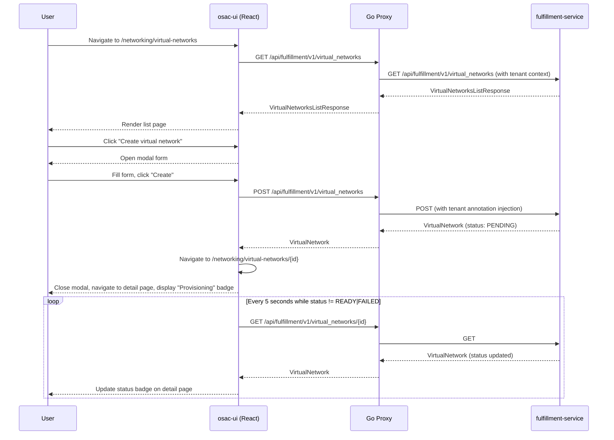

# OSAC Tenant UI: Networking Section

This enhancement adds a dedicated Networking section to the OSAC tenant UI for managing VirtualNetworks, Subnets, SecurityGroups, and PublicIPs, with integrated inline resource creation in the VMaaS wizard. See [PRD](prd.md) for detailed requirements.

## Summary

This design implements a tenant-facing UI for networking resource management using React 19, PatternFly 6, and TanStack Query. The implementation adds list/detail pages for VirtualNetworks, SecurityGroups, and PublicIPs, extends the existing VMaaS wizard with inline networking resource creation, and provides mutation hooks for create/update/delete operations against the fulfillment API. The design follows existing osac-ui patterns for page layout, query hooks, form validation, and wizard integration.

## Motivation

Tenant users and tenant admins currently manage networking resources (VirtualNetworks, Subnets, SecurityGroups, PublicIPs) via CLI or direct API calls. When provisioning VMs through the VMaaS wizard, users must pre-create networking resources in separate tools, then context-switch back to the wizard to select them. This creates friction for new tenants attempting their first VM provisioning and reduces discoverability of networking capabilities.

The fulfillment API already provides full CRUD operations for these resources. The osac-ui codebase includes read-only query hooks (`useVirtualNetworks`, `useSubnets`, `useSecurityGroups`) and a basic wizard networking step (`VmNetworkingStep.tsx`) that lists resources for selection. This design extends the existing foundation with create/update/delete mutation hooks, dedicated pages for resource management, and inline VirtualNetwork creation workflow in the wizard.

The proposed UI leverages PatternFly 6 components (Table, Drawer, Modal, Wizard), TanStack Query for data fetching and cache management, and react-router-dom v7 for navigation. The design reuses existing form components (`SelectField`, `MultiSelectField`, `InputField`) and follows the established pattern for query hooks, page layout, and wizard adapters.

### Goals

- Reuse existing osac-ui patterns for query hooks, page layout, form validation, and wizard integration
- Support inline VirtualNetwork creation from the VMaaS wizard without leaving the wizard flow
- Provide accessible, responsive UI following PatternFly 6 design system and WCAG standards
- Handle resource lifecycle states (Provisioning, Ready, Failed, Deleting) with appropriate UI feedback and auto-refresh
- Enforce single network attachment per VM (one VirtualNetwork, one Subnet, optional SecurityGroups) in the wizard UX

### Non-Goals

- Provider-only resource management (NetworkClass CRUD, PublicIPPool CRUD, NATGateway, ExternalIPAttachment)
- BaremetalInstance or Cluster networking UI (out of scope for VMaaS phase)
- Migration or enhancement of the existing AdminNetworksPage topology view
- Multi-region VirtualNetwork support, cross-VN NIC attachments, and multi-NIC support (deferred to future phase)
- No new fulfillment-service API endpoints, proto messages, database tables, or controllers

## Proposal

This design adds three categories of UI components to osac-ui:

1. **Pages and components** in `libs/ui-components/src`: list pages for VirtualNetworks, SecurityGroups, and PublicIPs; detail pages with tabbed views for Subnets (VN detail) and Rules (SG detail); create/edit forms in modals; delete confirmation modals.

2. **API hooks** in `libs/ui-components/src/api/v1/networking.ts`: mutation hooks (`useCreateVirtualNetwork`, `useDeleteVirtualNetwork`, `usePatchSecurityGroup`, etc.) following the established pattern in `compute-instance.ts`; single-resource query hooks (`useVirtualNetwork(id)`, `useSecurityGroup(id)`, `usePublicIP(id)`); and invalidation helpers for cache management.

3. **Wizard extensions** in `libs/ui-components/src/components/catalogProvision/wizard/adapters/computeInstance/VmNetworkingStep.tsx`: inline VirtualNetwork creation modal; single network attachment UI; PublicIP allocation with IP family selection. Note: Subnet and SecurityGroup selection already exist in `VmNetworkingStep` (SelectField for subnets, MultiSelectField with chips for security groups).

Routing changes in `apps/app-frontend/src/shell` add a "Networking" section to the tenant user and tenant admin sidebars with navigation to `/networking/virtual-networks`, `/networking/security-groups`, and `/networking/public-ips`.

The design leverages the existing fulfillment API endpoints (`/api/fulfillment/v1/virtual_networks`, `/api/fulfillment/v1/subnets`, `/api/fulfillment/v1/security_groups`, `/api/fulfillment/v1/public_ips`, `/api/fulfillment/v1/public_ip_attachments`). No backend changes are required—the API surface is already stable.

### Workflow Description

#### Actor definitions

- **Tenant Admin** — a user with the `tenant-admin` Keycloak role. Can create, update, and delete all networking resources within their tenant.
- **Tenant User** — a user with the `tenant-user` Keycloak role. Can list and view networking resources. Cannot create, update, or delete.
- **Cloud Infrastructure Admin** — a platform-level admin who manages NetworkClasses and PublicIPPools. This role is out of scope for the Networking UI section; those resources are not exposed to tenant users.
- **Cloud Provider Admin** — a provider-level admin responsible for platform infrastructure. NATGateway and ExternalIPAttachment management are provider-only and excluded from this design.

#### Workflow 1: Tenant User or Admin views all Virtual Networks

**Starting state:** User is logged into the Tenant UI. At least one VirtualNetwork exists for the tenant.

1. User clicks **Networking → Virtual Networks** in the sidebar.
2. The UI issues `GET /api/fulfillment/v1/virtual_networks` with the tenant's bearer token.
3. The fulfillment-service applies the tenant filter and returns the list.
4. The UI renders a PatternFly Table with columns: **Name**, **IPv4 CIDR**, **Subnets count**, **Status**.
5. User clicks a row to navigate to the VirtualNetwork detail page (`/networking/virtual-networks/{id}`).
6. Detail page shows three tabs: **Subnets** (default), **Security Groups**, **Details**.

#### Workflow 2: Tenant Admin creates a VirtualNetwork

**Starting state:** Admin is on the Virtual Networks list page.

1. Admin clicks **Create virtual network**.
2. A modal opens with form fields:
   - **Name** (required, DNS-label, max 63 chars, pattern `^[a-z0-9][a-z0-9-]*[a-z0-9]$`)
   - **IPv4 CIDR** (required, /16 to /24 range)
   - **IPv6 CIDR** (optional)
   - Note: NetworkClass is assigned automatically by the platform and is not exposed to tenant users.
3. The UI validates client-side with Formik + Yup. The Create button remains **enabled**; inline errors appear below fields after blur or failed submit attempt.
4. Admin clicks **Create**. The UI issues `POST /api/fulfillment/v1/virtual_networks` with `{ object: { metadata: { name }, spec: { ipv4_cidr, ipv6_cidr } } }`.
5. On success (201), the modal closes and the UI navigates to the VirtualNetwork detail page showing `Provisioning` status.
6. Auto-refresh polls every 5 seconds until status becomes `Ready` or `Failed`.

**Error sub-flow — duplicate name:**
Server returns 409/`ALREADY_EXISTS`. Modal displays: "VirtualNetwork with this name already exists in your tenant."

**Error sub-flow — invalid CIDR:**
Server returns 400/`INVALID_ARGUMENT`. Field-level error appears below the CIDR input.

#### Workflow 3: Tenant Admin creates a Subnet from VirtualNetwork detail page

1. Admin is on the VirtualNetwork detail page, **Subnets** tab.
2. Admin clicks **Create subnet**.
3. Modal opens with parent VN pre-selected (read-only). Helper text shows parent VN CIDR and existing subnet CIDRs.
4. Admin enters **Name** (required, DNS-label) and **CIDR** (required, within parent VN CIDR, no overlap with existing subnets).
5. `POST /api/fulfillment/v1/subnets` with `{ object: { metadata: { name }, spec: { virtual_network, ipv4_cidr } } }`.
6. On success, modal closes and Subnets tab refreshes.

**Error sub-flow — CIDR not a subset:**
Server returns 400. UI highlights the CIDR field: "CIDR must be within the parent Virtual Network's CIDR range."

#### Workflow 4: Tenant Admin creates/updates a SecurityGroup

**Create:**
1. Admin navigates to **Networking → Security Groups** → **Create security group**.
2. Form fields:
   - **Virtual Network** (required, dropdown)
   - **Name** (required, DNS-label)
   - **Inbound Rules** (expandable section, repeatable rule editor)
   - **Outbound Rules** (expandable section, same structure)
3. Each rule: Protocol (TCP/UDP/ICMP/All), Port Range (disabled for ICMP), Source/Destination CIDR.
4. `POST /api/fulfillment/v1/security_groups` with full rule sets.

**Update (rules):**
1. Admin opens SecurityGroup detail → **Inbound Rules** or **Outbound Rules** tab → **Add Rule** / **Edit** / **Delete** row actions.
2. Each action immediately submits `PATCH /api/fulfillment/v1/security_groups/{id}` with the full updated rule set.
3. `spec.virtual_network` is immutable and rendered read-only.

#### Workflow 5: Tenant Admin allocates a PublicIP

1. Admin navigates to **Networking → Public IPs** → **Allocate IP**.
2. Form fields:
   - **Name** (required)
   - **Pool** (required, dropdown showing `"pool-name (Available: N IPs)"`)
3. `POST /api/fulfillment/v1/public_ips` with `{ object: { metadata: { name }, spec: { pool } } }`.
4. On success, new PublicIP appears with `Available` status.

**Error sub-flow — pool exhausted:**
Server returns 400. UI: "The selected pool has no available addresses. Choose a different pool or contact your Cloud Infrastructure Admin."

#### Workflow 6: Tenant Admin attaches/detaches a PublicIP

**Attach:**
1. Admin clicks **Attach** on an `Available` PublicIP row.
2. Side drawer opens with searchable table of ComputeInstances.
3. Admin selects a VM, clicks **Attach**.
4. `POST /api/fulfillment/v1/public_ip_attachments` with `{ public_ip_id, resource_id, resource_type: "ComputeInstance" }`.
5. Drawer closes; row updates to `Attached` with VM name in "Attached To" column.

**Detach:**
1. Admin clicks **Detach** on an `Attached` PublicIP row.
2. Confirmation modal warns: "The VM will lose external connectivity on this IP."
3. `DELETE /api/fulfillment/v1/public_ip_attachments/{attachmentId}`.

#### Workflow 7: Provision a VM with inline VirtualNetwork creation

**Starting state:** User is in the VMaaS wizard, reaches the Network Configuration step.

1. If no VirtualNetworks exist: prominent message "You need to create a virtual network before provisioning a VM" with **Create Virtual Network** button.
   - User clicks button; Create VN modal overlays the wizard.
   - After successful creation, modal closes and wizard auto-selects the new VN.
2. Network Attachment section shows:
   - **Virtual Network** (dropdown, auto-selected if only 1), with **"Create new VN"** link
   - **Subnet** (SelectField, filtered to selected VN, auto-selected if only 1) — existing control in `VmNetworkingStep`
   - **Security Groups** (MultiSelectField with chips, filtered to selected VN, pre-checked if only 1) — existing control in `VmNetworkingStep`
   - Note: "Create new Subnet" and "Create new Security Group" links are NOT added — only VirtualNetwork inline creation is in scope.
3. **Public IP** section: checkbox "Allocate Public IP" (default checked for new tenants with no existing IPs), IP Family dropdown (IPv4/IPv6, default IPv4).
4. User clicks **Create VM**.
5. If checkbox checked: `POST /api/fulfillment/v1/public_ips` (with IP family), then `POST /api/fulfillment/v1/compute_instances`, then `POST /api/fulfillment/v1/public_ip_attachments`.
6. Wizard closes; user redirected to VM detail page.

**Error handling:**
- Validation failure: inline errors below invalid fields; Create button stays enabled.
- API error (4xx/5xx): toast notification with error message; form remains open with user input preserved.
- Provisioning failure: resource transitions to `Failed`; detail page shows non-dismissible inline danger alert (see Failure Handling section).



The same polling pattern applies to Subnets, SecurityGroups, and PublicIPs (PublicIPs use AVAILABLE/ATTACHED states; both are terminal for polling purposes). Post-create navigation to a detail page applies to VirtualNetworks, SecurityGroups, and PublicIPs; Subnets remain on the parent VN detail page.

### API Extensions

This design introduces **no new API extensions**. The fulfillment API already provides the required gRPC services and REST gateway endpoints:

- `VirtualNetworks` service: List, Get, Create, Patch, Delete
- `Subnets` service: List, Get, Create, Delete (no Patch — subnets are immutable after creation)
- `SecurityGroups` service: List, Get, Create, Patch, Delete
- `PublicIPs` service: List, Get, Create, Delete
- `PublicIPAttachments` service: Create (attach), Delete (detach)
- `PublicIPPools` service: List (read-only for tenants)

`NetworkClasses` are platform-assigned and not exposed to tenant users. The fulfillment API assigns `spec.network_class` automatically during VirtualNetwork creation. No CRD changes, webhooks, or finalizers are required.

### Implementation Details/Notes/Constraints

#### File Structure

Following NFR-3, the implementation adds these files to `libs/ui-components/src`:

**Pages** (new directory: `pages/networking/`):
- `pages/networking/VirtualNetworksPage.tsx` — list page with table, toolbar (search/filter/sort), empty state, "Create" button
- `pages/networking/VirtualNetworkDetailPage.tsx` — detail page with tabs (Subnets, Security Groups, Details), breadcrumb, status badge, Delete action
- `pages/networking/SecurityGroupsPage.tsx` — list page
- `pages/networking/SecurityGroupDetailPage.tsx` — detail page with tabs (Inbound Rules, Outbound Rules, Details)
- `pages/networking/PublicIPsPage.tsx` — list page with Allocate/Attach/Detach/Release actions

**Components** (new directory: `components/networking/`):
- `components/networking/VirtualNetworkCreateModal.tsx` — create modal (used in list page and wizard inline creation)
- `components/networking/SubnetCreateModal.tsx` — create modal with parent VN CIDR helper text
- `components/networking/SecurityGroupCreateModal.tsx` — create modal with inline rule management
- `components/networking/SecurityGroupRuleRow.tsx` — reusable rule input row (Protocol dropdown, Port Range input, CIDR input)
- `components/networking/VirtualNetworkStatusLabel.tsx` — wrapper for ResourceStatusLabel with VN state mapping
- `components/networking/SecurityGroupStatusLabel.tsx` — wrapper for ResourceStatusLabel with SG state mapping
- `components/networking/PublicIPStatusLabel.tsx` — wrapper for ResourceStatusLabel with PublicIP state mapping
- `components/networking/PublicIPAllocateModal.tsx` — modal dialog for IP allocation
- `components/networking/PublicIPAttachDrawer.tsx` — side drawer with VM selection table (attach flow only)
- `components/networking/SubnetsTable.tsx` — table component for Subnets tab
- `components/networking/SecurityGroupsTable.tsx` — table component for SG list and VN detail SG tab
- `components/networking/SecurityGroupRulesTable.tsx` — table component for Inbound/Outbound rules tabs with Add/Edit/Delete actions

**API hooks** (extend `api/v1/networking.ts`):

Current state of the file:
```typescript
// Read-only hooks (already exist)
export const useVirtualNetworks = (params?, options?) => useApiQuery<VirtualNetworksListResponse, VirtualNetwork[]>(...)
export const useSubnets = (params?, options?) => useApiQuery<SubnetsListResponse, Subnet[]>(...)
export const useSecurityGroups = (params?, options?) => useApiQuery<SecurityGroupsListResponse, SecurityGroup[]>(...)
```

New additions to `api/v1/networking.ts`:
```typescript
// Single-resource getters
export const useVirtualNetwork = (id: string) =>
  useApiQuery<VirtualNetwork>({
    queryKey: ['v1/virtual_networks', [id]],
    meta: { decode: VirtualNetworkSchema },
    enabled: Boolean(id?.trim()),
  });

export const useSubnet = (id: string) => useApiQuery<Subnet>({ queryKey: ['v1/subnets', [id]], ... });
export const useSecurityGroup = (id: string) => useApiQuery<SecurityGroup>({ queryKey: ['v1/security_groups', [id]], ... });
export const usePublicIP = (id: string) => useApiQuery<PublicIP>({ queryKey: ['v1/public_ips', [id]], ... });

// Mutation hooks
export const useCreateVirtualNetwork = () => {
  const apiFetch = useApiFetch();
  const qc = useApiQueryClient();
  return useMutation({
    mutationFn: async (vn: VirtualNetworkInput) =>
      apiFetch<VirtualNetwork>('v1/virtual_networks', {
        method: 'POST',
        body: { object: vn },
        decode: VirtualNetworkSchema,
      }),
    onSuccess: () => invalidateVirtualNetworksQueries(qc),
  });
};

export const useDeleteVirtualNetwork = () => {
  const apiFetch = useApiFetch();
  const qc = useApiQueryClient();
  return useMutation({
    mutationFn: (id: string) =>
      apiFetch<void>('v1/virtual_networks', { pathParams: [id], method: 'DELETE' }),
    onSuccess: () => invalidateVirtualNetworksQueries(qc),
  });
};

// Patch hook for SecurityGroups (rule updates)
export const usePatchSecurityGroup = () => {
  const apiFetch = useApiFetch();
  const qc = useApiQueryClient();
  return useMutation({
    mutationFn: ({ id, patch }: { id: string; patch: Partial<SecurityGroup> }) =>
      apiFetch<SecurityGroup>('v1/security_groups', {
        pathParams: [id],
        method: 'PATCH',
        body: { object: patch, field_mask: { paths: Object.keys(patch) } },
        decode: SecurityGroupSchema,
      }),
    onSuccess: () => invalidateSecurityGroupsQueries(qc),
  });
};

// PublicIP mutation hooks
export const useCreatePublicIP = () => {
  const apiFetch = useApiFetch();
  const qc = useApiQueryClient();
  return useMutation({
    mutationFn: async (ip: PublicIPInput) =>
      apiFetch<PublicIP>('v1/public_ips', {
        method: 'POST',
        body: { object: ip },
        decode: PublicIPSchema,
      }),
    onSuccess: () => invalidatePublicIPsQueries(qc),
  });
};

export const useDeletePublicIP = () => {
  const apiFetch = useApiFetch();
  const qc = useApiQueryClient();
  return useMutation({
    mutationFn: (id: string) =>
      apiFetch<void>('v1/public_ips', { pathParams: [id], method: 'DELETE' }),
    onSuccess: () => invalidatePublicIPsQueries(qc),
  });
};

// PublicIP attach/detach hooks
export const useAttachPublicIP = () => {
  const apiFetch = useApiFetch();
  const qc = useApiQueryClient();
  return useMutation({
    mutationFn: ({ publicIpId, resourceId, resourceType }: AttachPublicIPInput) =>
      apiFetch<PublicIPAttachment>('v1/public_ip_attachments', {
        method: 'POST',
        body: { object: { public_ip_id: publicIpId, resource_id: resourceId, resource_type: resourceType } },
        decode: PublicIPAttachmentSchema,
      }),
    onSuccess: () => {
      invalidatePublicIPsQueries(qc);
      invalidateComputeInstancesQueries(qc); // Refresh VM list to show attached IP
    },
  });
};

export const useDetachPublicIP = () => {
  const apiFetch = useApiFetch();
  const qc = useApiQueryClient();
  return useMutation({
    mutationFn: (attachmentId: string) =>
      apiFetch<void>('v1/public_ip_attachments', { pathParams: [attachmentId], method: 'DELETE' }),
    onSuccess: () => {
      invalidatePublicIPsQueries(qc);
      invalidateComputeInstancesQueries(qc);
    },
  });
};

// Cache invalidation helpers
const invalidateVirtualNetworksQueries = async (qc: ReturnType<typeof useApiQueryClient>) => {
  await qc.invalidateQueries({ queryKey: apiQueryKey('v1/virtual_networks', null) });
};
// ... similar invalidation helpers for subnets, security_groups, public_ips
```

Pattern follows `api/v1/compute-instance.ts`: mutation hooks use `useMutation` from TanStack Query, call `apiFetch` with method/body/decode, and invalidate relevant queries in `onSuccess`.

**Wizard integration** (extend existing file `VmNetworkingStep.tsx`):

The file currently implements Subnet selection via `SelectField` and SecurityGroup selection via `MultiSelectField` with chips. The design extends it with:

1. **Inline VirtualNetwork creation modal:** "Create new VN" link opens `<VirtualNetworkCreateModal />` as a Modal overlay on the wizard. After `onSuccess`, the modal closes and the VirtualNetwork dropdown refetches and auto-selects the new VN via TanStack Query cache invalidation. **Note:** Subnet and SecurityGroup inline creation are NOT added.

2. **Single network attachment:** State variable `attachment: { virtualNetworkId, subnetId, securityGroupIds }`. Exactly one network attachment per VM enforced in this phase.

3. **PublicIP allocation:** Checkbox "Allocate Public IP" (default checked for new tenants with no existing IPs) and IP Family dropdown. When checked, a pre-flight `POST /api/fulfillment/v1/public_ips` allocates an IP before VM creation.

**Navigation changes:**

`apps/app-frontend/src/shell/shellNav.ts`:

```typescript
// In getTenantUserNav():
{
  kind: 'section',
  sectionId: 'nav-tenant-networking',
  label: t('Networking'),
  children: [
    { id: 'virtual-networks', label: t('Virtual Networks'), path: '/networking/virtual-networks' },
    { id: 'security-groups', label: t('Security Groups'), path: '/networking/security-groups' },
    { id: 'public-ips', label: t('Public IPs'), path: '/networking/public-ips' },
  ],
},

// In getTenantAdminNav(), under 'nav-admin-mgmt' section:
{
  kind: 'section',
  sectionId: 'nav-admin-networking',
  label: t('Networking'),
  children: [
    { id: 'virtual-networks', label: t('Virtual Networks'), path: '/networking/virtual-networks' },
    { id: 'security-groups', label: t('Security Groups'), path: '/networking/security-groups' },
    { id: 'public-ips', label: t('Public IPs'), path: '/networking/public-ips' },
  ],
},
// Preserve existing 'nav-admin-infra' section with admin-networks (topology view)
```

`apps/app-frontend/src/shell/AppShell.tsx` adds routes:

```typescript
<Route path="/networking/virtual-networks" element={<VirtualNetworksPage />} />
<Route path="/networking/virtual-networks/:id" element={<VirtualNetworkDetailPage />} />
<Route path="/networking/security-groups" element={<SecurityGroupsPage />} />
<Route path="/networking/security-groups/:id" element={<SecurityGroupDetailPage />} />
<Route path="/networking/public-ips" element={<PublicIPsPage />} />
```

#### Routing Structure

```
/networking                           → redirect to /networking/virtual-networks
/networking/virtual-networks          → VirtualNetworks list page
/networking/virtual-networks/:id      → VirtualNetwork detail page (tabs: Subnets, Security Groups, Details)
/networking/security-groups           → SecurityGroups list page
/networking/security-groups/:id       → SecurityGroup detail page (tabs: Inbound Rules, Outbound Rules, Details)
/networking/public-ips                → PublicIPs list page
```

Note: Subnets do not have a top-level sidebar entry or a top-level route. They are managed exclusively from the VirtualNetwork detail page (Subnets tab), per PRD FR-13.

#### Data Models

The UI consumes protobuf-generated TypeScript types from `libs/types/src/osac/public/v1/`. Key interfaces:

```typescript
interface VirtualNetwork {
  id: string;
  metadata?: {
    name?: string;
    labels?: Record<string, string>;
    created_at?: Timestamp;
  };
  spec?: {
    network_class?: string;  // Platform-assigned, not shown to tenant users
    ipv4_cidr?: string;      // Required, /16 to /24
    ipv6_cidr?: string;      // Optional
  };
  status?: {
    state?: VirtualNetworkState;  // PENDING, READY, FAILED, DELETING
    message?: string;
  };
}

interface Subnet {
  id: string;
  metadata?: { name?: string; };
  spec?: {
    virtual_network?: string;  // Parent VN ID; immutable after creation
    ipv4_cidr?: string;        // Required, within parent VN CIDR; immutable after creation
  };
  status?: { state?: SubnetState; message?: string; };
}

interface SecurityGroup {
  id: string;
  metadata?: { name?: string; };
  spec?: {
    virtual_network?: string;          // Immutable after creation
    inbound_rules?: SecurityGroupRule[];
    outbound_rules?: SecurityGroupRule[];
  };
  status?: { state?: SecurityGroupState; message?: string; };
}

interface SecurityGroupRule {
  protocol?: string;    // "TCP" | "UDP" | "ICMP" | "All"
  port_range?: string;  // e.g., "22", "80-443", empty for ICMP/All
  cidr?: string;        // Source (inbound) or Destination (outbound) CIDR
  description?: string;
}

interface PublicIP {
  id: string;
  metadata?: { name?: string; };
  spec?: {
    pool?: string;     // PublicIPPool ID; immutable after allocation
    address?: string;  // Assigned by provider
  };
  status?: {
    state?: PublicIPState;  // PENDING, AVAILABLE, ATTACHED, FAILED, DELETING
    message?: string;
  };
}

interface PublicIPPool {
  id: string;
  metadata?: { name?: string; };
  spec?: { available_count?: number; };
}
```

#### Form Validation

All forms use Formik for state management and Yup for schema validation. The Create button stays **enabled**; validation errors are surfaced after blur or failed submit attempt.

**VirtualNetwork:**
- `metadata.name`: required, DNS-valid (RFC 1123 subdomain: lowercase alphanumeric, hyphens, max 63 chars)
- `spec.network_class`: platform-assigned, hidden from tenant users, omitted from create request
- `spec.ipv4_cidr`: required, valid CIDR notation, prefix length between /16 and /24 (implementation should use a proper CIDR validation library such as `cidr-regex` or `ip-address`; a simple Yup regex `/^(\d{1,3}\.){3}\d{1,3}\/(1[6-9]|2[0-4])$/` is illustrative only and does not fully validate IPv4 octets)
- `spec.ipv6_cidr`: optional, valid IPv6 CIDR if provided

**Subnet:**
- `metadata.name`: required, DNS-valid
- `spec.virtual_network`: required, pre-filled from parent VN, read-only
- `spec.ipv4_cidr`: required, valid CIDR, within parent VN CIDR (client-side check via ip-address library), no overlap with existing subnets (checked by fetching existing subnets for the VN)

**SecurityGroup:**
- `metadata.name`: required, DNS-valid
- `spec.virtual_network`: required
- Rule fields: `protocol` required; `port_range` required if TCP/UDP (format: `"22"` or `"80-443"`, regex `/^\d+(-\d+)?$/`), disabled for ICMP/All; `cidr` required, valid CIDR notation

**PublicIP:**
- `metadata.name`: required (user-provided label)
- `spec.pool`: required, must match an existing PublicIPPool ID

Error messages follow: `"{Field name} {validation rule}"`. Examples:
- "Name is required"
- "IPv4 CIDR must be in /16 to /24 range"
- "Subnet CIDR must be within parent VirtualNetwork CIDR 10.0.0.0/16"
- "Port range is invalid. Use a single port (22) or range (80-443)"

#### Status Handling and Auto-Refresh

Status badges use the shared `ResourceStatusLabel` component with resource-specific wrappers (`VirtualNetworkStatusLabel`, `SecurityGroupStatusLabel`, `PublicIPStatusLabel`) that map API state to `StatusKind`. This follows the same pattern as `VmStatusLabel` and `ClusterStatusLabel`.

State → StatusKind mapping:
- PENDING (Provisioning): `StatusKind.InProgress` (blue, spinner icon)
- READY: `StatusKind.Success` (green)
- FAILED: `StatusKind.Danger` (red)
- DELETING: `StatusKind.InProgress` (blue, spinner icon)
- AVAILABLE (PublicIPs): `StatusKind.Success` (green)
- ATTACHED (PublicIPs): `StatusKind.Info` (blue)

**Auto-refresh via TanStack Query `refetchInterval`:**

```typescript
const { data: virtualNetworks = [], refetch } = useVirtualNetworks(
  {},
  {
    refetchInterval: (data) => {
      const hasNonTerminalState = data?.some(
        (vn) => vn.status?.state === 'PENDING' || vn.status?.state === 'DELETING'
      );
      return hasNonTerminalState ? 5000 : false; // 5 seconds if any resource is in non-terminal state
    },
  }
);
```

Detail pages use the same pattern for single-resource polling. On window focus, TanStack Query auto-refetches (default behavior).

**Delete action behavior:**
- Resources in PENDING or DELETING state: Delete button is disabled (grayed out).
- Delete with optimistic update: row is immediately grayed out; if DELETE fails with 500, the optimistic update is rolled back and an error toast is shown.
- If DELETE returns 400 (business rule violation), show error modal with API message.

#### PublicIPPool Selector

When allocating a PublicIP, the Pool dropdown fetches `GET /api/fulfillment/v1/public_ip_pools` when the modal opens (`enabled: isModalOpen` in query options). Each pool is rendered as:
```
<pool.metadata.name> (Available: N IPs)
```
Pools with `available_count == 0` are shown but disabled with "(no addresses available)" suffix.

#### SecurityGroup Rule Editor

The SecurityGroupRulesTable provides Add/Edit/Delete actions per rule. Each Edit or Delete immediately submits a PATCH with the full updated rule set (no client-side batching). This is simpler than accumulating changes and matches the immediate-feedback pattern used elsewhere in the UI.

Port fields are disabled when Protocol is ICMP or All. At least one of IPv4 or IPv6 CIDR is required per rule.

#### Pagination

Pagination is **out of scope** for this feature. Existing osac-ui list tables (VMs, clusters, catalog) do not use PatternFly `Pagination`. Networking list pages follow the same non-paginated pattern for consistency. Pagination should be tracked as a separate Jira to implement holistically for all list pages.

#### Responsive Design

- **Tables:** PatternFly responsive table pattern — on screens < 768px, tables use compound expansion (row shows only Name, clicking expands to show all details inline).
- **Side panels:** PatternFly `Drawer` with `isInline={false}` becomes full-width on mobile.
- **Sidebar:** PatternFly `PageSidebar` is collapsible on all screen sizes (existing osac-ui behavior).

#### Accessibility

- **Form labels:** All inputs use PatternFly `FormGroup` with `label` prop.
- **Status badges:** `ResourceStatusLabel` via resource-specific wrappers handles `aria-label` automatically (e.g., `aria-label="Status: Ready"`).
- **Keyboard navigation:** All interactive elements are keyboard-accessible; PatternFly handles focus management.
- **Modal focus trap:** PatternFly `Modal` traps focus when open.
- **Live regions:** Status changes announced via `aria-live="polite"` region wrapping the status badge.
- **Helper text:** CIDR inputs include helper text: "Enter a CIDR range (e.g., 10.0.0.0/16)".

### Security Considerations

The design inherits the existing osac-ui security model without changes:

- **Authentication:** Handled by the Go proxy (`proxy/`). The proxy validates OIDC tokens and forwards authenticated requests to fulfillment-service with tenant context in headers. No new authentication flows are introduced.
- **Tenant isolation:** Enforced by fulfillment-service. All networking resources carry `osac.openshift.io/tenant` annotation (injected server-side). OPA policies enforce tenant isolation — tenants can only see and modify their own resources. The UI inherits this isolation transparently.
- **Input validation:** Client-side validation (Formik + Yup) is a UX convenience only. The fulfillment API performs authoritative server-side validation and returns 400 with error messages for invalid requests.
- **RBAC:** No RBAC changes required. Tenant users and tenant admins both access the Networking section; the API enforces the same CRUD permissions for both roles. NetworkClass and PublicIPPool resources are platform-defined (read-only for tenants). No new privilege escalation paths are introduced.
- **Data exposure:** The UI does not expose sensitive data. No secrets, tokens, or passwords are introduced by this feature.

### Failure Handling and Recovery

#### Client-Side Failures

**Network errors (fetch failures):**
- TanStack Query retries failed GET requests up to 3 times with exponential backoff (default behavior).
- If all retries fail, list pages show an empty state with "Failed to load" message and a "Retry" button.
- Mutation errors (POST/PATCH/DELETE) are not retried automatically. The UI shows a toast notification with the error message and keeps the form open with user input preserved. User can click "Retry" to re-submit.

**Double-submission prevention:**
- CREATE operations are not idempotent. The UI prevents double-submission by disabling the "Create" button after the first click and re-enabling it only if the request fails.
- PATCH and DELETE operations are idempotent; retrying is safe.

**Validation errors:**
- Client-side (Yup): inline errors below each invalid field after blur or failed submit. An inline validation alert also appears at the top of the form if submit is attempted with errors.
- Server-side (400 responses): toast notification with the API-provided error message verbatim (e.g., "VirtualNetwork with name 'prod-network' already exists").

#### API-Side Failures

**Provisioning failures:**
- If a resource fails to provision (transitions to FAILED state), the detail page shows:
  - `VirtualNetworkStatusLabel` (or resource-specific wrapper) in the page header displaying "Failed" status.
  - A non-dismissible inline danger Alert (`variant="danger" isInline`) below the header with **Title:** "Provisioning failed", **Body:** `status.message` from the API, **actionLinks:** "Retry" and "Delete".
  - The Details tab shows a DescriptionList with Status and Message rows (same pattern as cluster Conditions).
- **Retry** re-submits the original POST request. The UI does not persist intermediate state — users must re-enter form data if retry also fails.
- **Delete** removes the failed resource via DELETE request.

**Delete failures:**
- If DELETE returns 400 (e.g., VirtualNetwork has children): error modal with message "Cannot delete VirtualNetwork '{name}'. Delete all subnets and security groups first."
- If DELETE returns 500: toast "Failed to delete. Please try again." Optimistic update is rolled back; resource remains in list.
- No automatic retry for DELETE failures.

**Delete blocked by resource state:**
- User attempts to delete a resource in PENDING or DELETING state: Delete button is disabled. If the server nonetheless returns FAILED_PRECONDITION, the UI shows: "Cannot delete this resource while it is in a pending state. Please wait until it reaches a terminal state."

**Concurrent modification:**
- SecurityGroup rule edits use immediate PATCH (last-write-wins). If two admins edit rules simultaneously, the second PATCH overwrites the first. This is accepted as a trade-off for simpler state management; optimistic locking can be added in a future iteration if conflicts become a support burden.

**Controller reconciliation failures:**
- If osac-operator fails to reconcile a VirtualNetwork CRD, the resource may remain in PENDING state indefinitely or transition to FAILED if the controller sets an error condition.
- The UI auto-refresh (5-second polling) continues until a terminal state is reached or the user navigates away.
- If a resource is stuck in PENDING, no special client-side timeout is enforced — the user sees the spinner and can contact support. [Assumption: stuck resources are a support/operational concern, not a UI concern]

**Token expiry mid-session:**
- Keycloak token expires while user is in the Networking section.
- The existing Keycloak refresh-token mechanism (used by all Tenant UI pages) silently refreshes the token. If refresh also fails, the user is redirected to the login page. [Assumption: existing mechanism applies without changes]

**fulfillment-service unavailable:**
- All API calls fail with a network error or 5xx. TanStack Query exhausts retries.
- List pages show empty state with: "Unable to load networking resources. The service may be temporarily unavailable. Please try again." with a Retry button.
- Create/update forms remain open so the user does not lose their input.

**Pool exhausted on PublicIP allocation:**
- Server returns 400. Modal shows: "The selected pool has no available addresses. Choose a different pool or contact your Cloud Infrastructure Admin."
- User selects another pool or closes the modal.

### RBAC / Tenancy

No new RBAC roles or Keycloak realms are introduced. The Networking UI section is governed by existing roles:

| Role | Allowed operations |
|---|---|
| `tenant-admin` | List, Get, Create, Update, Delete all networking resources |
| `tenant-user` | List and Get all networking resources (read-only) |
| Cloud Infrastructure Admin | NetworkClass/PublicIPPool management (provider-only, not in this UI) |
| Cloud Provider Admin | NATGateway, ExternalIPAttachment management (provider-only, not in this UI) |

All API-level enforcement is performed by the fulfillment-service and OPA policies. The UI reflects these permissions by conditionally rendering action buttons based on the decoded Keycloak token role claim (following the existing pattern used for Compute and Cluster sections).

Tenant scoping: all networking resources carry `osac.openshift.io/tenant` annotation set by the fulfillment-service on create. The UI never sets or overrides the tenant field. Listing is automatically scoped to the calling user's tenant by the fulfillment-service.

Parent-child relationships (VirtualNetwork → Subnets, VirtualNetwork → SecurityGroups) use `osac.openshift.io/owner-reference` annotations. The UI does not directly interact with these annotations — deletion blocking is enforced by the API (returns 400 if children exist).

### Observability and Monitoring

No new observability changes are required. This is a UI-only enhancement. Existing observability mechanisms apply:

- **Metrics:** fulfillment-service already emits Prometheus metrics for API request rates, latencies, and error rates by endpoint and status code. The new UI workflows increase traffic to existing endpoints but do not require new metrics.
- **Events:** Kubernetes events for CRD reconciliation are emitted by osac-operator (existing behavior). The UI does not consume these directly — it polls resource status via the API.
- **Logging:** The Go proxy logs all HTTP requests (method, path, status code, duration). No new log entries are required.

### Risks and Mitigations

**Risk 1: PublicIP attach/detach API endpoint availability**

The PRD assumes `/api/fulfillment/v1/public_ip_attachments` endpoints exist for Attach (POST) and Detach (DELETE). If these endpoints are not implemented:
- **Mitigation:** Verify endpoint availability during design review. If missing, file a Jira issue. If endpoints cannot be delivered in time, defer PublicIP attach/detach UI to a future milestone.

**Risk 2: Subnet immutability not clearly communicated**

Subnets have no PATCH endpoint — CIDR is immutable after creation. Users may expect an edit action.
- **Mitigation:** Add helper text to Subnet detail: "Subnet CIDR cannot be changed after creation. To use a different CIDR, delete this subnet and create a new one."

**Risk 3: SecurityGroup rule update concurrent edits**

Editing one rule replaces the entire rule set via PATCH. Two concurrent edits result in last-write-wins.
- **Mitigation:** Accept this trade-off for the initial implementation. Immediate PATCH per action is simpler and matches existing UI patterns. Add optimistic locking (ETag-based) in a future iteration if conflicts become a support burden.

**Risk 4: PublicIPPool available count staleness**

`available_count` is eventually consistent. The displayed count in the pool dropdown may be stale.
- **Mitigation:** Refetch PublicIPPools when the Allocate IP modal opens. Accept minor staleness — if allocation fails due to pool exhaustion, the API returns 400 and the user selects a different pool.

**Risk 5: Wizard VN requirement enforcement ambiguity**

It is unclear whether the fulfillment API enforces "VirtualNetwork is required on ComputeInstance" server-side.
- **Mitigation:** Wizard validates required fields client-side for helpful errors before submission, but relies on API validation as the authoritative check. If the API does not enforce the constraint, file a Jira to add server-side validation.

**Risk 6: Performance degradation with large resource counts**

Non-paginated list pages may degrade with large resource counts.
- **Mitigation:** Implement pagination in a separate cross-cutting Jira (affects all list pages, not only networking). Monitor latency in testing with realistic data volumes.

### Drawbacks

- **API call volume:** Inline VirtualNetwork creation from the wizard triggers create → refetch → auto-select, adding network round-trips. Trade-off: simpler client-side state management (server as source of truth) at the cost of additional requests.
- **Subnet immutability:** No edit action for Subnet CIDR. Users must delete and recreate. This reflects the platform constraint and is documented in UX helper text.
- **SecurityGroup rule update granularity:** Editing one rule replaces the full rule set (no individual rule-level endpoints). Last-write-wins for concurrent edits. Accepted as a simplicity trade-off.
- **Single NIC per VM:** Multi-NIC support deferred to future phase. Simplifies initial wizard UX.
- **No pagination:** Non-paginated lists are consistent with existing osac-ui but will require a future cross-cutting effort as resource counts grow.

## Alternatives (Not Implemented)

### Alternative 1: Modal dialogs instead of side drawers for create forms

**Description:** Use PatternFly `Modal` for all create forms instead of `DrawerPanelContent`.

**Rejection rationale:** Modals are used for shorter forms (PublicIP allocation, VN creation inline from wizard). Drawers are PatternFly's recommended pattern for multi-field forms (SecurityGroup with rule management) and allow the user to reference the list table while filling the form. Inline wizard creation requires an overlay that doesn't fully hide the wizard — a drawer fits this pattern better for complex forms.

### Alternative 2: Dedicated top-level page for Subnets

**Description:** Add Subnets to the sidebar and provide `/networking/subnets` list page.

**Rejection rationale:** PRD requirement FR-13 explicitly states "Subnets must not have their own top-level sidebar entry." Subnets are tightly coupled to their parent VirtualNetwork; surfacing them at the top level suggests independence that doesn't exist and adds visual clutter to the sidebar.

### Alternative 3: Client-side batching for SecurityGroup rule edits

**Description:** Accumulate rule edits client-side and provide a "Save changes" button to submit one PATCH.

**Rejection rationale:** Increases UI complexity (unsaved-changes indicator, form abandonment handling, error recovery for partial batches). Immediate PATCH on each Edit/Delete action is simpler, consistent with the rest of the UI, and API call volume is acceptable for infrequent rule edits.

### Alternative 4: Optimistic updates without refetch after create

**Description:** Insert new resource into TanStack Query cache client-side without refetching.

**Rejection rationale:** Risk of stale cache if server assigns different IDs or applies defaults. Inline wizard creation still requires refetch to populate the VN dropdown with the correct server-assigned ID. Reliability over performance — refetching ensures the UI always reflects server state.

## Open Questions

1. **PublicIP attach/detach API endpoint confirmation:** Does `/api/fulfillment/v1/public_ip_attachments` exist for Attach (POST) and Detach (DELETE)? **Owner:** fulfillment-service team. **Impact:** High — if missing, attach/detach UI (FR-27, FR-28, FR-35) must be deferred.

2. **NetworkClass platform assignment behavior:** Does the platform always assign exactly one NetworkClass per tenant, or can assignment vary? **Owner:** Platform team. **Impact:** Affects whether a "no NetworkClass available" error state is needed.

3. **Testing strategy and deliverables:** What testing deliverables are expected (unit tests, integration tests, E2E tests, accessibility tests)? **Owner:** Product Owner / QE team. **Impact:** Determines implementation timeline and coverage strategy.

4. **Exact error message strings:** What are the exact strings for validation failures? **Owner:** UX team / Technical Writer. **Impact:** Affects form validation implementation (FR-4, FR-11, FR-18).

5. **Sidebar navigation label:** Should the top-level item be "Networking" or "Networks"? **Owner:** UX team. **Impact:** Low — cosmetic but should be confirmed before implementation.

6. **Detail view pattern for PublicIPs:** PublicIPs list page includes Attach/Detach/Release row actions inline. Is a dedicated detail page (`/networking/public-ips/:id`) needed, or is the list row sufficient? **Owner:** UX team.

## Test Plan

**Unit tests** (Vitest + React Testing Library):
- Form validation logic: test Yup schemas for VirtualNetwork, Subnet, SecurityGroup, PublicIP. Verify error messages for invalid inputs (DNS names, CIDR ranges, port ranges).
- Query hook behavior: test `useCreateVirtualNetwork`, `useDeleteVirtualNetwork`, `usePatchSecurityGroup`, `useAttachPublicIP`, etc. with mocked `apiFetch`. Verify mutation callbacks (onSuccess invalidates queries).
- Component rendering: test empty states, `VirtualNetworkStatusLabel`/`SecurityGroupStatusLabel`/`PublicIPStatusLabel` badge rendering, table row rendering with mocked data.
- Role-based rendering: Create/Edit/Delete buttons not rendered for `tenant-user` role; rendered for `tenant-admin`.
- Auto-refresh logic: verify `refetchInterval` returns 5000 when any resource is in PENDING/DELETING, returns `false` when all are terminal.
- Double-submission prevention: Create button disabled after first click, re-enabled on failure.

**Integration tests** (Vitest with mocked API):
- List page workflows: fetch resources, render table, click "Create" button, submit form, verify cache invalidation and refetch.
- Detail page workflows: fetch single resource, render tabs, navigate between tabs (Subnets, Security Groups, Details).
- Wizard inline creation: open VN create modal from wizard, submit form, verify modal closes and wizard VN dropdown refetches and auto-selects new VN.
- SecurityGroup rule editor: add rule, submit PATCH, verify full rule set is sent; delete rule, submit PATCH, verify rule removed.

**E2E tests** (Cypress):
- End-to-end VirtualNetwork creation: navigate to `/networking/virtual-networks`, create VN, verify Provisioning status badge, wait for Ready.
- End-to-end VM provisioning with inline VN creation: navigate to catalog, select template, reach Network Configuration step, create VN inline, verify auto-selected, submit wizard, verify VM appears in list.
- PublicIP lifecycle: allocate IP from pool, verify Available status, attach to VM, verify Attached status with VM name in row, detach, verify Available.
- Error handling: attempt to delete VN with subnets, verify error modal appears with correct message.
- Tenant User read-only: log in as `tenant-user`, verify no Create/Edit/Delete buttons on any Networking page.
- Empty states: tenant with no resources sees empty state with illustration and "Create" CTA on all list pages.

**Accessibility tests** (axe-core via Cypress):
- Run axe checks on all list pages, detail pages, and forms. Verify no critical accessibility violations (missing labels, focus trap issues, color contrast).

**Tricky areas:**
- CIDR validation and range overlap checking (Subnet CIDR within parent VN CIDR, no overlap with existing subnets).
- PublicIP allocation state management (pre-flight allocation before VM creation in wizard).
- Auto-refresh stopping correctly when all resources reach terminal states.
- Concurrent rule edits on SecurityGroup (last-write-wins scenario).

## Graduation Criteria

Graduation criteria will be defined when targeting a release. Expected stages:

- **Dev Preview:** Feature deployed to internal dev environment. All six networking list pages render. Create forms functional for VirtualNetworks, Subnets, SecurityGroups, PublicIPs. Delete with confirmation dialogs functional. Wizard inline VN creation functional. Unit tests for form validation and status labels passing. Manual verification by OSAC UX team.

- **Tech Preview:** All integration tests pass against a kind cluster running fulfillment-service. RBAC enforcement (Tenant User read-only) verified by integration tests. Polling and progressive status updates verified end-to-end. Error handling for all enumerated failure modes verified. No open `[Assumption]`-tagged questions remain unresolved.

- **GA:** All E2E tests in Cypress pass. Accessibility compliance verified (WCAG 2.1 Level AA via axe-core). New tenants can provision their first VM without leaving the wizard. User-facing documentation published. Security review completed (no new authentication or authorization paths). UX review signed off.

## Upgrade / Downgrade Strategy

This enhancement is UI-only. The fulfillment-service API it consumes is already stable and versioned. No database migrations, CRD changes, or controller changes are introduced.

**Upgrade:** Deploying a new `osac-ui` image that includes the Networking section has no impact on existing tenants or running workloads. Existing networking resources created via CLI or API prior to this UI release are immediately visible in the new Networking section with no migration required.

**Downgrade:** Rolling back to a previous `osac-ui` image removes the UI surface but has no impact on existing networking resources — they remain fully functional and accessible via the CLI and API. VMs provisioned via the UI with networking attachments continue to function.

No data migration or manual steps required for upgrade or downgrade.

## Version Skew Strategy

The Networking UI section consumes only the public REST API (`/api/fulfillment/v1/`). The public API is versioned (`v1`) and governed by the OSAC API stability policy. Additive API changes (new optional fields) are tolerated by the TypeScript client (unknown fields are ignored). Breaking changes are prohibited by OSAC policy without a major version bump.

If osac-ui is upgraded before fulfillment-service and PublicIP attach/detach endpoints are not yet available, the Attach/Detach actions return 404. The UI shows a toast: "Feature not available. Please contact your administrator." [Assumption: osac-ui and fulfillment-service are deployed together from the same osac-installer manifest, so this scenario is unlikely.]

If fulfillment-service is upgraded before osac-ui, no impact — the API is backward-compatible.

## Support Procedures

**Failure detection:**

| Symptom | Where to look | Likely cause |
|---|---|---|
| Networking list page shows spinner indefinitely | Browser DevTools → Network tab; fulfillment-service pod logs | Service unavailable, Keycloak token expired |
| "Unable to load" alert on Networking pages | Browser console → check 4xx/5xx on `/api/fulfillment/v1/virtual_networks` | Auth issue (401) or service down (503) |
| Create modal shows server error on submit | Browser DevTools → request payload + response body | Validation failure (400), duplicate name (409) |
| Delete fails with "dependent resources" error | UI error modal + fulfillment-service logs | Child Subnets/SecurityGroups still exist |
| VirtualNetwork stuck in Provisioning > 5 min | `kubectl get virtualnetworks -n <tenant-namespace>`; osac-operator logs `kubectl logs -n osac-system -l app=osac-operator \| grep "VirtualNetwork/<id>"` | Controller reconciliation failure or osac-operator error |
| PublicIP stuck in Pending | `PublicIP` status.message in detail view + osac-operator controller logs | Pool exhaustion at provisioning time or AAP job failure |

**Disabling the Networking UI section:**

The Networking section is a frontend-only feature. Disable by:
1. Removing the Networking section from `shellNav.ts` and redeploying the `osac-ui` image.
2. Optionally reverting to a prior `osac-ui` image version.

**Consequences of disabling:** Existing networking resources are unaffected; accessible via `osac` CLI and API. No running workloads are disrupted.

**Resuming after disable:** Re-deploying the `osac-ui` image with the Networking section requires no data migration. All resources (including those created during the disabled period via CLI/API) are immediately visible in the restored UI.

## Infrastructure Needed

None. The Networking section is a purely frontend addition to the existing `osac-ui` project, consuming the already-deployed fulfillment-service public API. No new repositories, CI jobs, or testing infrastructure beyond the existing Cypress E2E test suite are needed.