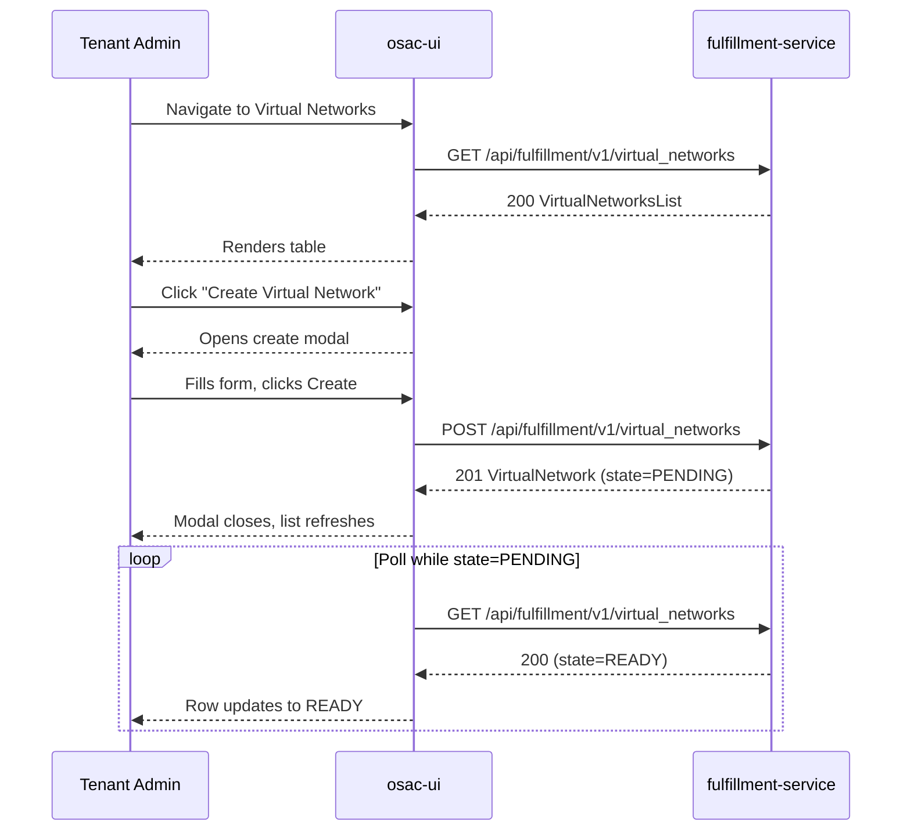

Now I have comprehensive knowledge of the codebase. I'll generate the full specification document.

---

```markdown
---
title: osac-tenant-ui-networking-section
authors:
  - TBD
creation-date: 2026-08-13
last-updated: 2026-08-13
tracking-link:
  - https://issues.redhat.com/browse/OSAC-1425
prd:
  - "prd.md"
see-also: []
replaces: []
superseded-by: []
---

# OSAC Tenant UI: Networking Section

## Summary

This enhancement adds a **Networking** section to the OSAC Tenant UI (`osac-ui`) that allows Tenant Admins and Tenant Users to view and manage their tenant's networking resources — VirtualNetworks, Subnets, SecurityGroups, ExternalIPs, ExternalIPAttachments, and NATGateways — using the existing public fulfillment-service API. No new API resources, proto messages, or database tables are introduced; the implementation is a UI-only addition that consumes the existing public gRPC-transcoded REST API. See [PRD](prd.md) for detailed requirements.

## Motivation

OSAC tenants currently provision compute instances (VMs, bare-metal, clusters) but have no dedicated UI surface to inspect or manage the underlying network topology. Networking objects — VirtualNetworks, Subnets, SecurityGroups, ExternalIPs, ExternalIPAttachments, and NATGateways — must be managed via the `osac` CLI or raw API calls. This gap creates operational friction: Tenant Admins cannot easily visualise CIDR assignments, firewall rules, or public-IP allocation without shell access.

The fulfillment-service public API already exposes full CRUD for all six networking resource types (`VirtualNetworks`, `Subnets`, `SecurityGroups`, `ExternalIPs`, `ExternalIPAttachments`, `NATGateways`) and read-only access to `ExternalIPPools`. The UI needs only to consume these endpoints through the Keycloak-authenticated session already used by every other Tenant UI section.

This design follows the established OSAC UI patterns: React + PatternFly 6, OpenAPI-generated TypeScript client (`pnpm gen-types`), per-resource list/detail pages with drawer or modal forms, and Keycloak bearer-token auth.

### Goals

- Deliver a **Networking** top-level navigation section in the Tenant UI covering: VirtualNetworks, Subnets, SecurityGroups, ExternalIPs, ExternalIPAttachments, NATGateways.
- Provide **list and detail views** for all six resource types, and **create / update / delete** forms where the public API permits.
- Expose ExternalIPPools as a **read-only reference** so Tenant Users can select a pool when allocating an ExternalIP.
- Reuse the existing PatternFly 6 component library, TypeScript API client conventions, and the established authenticated-fetch pattern.
- Keep the UI fully **declarative** — all mutations go through existing REST endpoints with no imperative or out-of-band calls.
- Enforce that immutable fields (CIDRs, `virtual_network`, `pool`, `external_ip`) are rendered read-only after object creation.

### Non-Goals

- No new fulfillment-service API endpoints, proto messages, database tables, or controllers. [PRD: Out of Scope]
- No NetworkClass management UI (admin-only, scoped to Cloud Infrastructure Admin). [PRD: Out of Scope]
- No private-API fields (`region`, `implementation_strategy`, `hub`) exposed in the UI. [PRD: Out of Scope]
- No topology/graph visualisation of the network (deferred). [PRD: Out of Scope]
- No auto-scaling, quota enforcement UI, or bulk operations. [PRD: Out of Scope]
- No changes to Keycloak roles or OPA policies — existing tenant isolation applies. [PRD: Out of Scope]
- No Prometheus metrics, alerting, or Grafana dashboards for UI behaviour. [PRD: Out of Scope]

## Proposal

The Networking section is a new top-level navigation entry in the OSAC Tenant UI sidebar. It contains six resource sub-pages:

| Sub-page | API resource | CRUD in UI |
|---|---|---|
| Virtual Networks | `VirtualNetworks` | List, Get, Create, Update (name/labels), Delete |
| Subnets | `Subnets` | List, Get, Create, Delete (no mutable spec fields) |
| Security Groups | `SecurityGroups` | List, Get, Create, Update (ingress/egress rules), Delete |
| External IPs | `ExternalIPs` | List, Get, Create, Delete |
| External IP Attachments | `ExternalIPAttachments` | List, Get, Create, Delete |
| NAT Gateways | `NATGateways` | List, Get, Create, Delete |

ExternalIPPools appear only as a reference selector when creating ExternalIPs; there is no dedicated pools sub-page.

All pages follow the established Tenant UI pattern:
1. A **list page** with a PatternFly `Table` or `DataList`, pagination, and a toolbar with filter/search.
2. A **detail drawer or full page** showing spec and status fields.
3. A **create modal or form** for new objects, with inline validation.
4. **Delete confirmation dialogs** with dependency warnings where relevant.

### Workflow Description

#### Actor definitions

- **Tenant Admin** — a user with the `tenant-admin` Keycloak role. Can create, update, and delete all networking resources within their tenant.
- **Tenant User** — a user with the `tenant-user` Keycloak role. Can list and view networking resources. Cannot create, update, or delete.

[Assumption] Role-gating in the UI mirrors the existing pattern used for ComputeInstance and ClusterOrder pages: the "Create" and "Delete" buttons are hidden (not merely disabled) for Tenant Users based on the decoded Keycloak token role claim.

#### Workflow 1: Tenant Admin views all Virtual Networks

**Starting state:** Tenant Admin is logged into the Tenant UI. At least one VirtualNetwork exists for the tenant.

1. Admin clicks **Networking → Virtual Networks** in the sidebar.
2. The UI issues `GET /api/fulfillment/v1/virtual_networks` with the tenant's bearer token.
3. The fulfillment-service applies the tenant filter (Keycloak token's `tenant` claim) and returns a paginated list.
4. The UI renders a PatternFly Table with columns: **Name**, **IPv4 CIDR**, **IPv6 CIDR**, **Network Class**, **State**, **Created**.
5. Admin clicks a row to open the detail drawer showing full spec (network_class, CIDRs) and status (state, message).

#### Workflow 2: Tenant Admin creates a VirtualNetwork

**Starting state:** Admin is on the Virtual Networks list page.

1. Admin clicks **Create Virtual Network**.
2. A modal opens with form fields:
   - **Name** (required, DNS-label, max 63 chars, pattern `^[a-z0-9][a-z0-9-]*[a-z0-9]$`)
   - **Display Name** (optional, max 63 chars)
   - **Description** (optional, max 256 chars)
   - **Network Class** (required, searchable dropdown populated from `GET /api/fulfillment/v1/network_classes`)
   - **IPv4 CIDR** (optional unless IPv6 also absent; free-text with CIDR format hint)
   - **IPv6 CIDR** (optional; shown only when selected NetworkClass `capabilities.supports_ipv6 = true` or `supports_dual_stack = true`)
   - **Labels** (optional, key-value editor)
3. The UI validates client-side:
   - Name matches DNS-label pattern.
   - At least one of IPv4 CIDR or IPv6 CIDR is provided.
   - IPv4 CIDR is valid CIDR notation (e.g., `10.0.0.0/16`).
   - IPv6 CIDR is valid CIDR notation.
   - Network Class is selected.
4. Admin clicks **Create**. The UI issues `POST /api/fulfillment/v1/virtual_networks` with the assembled request body.
5. On success (201), the modal closes and the list refreshes showing the new VirtualNetwork in `PENDING` state.
6. On error, the modal displays the gRPC status message inline.

**Error sub-flow — duplicate name:**
- Server returns `ALREADY_EXISTS`. Modal displays: "A Virtual Network with this name already exists."

**Error sub-flow — invalid CIDR:**
- Server returns `INVALID_ARGUMENT` with field-level details. Modal highlights the offending field.

**Error sub-flow — network class capability mismatch:**
- Server returns `INVALID_ARGUMENT`. Modal displays the returned message below the Network Class field.

#### Workflow 3: Tenant Admin updates a VirtualNetwork

**Starting state:** Admin is viewing the VirtualNetwork detail page/drawer.

1. Admin clicks **Edit**.
2. An edit modal opens. Mutable fields are editable:
   - `metadata.display_name`, `metadata.description`, `metadata.labels`
   - No other spec fields (CIDRs and `network_class` are **IMMUTABLE** and rendered as read-only text, not inputs).
3. Admin saves. The UI issues `PATCH /api/fulfillment/v1/virtual_networks/{id}` with `update_mask` containing only the changed metadata fields.
4. On success the drawer refreshes.

**Error sub-flow — concurrent modification:**
- If `lock: true` is set and `metadata.version` has changed, the server returns `ABORTED`. The UI shows: "This resource was modified by another user. Please reload and try again."

#### Workflow 4: Tenant Admin deletes a VirtualNetwork

1. Admin clicks **Delete** on the VirtualNetwork list row or detail page.
2. Confirmation dialog: "Deleting this Virtual Network will also delete all associated Subnets, Security Groups, and NAT Gateways. This action cannot be undone."
3. Admin confirms. The UI issues `DELETE /api/fulfillment/v1/virtual_networks/{id}`.
4. If Subnets or SecurityGroups reference this VirtualNetwork, the server returns `FAILED_PRECONDITION` (Z0003 translated). The UI shows: "Cannot delete: this Virtual Network has dependent resources. Delete all Subnets and Security Groups first."

[Assumption] The fulfillment-service enforces referential integrity at the database level via the Z0003 SQLSTATE trigger, translated to `FAILED_PRECONDITION`. The UI surfaces this error without a separate pre-flight check.

#### Workflow 5: Tenant Admin creates a Subnet

1. Admin navigates to **Networking → Subnets** and clicks **Create Subnet**.
2. Modal fields:
   - **Name** (required, DNS-label)
   - **Virtual Network** (required, searchable dropdown from `GET /api/fulfillment/v1/virtual_networks?filter=status.state=="READY"`)
   - **IPv4 CIDR** (optional; must be a subset of the parent VirtualNetwork's `ipv4_cidr` — validated server-side)
   - **IPv6 CIDR** (optional; must be a subset of the parent VirtualNetwork's `ipv6_cidr` — validated server-side)
3. Admin submits. `POST /api/fulfillment/v1/subnets`.
4. On success, list refreshes with new Subnet in `PENDING` state.

**Error sub-flow — CIDR not a subset:**
Server returns `INVALID_ARGUMENT`. UI highlights the CIDR field: "CIDR must be within the parent Virtual Network's CIDR range."

#### Workflow 6: Tenant Admin creates/updates a SecurityGroup

**Create:**
1. Admin navigates to **Networking → Security Groups** → **Create Security Group**.
2. Form fields:
   - **Name** (required)
   - **Virtual Network** (required, dropdown)
   - **Ingress Rules** — repeatable rule editor: Protocol (TCP/UDP/ICMP/ALL), Port From, Port To, IPv4 CIDR, IPv6 CIDR.
   - **Egress Rules** — same structure.
3. `POST /api/fulfillment/v1/security_groups`.

**Update:**
1. Admin opens SecurityGroup detail → **Edit**.
2. Mutable: `metadata.display_name`, `metadata.description`, `metadata.labels`, `spec.ingress`, `spec.egress`.
3. Immutable: `spec.virtual_network` rendered read-only.
4. `PATCH /api/fulfillment/v1/security_groups/{id}` with `update_mask: ["spec.ingress","spec.egress","metadata.display_name"]`.

#### Workflow 7: Tenant Admin allocates an ExternalIP

1. Admin navigates to **Networking → External IPs** → **Allocate External IP**.
2. Form fields:
   - **Name** (required)
   - **Pool** (required, searchable dropdown populated from `GET /api/fulfillment/v1/external_ip_pools`, showing `metadata.name`, `spec.ip_family`, and `status.available` count)
3. `POST /api/fulfillment/v1/external_ips`.
4. On success, list shows new ExternalIP in `PENDING` state. `status.address` is displayed once the state reaches `ALLOCATED`.

**Error sub-flow — pool exhausted:**
Server returns `FAILED_PRECONDITION`. UI shows: "The selected pool has no available addresses."

#### Workflow 8: Tenant Admin creates an ExternalIPAttachment

1. Admin navigates to **Networking → External IP Attachments** → **Create Attachment**.
2. Form fields:
   - **Name** (required)
   - **External IP** (required, dropdown from `GET /api/fulfillment/v1/external_ips?filter=status.state=="ALLOCATED"&&status.attached==false`)
   - **Target Type** (radio: Compute Instance / Cluster / Bare Metal Instance)
   - **Target** (required, searchable dropdown populated dynamically based on Target Type)
   - **Endpoint** (radio: API / Ingress — shown only when Target Type = Cluster)
3. `POST /api/fulfillment/v1/external_ip_attachments`.

**Error sub-flow — IP already attached:**
Server returns `ALREADY_EXISTS`. UI: "This External IP is already attached to another resource."

#### Workflow 9: Tenant Admin creates a NATGateway

1. Admin navigates to **Networking → NAT Gateways** → **Create NAT Gateway**.
2. Form fields:
   - **Name** (required)
   - **Virtual Network** (required; only networks in `READY` state; one NATGateway per VirtualNetwork enforced by server)
   - **External IP** (required; only IPs in `ALLOCATED` state not already consumed by another NATGateway or ExternalIPAttachment)
3. `POST /api/fulfillment/v1/nat_gateways`.

**Error sub-flow — duplicate NATGateway:**
Server returns `ALREADY_EXISTS`. UI: "A NAT Gateway already exists for this Virtual Network."

#### Workflow 10: State polling / progressive status updates

All resource list and detail pages poll their respective list/get endpoints every 30 seconds while any resource is in a transitional state (`PENDING`, `DELETING`). [Assumption] Polling interval and stop condition (all resources in terminal states) follow the same pattern already used by the ComputeInstance and ClusterOrder pages.



### API Extensions

This enhancement introduces **no new API extensions**. It consumes the existing public REST API exposed by the fulfillment-service. All six networking resource types are already fully implemented at the proto, server, controller, and database layers. No CRDs, admission webhooks, aggregated API servers, or finalizers are added or modified.

## UX Alignment

No `osac-ux/libs/ui-components/src/api/v1/<resource>.ts` TypeScript files exist in the current repository. The TypeScript API client types will be generated from the existing OpenAPI/proto definitions via `pnpm gen-types` when the `osac-ux` frontend project is instantiated. [Assumption] This generation step is part of the standard `osac-ux` build pipeline and does not require manual type authoring.

The table below maps the key proto fields to the expected TypeScript field names post-generation for the primary networking resource types, to allow UI implementers to plan component props ahead of generation:

| Proto field | Expected TypeScript field | UI usage |
|---|---|---|
| `metadata.name` | `metadata.name` | Display in table, form input |
| `metadata.display_name` | `metadata.displayName` | Editable in update form |
| `metadata.description` | `metadata.description` | Editable in update form |
| `metadata.tenant` | `metadata.tenant` | Read-only, not displayed |
| `metadata.labels` | `metadata.labels` | Key-value label editor |
| `metadata.creation_timestamp` | `metadata.creationTimestamp` | Display in detail view |
| `metadata.version` | `metadata.version` | Sent with `lock: true` for optimistic locking |
| `spec.ipv4_cidr` | `spec.ipv4Cidr` | Read-only after creation |
| `spec.ipv6_cidr` | `spec.ipv6Cidr` | Read-only after creation |
| `spec.network_class` | `spec.networkClass` | Reference selector on create, read-only after |
| `spec.virtual_network` | `spec.virtualNetwork` | Reference selector on create, read-only after |
| `spec.ingress` | `spec.ingress` | Repeatable rule editor |
| `spec.egress` | `spec.egress` | Repeatable rule editor |
| `spec.pool` | `spec.pool` | Pool selector on ExternalIP create |
| `spec.external_ip` | `spec.externalIp` | ExternalIP selector on Attachment/NATGateway create |
| `status.state` | `status.state` | State badge (PatternFly Label) |
| `status.message` | `status.message` | Tooltip or alert on failure |
| `status.address` | `status.address` | ExternalIP: displayed after ALLOCATED |
| `status.attached` | `status.attached` | ExternalIP: shown as boolean badge |
| `status.available` | `status.available` | ExternalIPPool selector: pool availability hint |

No deviations from known anti-patterns. All fields are direct proto → camelCase mappings with no sub-resource actions, string-union storage classes, K8s-internal fields, one-time secrets, or RHOAI operator fields.

### Implementation Details/Notes/Constraints

#### Routing structure

The Networking section adds the following routes to the `osac-ui` React Router configuration:

```
/networking                           → redirect to /networking/virtual-networks
/networking/virtual-networks          → VirtualNetworks list page
/networking/virtual-networks/:id      → VirtualNetwork detail page (or drawer anchor)
/networking/subnets                   → Subnets list page
/networking/subnets/:id               → Subnet detail
/networking/security-groups           → SecurityGroups list page
/networking/security-groups/:id       → SecurityGroup detail
/networking/external-ips              → ExternalIPs list page
/networking/external-ips/:id          → ExternalIP detail
/networking/external-ip-attachments   → ExternalIPAttachments list page
/networking/external-ip-attachments/:id → ExternalIPAttachment detail
/networking/nat-gateways              → NATGateways list page
/networking/nat-gateways/:id          → NATGateway detail
```

#### API client usage

All API calls use the generated TypeScript client from `pnpm gen-types`. Every request includes the Keycloak bearer token obtained from the auth context hook (existing pattern). [Assumption] The API base URL and auth context are provided by the same environment configuration used by the existing Compute and Cluster pages.

#### Immutability enforcement

Fields marked `IMMUTABLE` in the proto (CIDRs, `virtual_network`, `network_class`, `pool`, `external_ip`) are rendered as read-only `<TextInput readOnly>` elements (PatternFly) in edit forms. The UI does NOT send these fields in `update_mask` on PATCH requests, preventing accidental immutability-violation errors from the server. [Codebase: fulfillment-service/internal/servers/cidr_validation.go]

#### SecurityGroup rule editor component

The ingress/egress rule editor is a reusable PatternFly `ActionList`-based component:
- Each rule row: Protocol dropdown (TCP/UDP/ICMP/ALL), Port From input (disabled for ICMP/ALL), Port To input (disabled for ICMP/ALL), IPv4 CIDR input, IPv6 CIDR input, Delete row button.
- Validation: Port fields are required when Protocol is TCP or UDP; port range 1–65535; at least one of IPv4 CIDR or IPv6 CIDR must be set per rule.
- Maximum 50 rules per direction [Assumption: no explicit API limit documented; 50 is a reasonable UX limit].

#### ExternalIPPool selector

When creating an ExternalIP, the Pool selector fetches `GET /api/fulfillment/v1/external_ip_pools` and renders each pool as:
```
<pool.metadata.name> (<ip_family>) — <status.available> available
```
Pools with `status.available == 0` are shown but disabled in the dropdown with a "(no addresses available)" suffix.

#### NATGateway constraints enforcement (client-side hints)

The NATGateway create form pre-filters the Virtual Network dropdown to `state == READY` and the External IP dropdown to `state == ALLOCATED && attached == false`. These filters are applied via the `filter` query parameter (CEL expressions), matching the API's filter capability. Server-side enforcement remains authoritative; client-side filtering is UX-only.

#### Pagination and filtering

All list pages implement server-side pagination via `offset`/`limit` query parameters using PatternFly `Pagination`. Default page size: 20 items. Each list page has a text search filter that constructs a CEL `filter` expression (e.g., `this.metadata.name.startsWith("prod")` for a prefix search on name).

#### State badges

Resource state is displayed as a PatternFly `Label` component with colour coding:

| State | PatternFly colour |
|---|---|
| PENDING | `blue` |
| READY / ALLOCATED | `green` |
| FAILED / DELETE_FAILED | `red` |
| DELETING | `orange` |
| UNSPECIFIED | `grey` |

#### Deletion dependency warnings

Before rendering the delete confirmation dialog for a VirtualNetwork, the UI fetches:
- `GET /api/fulfillment/v1/subnets?filter=spec.virtual_network.id=="{id}"` (count check)
- `GET /api/fulfillment/v1/security_groups?filter=spec.virtual_network.id=="{id}"` (count check)
- `GET /api/fulfillment/v1/nat_gateways?filter=spec.virtual_network.id=="{id}"` (count check)

[Assumption] These CEL filter expressions work as written given the documented filter capability in `docs/FILTER.md`. If child resources exist, the dialog lists them and advises the user to delete them first, before the server rejects with `FAILED_PRECONDITION`.

### Security Considerations

#### Authentication

All API calls from the Networking UI pages use the existing Keycloak OIDC bearer token, identical to all other Tenant UI pages. No new authentication flows are introduced.

#### Tenant isolation

The fulfillment-service enforces tenant isolation at the server layer: every List and Get call filters results to the authenticated user's tenant (derived from the Keycloak token's `tenant` claim). The UI inherits this isolation transparently — it cannot request resources from other tenants because the server ignores cross-tenant requests.

OPA policies (existing) enforce that a tenant can only create, read, update, and delete resources in their own namespace. The UI has no bypass path. [Codebase: fulfillment-service/internal/servers/]

#### Input validation

Client-side validation (DNS-label name, CIDR format, port ranges) is a UX convenience only. The fulfillment-service performs authoritative server-side validation via protovalidate and server-layer CIDR checks. All error messages from the server are surfaced in the UI as PatternFly inline alerts. [Codebase: fulfillment-service/internal/servers/cidr_validation.go]

#### Sensitive data

ExternalIP `status.address` values are displayed in the UI. These are IP addresses, not credentials. No secrets, tokens, or passwords are introduced by this feature. The ExternalIPPool CIDR ranges (`spec.cidrs`) are private-API-only fields and are NOT exposed through the public API or rendered in the UI. The UI only sees `spec.ip_family` and `status.available` from pools.

#### RBAC gate

[Assumption] Tenant User role (`tenant-user`) is allowed to perform List and Get operations only. Create, Update, and Delete buttons are conditionally rendered based on the `tenant-admin` role claim in the decoded Keycloak token. This follows the established pattern used in the Compute and Cluster sections of the Tenant UI.

### Failure Handling and Recovery

#### fulfillment-service unavailable

- **What happens:** All API calls fail with a network error or 503.
- **User observes:** PatternFly inline `Danger` alert: "Unable to load networking resources. The service may be temporarily unavailable. Please try again."
- **Recovery:** User retries manually or waits for the service to recover. The UI does not auto-retry list calls beyond one attempt; create/update forms remain open so the user does not lose their input.

#### Resource in PENDING or transitional state

- **What happens:** User attempts to delete a resource in `PENDING` state.
- **User observes:** Server returns `FAILED_PRECONDITION`. UI displays: "Cannot delete this resource while it is in a pending state. Please wait until it is ready or failed."
- **Recovery:** User waits for the resource to reach a terminal state.

#### Delete rejected due to dependent children (Z0003)

- **What happens:** `DELETE /api/fulfillment/v1/virtual_networks/{id}` → server returns `FAILED_PRECONDITION` (Z0003 translated by `translateError`).
- **User observes:** Error alert: "Cannot delete: dependent resources exist. Delete all Subnets, Security Groups, and NAT Gateways first."
- **Recovery:** User navigates to child resource pages and deletes them, then retries VirtualNetwork deletion.
- [Codebase: fulfillment-service/internal/servers/ — `translateError` maps Z0003 → FAILED_PRECONDITION]

#### Optimistic locking conflict (ABORTED)

- **What happens:** Two Tenant Admins edit the same SecurityGroup simultaneously. Second save hits `ABORTED`.
- **User observes:** Error alert in the edit modal: "This resource was modified by another user. Reload the page to get the latest version and try again."
- **Recovery:** User closes the modal, the list/detail auto-refreshes, user re-opens edit with the current version.

#### Invalid form submission (INVALID_ARGUMENT)

- **What happens:** User submits a form with an invalid CIDR or name pattern that bypasses client-side validation.
- **User observes:** Server returns `INVALID_ARGUMENT` with field-level violation messages. UI renders these as inline field errors below the relevant inputs using PatternFly `FormHelperText` with `isError`.
- **Recovery:** User corrects the indicated fields and resubmits.

#### ALREADY_EXISTS on create

- **What happens:** `POST /api/fulfillment/v1/virtual_networks` → server returns `ALREADY_EXISTS`.
- **User observes:** Inline alert at the top of the create modal: "A resource with this name already exists in your tenant."
- **Recovery:** User changes the name.

#### Pool exhausted (FAILED_PRECONDITION)

- **What happens:** `POST /api/fulfillment/v1/external_ips` → pool has no available addresses.
- **User observes:** Error alert in the create modal: "The selected pool has no available addresses. Choose a different pool or contact your Cloud Infrastructure Admin."
- **Recovery:** User selects another pool or waits for addresses to be released.

#### NATGateway duplicate (ALREADY_EXISTS)

- **What happens:** `POST /api/fulfillment/v1/nat_gateways` → VirtualNetwork already has a NATGateway.
- **User observes:** Error alert: "A NAT Gateway already exists for the selected Virtual Network."
- **Recovery:** User selects a different VirtualNetwork.

#### Token expiry mid-session

- **What happens:** Keycloak token expires while user is interacting with the Networking section.
- **User observes:** API calls return 401. [Assumption] The existing Keycloak refresh-token mechanism (already used by all Tenant UI pages) silently refreshes the token. If refresh also fails, the user is redirected to the login page.
- **Recovery:** Re-authentication; the URL state should allow the user to return to their previous Networking sub-page.

### RBAC / Tenancy

No new RBAC roles or Keycloak realms are introduced. The Networking UI section is governed by the same two existing roles:

| Role | Allowed operations |
|---|---|
| `tenant-admin` | List, Get, Create, Update, Delete all networking resources |
| `tenant-user` | List and Get all networking resources (read-only) |

All API-level enforcement is performed by the fulfillment-service and OPA policies. The UI reflects these permissions by conditionally rendering action buttons based on the decoded Keycloak token role claim. [Assumption] The role claim key and value follow the existing Tenant UI conventions.

Tenant scoping: all networking resources carry `metadata.tenant` set by the fulfillment-service on create (from the authenticated user's token). The UI never sets or overrides the `tenant` field. Listing is automatically scoped to the calling user's tenant by the fulfillment-service. [Codebase: fulfillment-service/internal/servers/virtual_networks_server.go]

### Observability and Monitoring

No new observability changes. Existing monitoring mechanisms apply. The fulfillment-service already emits structured logs and (where configured) metrics for every API call including the networking endpoints consumed by this UI.

### Risks and Mitigations

| Risk | Likelihood | Impact | Mitigation |
|---|---|---|---|
| UI displays stale state for long-provisioning resources | Medium | Low | 30-second polling for resources in transitional states; state badge clearly indicates PENDING |
| SecurityGroup rule editor complexity leads to user error | Medium | Medium | Clear port-range UX with protocol-aware field disabling; server-side validation is authoritative |
| ExternalIP pool availability changes between form open and submit | Low | Low | Server rejects with `FAILED_PRECONDITION`; UI surfaces error message and allows user to pick another pool |
| Client-side CEL filter expressions for dependency pre-checks may not match all server implementations | Low | Low | Pre-checks are advisory only; server-side Z0003 enforcement is authoritative; error messages guide recovery |
| `pnpm gen-types` generates TypeScript types that don't match expected field shapes for NetworkClass capabilities | Low | Medium | Validate generated types against known proto fields in PR review; add TypeScript type assertions in unit tests |

Security review: The Networking section introduces no new privilege escalation paths, no new secrets handling, and no new inter-service communication. The existing OPA + Keycloak review process covers this feature.

### Drawbacks

- **Six new sub-pages increase UI surface area.** Each sub-page requires its own component, routing, and test coverage. The tradeoff is justified by the operational need for Tenant Admins to manage networking without CLI access.
- **Polling is not push-based.** The 30-second poll cycle means users may see stale state for up to 30 seconds after a resource transitions. A WebSocket or server-sent-events approach would provide live updates but is out of scope for this ticket.
- **Client-side CIDR validation may diverge from server-side.** If the fulfillment-service updates its CIDR validation rules, client-side hints may become inaccurate. Mitigation: treat client-side validation as advisory; server-side errors are always surfaced.

## Alternatives (Not Implemented)

### Alternative 1: Inline Networking within Compute Instance forms

**Description:** Expose networking fields (VirtualNetwork, Subnet selection) only within the ComputeInstance create/edit forms rather than as a dedicated top-level section.

**Rejection rationale:** This does not address the Tenant Admin's need to manage network topology independently of compute instances. VirtualNetworks, Subnets, SecurityGroups, and NATGateways have lifecycle and operational significance beyond their role as compute-instance parameters. A dedicated section provides clearer visibility and management. [PRD: User Story: Tenant Admin]

### Alternative 2: Read-only networking dashboard (no create/update/delete)

**Description:** Implement only list and detail views; defer mutation operations to a future ticket.

**Rejection rationale:** Read-only views significantly reduce the feature's value since Tenant Admins currently rely on the CLI for mutations. The API already supports full CRUD; the cost of omitting mutation UI is a worse user experience with minimal implementation savings.

### Alternative 3: Single combined "Networking" list page with mixed resource types

**Description:** Show all networking resources (VirtualNetworks, Subnets, etc.) in a single unified list with a "Type" column.

**Rejection rationale:** Mixed-type lists with heterogeneous schema create a poor UX — filtering, sorting, and form layouts differ significantly per resource type. Separate sub-pages per resource type follow PatternFly guidance for complex resource hierarchies and are consistent with the existing OSAC UI structure for Compute and Cluster sections.

## Open Questions

1. **Sidebar navigation label:** Should the top-level navigation item be labelled "Networking" or "Networks"? [Assumption] "Networking" is used in this EP; confirm with UX.
2. **Detail view pattern — drawer vs. full page:** Should the resource detail be a PatternFly drawer (slide-in panel on the same list page) or a separate full-page route? [Assumption] This EP assumes the same pattern used for ComputeInstance details in the existing UI; confirm with UX before implementation.
3. **VirtualNetwork CIDR default population:** When a user selects a NetworkClass that has `defaults.virtual_network_ipv4_cidr` set, should the CIDR fields in the create modal be pre-populated with those defaults? [Assumption] Yes — improves discoverability. Confirm with product.
4. **ExternalIPPool filter for ExternalIP selector:** The public API exposes `status.available` but no `state` field on `ExternalIPPool`. Confirm that filtering on `status.available > 0` via CEL is supported in the fulfillment-service filter implementation before implementing the pool selector.
5. **Maximum SecurityGroup rules:** Is there a server-enforced limit on the number of ingress/egress rules per SecurityGroup? Confirm with fulfillment-service team before setting a client-side maximum.

## Test Plan

### Unit Tests

- **VirtualNetwork create form validation:**
  - Rejects empty name.
  - Rejects name exceeding 63 characters.
  - Rejects name with uppercase letters or spaces (DNS-label pattern).
  - Rejects both IPv4 CIDR and IPv6 CIDR left empty.
  - Accepts valid IPv4 CIDR (`10.0.0.0/16`).
  - Accepts valid IPv6 CIDR (`fd00::/48`).
  - Accepts both CIDRs (dual-stack).

- **SecurityGroup rule editor:**
  - Port fields are disabled when Protocol is ICMP or ALL.
  - Port fields are required and enabled when Protocol is TCP or UDP.
  - Rejects port values outside 1–65535.
  - Requires at least one of IPv4 CIDR or IPv6 CIDR per rule.
  - Adds and removes rule rows correctly.

- **Immutable field rendering:**
  - VirtualNetwork edit modal renders `ipv4_cidr`, `ipv6_cidr`, `network_class` as read-only inputs.
  - Subnet edit modal renders `virtual_network`, `ipv4_cidr`, `ipv6_cidr` as read-only inputs.
  - ExternalIP edit/detail renders `pool` as read-only.

- **State badge component:**
  - Renders `green` for READY and ALLOCATED states.
  - Renders `red` for FAILED and DELETE_FAILED states.
  - Renders `blue` for PENDING state.
  - Renders `orange` for DELETING state.

- **Role-based button visibility:**
  - Create, Edit, Delete buttons are not rendered when Keycloak role claim is `tenant-user`.
  - Create, Edit, Delete buttons are rendered when Keycloak role claim is `tenant-admin`.

- **Error message rendering:**
  - `ALREADY_EXISTS` error → correct inline alert message for VirtualNetwork creation.
  - `FAILED_PRECONDITION` error → correct inline alert message for delete-with-dependents scenario.
  - `ABORTED` error → correct inline alert message in edit modal.
  - `INVALID_ARGUMENT` error → field-level error rendering on create/edit forms.

- **ExternalIP pool selector:**
  - Pools with `status.available == 0` are rendered as disabled options.
  - Pool display format includes name, IP family, and available count.

### Integration Tests

Test scenarios exercising the `osac-ui` against a live or mocked fulfillment-service API in a kind cluster:

- **VirtualNetwork list page** loads and displays existing VirtualNetworks scoped to the authenticated tenant; VirtualNetworks from another tenant are not shown.
- **VirtualNetwork creation** via the UI results in a new VirtualNetwork appearing in the list with `PENDING` state, transitioning to `READY` after controller reconciliation.
- **VirtualNetwork update** via the UI edit modal updates `display_name` and `labels` but not immutable fields.
- **VirtualNetwork delete** via the UI issues DELETE; the resource disappears from the list.
- **Subnet create** from the UI with a parent VirtualNetwork reference results in a `PENDING` Subnet.
- **SecurityGroup create** with ingress and egress rules produces a SecurityGroup with the correct rule set.
- **SecurityGroup update** replaces ingress rules and persists via PATCH.
- **ExternalIP allocation** from the UI selects a pool and creates an ExternalIP; `status.address` appears once ALLOCATED.
- **ExternalIPAttachment create** attaches an ExternalIP to a ComputeInstance target.
- **NATGateway create** associates a VirtualNetwork and ExternalIP; duplicate attempt returns `ALREADY_EXISTS` surfaced correctly.
- **Polling** — resource created in PENDING state is shown as READY in the list after server reconciliation, without page reload.
- **Dependency delete protection** — deleting a VirtualNetwork with existing Subnets returns `FAILED_PRECONDITION` and the UI shows the correct error message.

### E2E Tests

Reference: `osac-test-infra` pytest patterns.

- **Full networking provisioning flow:** Tenant Admin logs in → creates VirtualNetwork → creates Subnet → creates SecurityGroup with ingress rule → creates ExternalIP → attaches ExternalIP to a ComputeInstance → verifies ExternalIP `status.attached == true` in the UI.
- **NATGateway lifecycle:** Tenant Admin creates VirtualNetwork → allocates ExternalIP → creates NATGateway → verifies NATGateway appears in list with correct VirtualNetwork and ExternalIP references → deletes NATGateway.
- **Tenant isolation:** Two tenants each create a VirtualNetwork with the same name. Tenant A cannot see Tenant B's VirtualNetwork in the Networking UI.
- **Tenant User read-only access:** Tenant User logs in → navigates to Virtual Networks → verifies no Create/Edit/Delete buttons are rendered → verifies list is populated.
- **SecurityGroup rule update:** Tenant Admin adds an ingress rule via the rule editor → saves → verifies rule appears in the detail view.
- **Delete cascade prompt:** Tenant Admin attempts to delete a VirtualNetwork with a Subnet → UI shows dependency warning → Admin deletes Subnet first → Admin retries VirtualNetwork delete → succeeds.

**Tricky test areas:**
- CIDR validation edge cases (canonical vs. non-canonical notation, e.g., `10.0.1.0/16` vs. `10.0.0.0/16`).
- Dual-stack (both IPv4 and IPv6 CIDRs) VirtualNetwork and Subnet creation.
- Concurrent edit conflict (`ABORTED`) requiring two concurrent browser sessions.
- ExternalIPPool filter when `status.available` changes between page load and form submit.

## Graduation Criteria

### Dev Preview

- All six networking resource list pages render correctly for authenticated Tenant Admin.
- Create forms functional for VirtualNetwork, Subnet, SecurityGroup, ExternalIP, ExternalIPAttachment, NATGateway.
- Delete operations functional with confirmation dialogs.
- Unit tests covering form validation and state badge components pass.
- Manual verification by the OSAC UX team on the PatternFly component usage.

### Tech Preview

- All integration tests pass against a kind cluster running the fulfillment-service.
- RBAC enforcement (Tenant User read-only) verified by integration tests.
- Polling and progressive status updates verified end-to-end.
- Error handling for all enumerated failure modes verified manually and in tests.
- Documentation in `openshift-docs` updated: Networking section usage guide for Tenant Admins.

### GA

- All E2E tests in `osac-test-infra` pass.
- Tenant isolation verified by E2E test.
- No `[Assumption]`-marked open questions remain unresolved.
- UX review signed off by OSAC UX lead.
- Security review completed (no new authentication or authorization paths introduced).

## Upgrade / Downgrade Strategy

This enhancement is UI-only. The fulfillment-service API it consumes is already stable and versioned. No database migrations, CRD changes, or controller changes are introduced.

**Upgrade:** Deploying a new `osac-ui` image that includes the Networking section has no impact on existing tenants or running workloads. Existing networking resources (VirtualNetworks, Subnets, etc.) created via CLI or API prior to this UI release are immediately visible in the new Networking section with no migration required.

**Downgrade:** Rolling back to a previous `osac-ui` image that lacks the Networking section removes the UI surface but has no impact on existing networking resources — they remain fully functional and accessible via the CLI and API.

**Version skew:** The UI communicates only with the public fulfillment-service API. If the fulfillment-service is upgraded independently, the UI continues to work as long as the public API remains backward-compatible (additive changes only). Removing or renaming existing public API fields would require a coordinated UI update.

## Version Skew Strategy

The Networking UI section consumes only the public REST API (`/api/fulfillment/v1/`). The public API is versioned (`v1`) and governed by the OSAC API stability policy. The UI is tolerant of additive API changes (new optional fields returned by the server are ignored by the TypeScript client). Breaking changes (field removals, type changes) in `v1` are prohibited by OSAC policy without a major version bump.

If the `osac-ui` is deployed against an older fulfillment-service that does not yet include a particular networking resource (unlikely given all six types are already implemented), the affected list page will return an empty result or a 404 on the service endpoint; the UI should render an empty state rather than an error page. [Assumption] The TypeScript client's error handling wraps 404 responses to service-level endpoints as empty lists.

## Support Procedures

### Detecting failure modes

| Symptom | Where to look | Likely cause |
|---|---|---|
| Networking list page shows spinner indefinitely | Browser DevTools → Network tab (check API response) / fulfillment-service pod logs | Service unavailable, or Keycloak token expired |
| "Unable to load" alert on Networking pages | Browser console → check 4xx/5xx on `/api/fulfillment/v1/virtual_networks` | Auth issue (401) or service down (503) |
| Create modal shows server error on submit | Browser DevTools → request payload + response body | Validation failure (INVALID_ARGUMENT), duplicate name (ALREADY_EXISTS) |
| Delete fails with "dependent resources" error | UI alert + fulfillment-service logs for Z0003 trigger | Child Subnets/SecurityGroups still exist |
| ExternalIP stuck in PENDING | `ExternalIP` status.message in detail view + osac-operator controller logs | AAP job failure or pool exhaustion at provisioning time |
| NATGateway stuck in PENDING | `NATGateway` status.message + osac-operator logs | AAP playbook failure |

### Disabling the Networking UI section

The Networking section is a frontend-only feature. It can be disabled by:
1. Reverting the `osac-ui` deployment to a prior image version that does not include the Networking routes.
2. Optionally, removing the sidebar navigation entry via a feature-flag mechanism [Assumption: if a feature-flag system exists in `osac-ui`].

**Consequences of disabling:**
- Existing networking resources are unaffected; they remain accessible via the `osac` CLI and direct API calls.
- No running workloads are disrupted.
- Tenant Admins revert to CLI-based networking management.

### Resuming after disable

Re-enabling the Networking UI section (by re-deploying the `osac-ui` image with the Networking section) requires no data migration. All networking resources previously created (via UI or CLI) are immediately visible in the restored UI.

## Infrastructure Needed

No new infrastructure is required. The Networking section is a purely frontend addition to the existing `osac-ui` project, consuming the already-deployed fulfillment-service public API. No new repositories, CI jobs, or testing infrastructure beyond the existing `osac-test-infra` E2E test suite are needed.
```