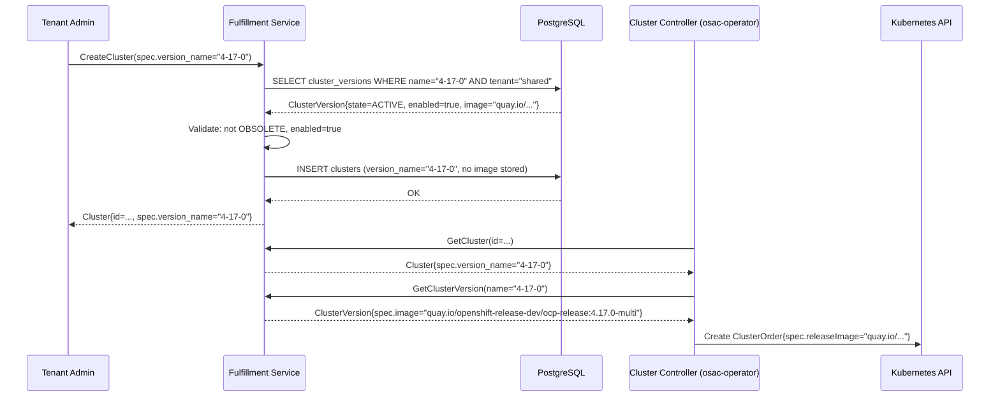

# ClusterVersion API

## Summary

This enhancement introduces a new platform-global `ClusterVersion` resource in the fulfillment-service that maps user-friendly version identifiers (e.g., `"4.17.0"`) to private OCI release image pullspecs, with lifecycle state management (active/deprecated/obsolete). The `ClusterSpec.release_image` field is replaced by `ClusterSpec.version_name`; the cluster controller resolves the image at reconciliation time. See [PRD](prd.md) for detailed requirements.

## Motivation

The current `ClusterSpec.release_image` field requires callers to supply a full OCI pullspec such as `quay.io/openshift-release-dev/ocp-release:4.17.0-multi`. This design has three concrete problems from an implementation standpoint:

1. **Late validation:** Typos and invalid URLs are caught only when the osac-operator attempts to instantiate the `ClusterOrder` CRD, not at API entry time — producing opaque provisioning failures rather than descriptive validation errors.
2. **Infra detail leakage:** Internal OCI registry paths and multi-arch image suffixes are exposed in every public API response and CLI command, coupling tenants to infrastructure specifics they should not depend on.
3. **No discoverability:** There is no catalog endpoint; users have no way to enumerate available or end-of-life versions without out-of-band communication.

The `ClusterVersion` resource solves all three problems declaratively: admins manage the catalog, tenants select by version number, validation runs at API admission time, and image resolution is deferred to the controller (where it is private and subject to delete protection guarantees).

### Goals

- Introduce a new `ClusterVersion` resource in the fulfillment-service following the standard OSAC object shape (id, metadata, spec, status).
- Replace `ClusterSpec.release_image` (field 6) with `ClusterSpec.version_name` (field 9) without breaking the existing provisioning path downstream.
- Defer image resolution to the cluster controller; the fulfillment-service stores only `version_name`.
- Implement lifecycle state transitions (active → deprecated → obsolete and back) with automatic timestamp recording.
- Enforce at-most-one-default invariant at the database layer with a partial unique index.
- Enforce delete protection and referential integrity via database triggers, surfaced as gRPC `FAILED_PRECONDITION` and `INVALID_ARGUMENT` errors respectively.
- Restrict `spec.image` (OCI pullspec) to private API responses only; never expose it in public endpoints.
- Reuse the existing GenericServer, DAO, and event-plumbing patterns from the fulfillment-service.

### Non-Goals

- Cluster upgrade operations — deferred to OSAC-1415.
- Auto-sync with ACM `ClusterImageSet` — versions are admin-managed in v0.2.
- VM image management (`ComputeImage`) — separate resource tracked in OSAC-979.
- In-place upgrade migration for existing clusters carrying a raw `release_image`.
- Channel-based or graph-based version selection — the `allowed_upgrades` field is the extension point; OSAC-1415 will add channel semantics on top.

## Proposal

The proposal makes changes in four areas:

1. **New `ClusterVersion` proto message and CRUD service** in the fulfillment-service, backed by `cluster_versions` and `archived_cluster_versions` database tables.
2. **Schema changes** to `ClusterSpec` and `ClusterTemplateSpecDefaults` proto messages to replace `release_image` with `version_name`.
3. **Database triggers** for delete protection, inbound referential integrity, upgrade-target validation, and immutability enforcement.
4. **Controller-side resolution** in the osac-operator cluster controller: fetch `ClusterVersion.spec.image` via gRPC at reconcile time and populate `ClusterOrder.spec.releaseImage`.

No new operator CRDs or AAP playbooks are introduced. The `ClusterOrder` CRD is unchanged — only the controller logic that populates it changes.

### Workflow Description

#### Actor Definitions

| Actor | Role |
|---|---|
| Cloud Provider Admin | Manages the global version catalog (create, update, lifecycle, delete) |
| Tenant Admin | Creates and manages clusters; selects versions from the catalog |
| Tenant User | Views cluster details including the version and its lifecycle state |

#### Workflow 1 — Admin Populates the Version Catalog

**Starting state:** No `ClusterVersion` entries exist.

1. Cloud Provider Admin calls `CreateClusterVersion` with `spec.version = "4.17.0"` and `spec.image = "quay.io/openshift-release-dev/ocp-release:4.17.0-multi"`.
2. The fulfillment-service server validates `spec.version` is SemVer 2.0.0-compatible (max 256 chars).
3. The server auto-generates `metadata.name` from `spec.version` by lowercasing and replacing non-`[a-z0-9-]` characters with dashes: `"4.17.0"` → `"4-17-0"`. If the result exceeds 63 characters it is truncated to 58 characters and a 4-character hex suffix is appended.
4. `ClusterVersionState` defaults to `ACTIVE`. `enabled` defaults to `true`. `is_default` defaults to `false` unless explicitly set.
5. The database partial unique index on `(spec.version, tenant, project)` (excluding soft-deleted rows) prevents duplicates; a collision returns `ALREADY_EXISTS`.
6. The `ClusterVersion` record is persisted and a creation event is emitted.

#### Workflow 2 — Admin Sets a Default Version

1. Cloud Provider Admin calls `UpdateClusterVersion` with `spec.is_default = true` on the target version.
2. The server clears `is_default` on any other version that currently holds `true` within the same `(tenant, project)` scope, then sets `is_default = true` on the target — all in one transaction, enforced by the partial unique index `(tenant, project) WHERE is_default = true`.
3. Attempting to set `is_default = true` on an `OBSOLETE` version returns `INVALID_ARGUMENT` with message `"obsolete versions cannot be the default"`.
4. Attempting to set `is_default = true` on a disabled (`enabled = false`) version returns `INVALID_ARGUMENT`.

#### Workflow 3 — Admin Manages Lifecycle State

**Allowed transitions:** Any direction is permitted [PRD: FR-13].

| From | To | Side Effect |
|---|---|---|
| ACTIVE | DEPRECATED | `deprecation_timestamp` set to now |
| DEPRECATED | OBSOLETE | `obsolescence_timestamp` set to now |
| OBSOLETE | ACTIVE | Both timestamps cleared; `is_default` cleared if set |
| ACTIVE | OBSOLETE | Both timestamps set; `is_default` cleared |
| DEPRECATED | ACTIVE | `deprecation_timestamp` cleared |
| OBSOLETE | DEPRECATED | `obsolescence_timestamp` cleared; `deprecation_timestamp` set to now |

1. Cloud Provider Admin calls `UpdateClusterVersion` with the new `spec.state` value.
2. Server applies the transition, records timestamps, and clears `is_default` if the target state is `OBSOLETE`.
3. No validation against active cluster references is required for state transitions — references to deprecated/obsolete versions by existing clusters remain valid [PRD: FR-13].

#### Workflow 4 — Tenant Creates a Cluster (Happy Path)

**Starting state:** At least one `ACTIVE` `ClusterVersion` exists.



**Version resolution precedence** [PRD: FR-4, FR-5]:
1. Explicit `spec.version_name` in the request — used as-is.
2. Template default: `ClusterTemplateSpecDefaults.version_name` — applied when the cluster is created from a template that specifies one.
3. System default: the single `ClusterVersion` with `is_default = true` — applied when neither of the above is present.
4. If none resolves, `CreateCluster` returns `INVALID_ARGUMENT` with message `"no version specified and no default version exists"`.

#### Workflow 5 — Tenant Creates a Cluster with a Deprecated Version

1. Tenant Admin calls `CreateCluster(spec.version_name="4-15-0")` where `4-15-0` is `DEPRECATED`.
2. Validation passes — deprecated versions are allowed [PRD: FR-7].
3. Response includes a warning annotation or a non-fatal status condition `VersionDeprecated` indicating the version is deprecated and will eventually be blocked [Assumption: warning surfaced via metadata annotation; exact mechanism to be confirmed during implementation].
4. Cluster is created successfully.

#### Workflow 6 — Tenant Creates a Cluster with an Obsolete Version

1. Tenant Admin calls `CreateCluster(spec.version_name="4-14-0")` where `4-14-0` is `OBSOLETE`.
2. The inbound reference-validation trigger fires: the version is obsolete → raises SQLSTATE `Z0002`.
3. `translateError` maps `Z0002` → `INVALID_ARGUMENT`.
4. Response: `INVALID_ARGUMENT`, message `"version '4-14-0' is obsolete and cannot be used for new clusters"`.

#### Workflow 7 — Admin Attempts to Delete an In-Use Version

1. Cloud Provider Admin calls `DeleteClusterVersion(name="4-17-0")`.
2. The delete-protection trigger fires: checks `clusters`, `cluster_templates`, and `cluster_catalog_items` for references — finds active clusters using `"4-17-0"` → raises SQLSTATE `Z0003`.
3. `translateError` maps `Z0003` → `FAILED_PRECONDITION`.
4. Response: `FAILED_PRECONDITION`, message `"version '4-17-0' is referenced by cluster '<cluster-name>'"` [PRD: FR-11].

#### Workflow 8 — Admin Deletes an Unused Version

1. Cloud Provider Admin calls `DeleteClusterVersion(name="4-14-0")`.
2. No active references exist; the delete-protection trigger does not fire.
3. The record is soft-deleted (`deletion_timestamp` set). The partial unique indexes exclude soft-deleted rows, so a new `ClusterVersion` with `spec.version = "4.14.0"` may subsequently be created.
4. A deletion event is emitted.

### API Extensions

This enhancement adds the `ClusterVersion` resource to the fulfillment-service gRPC/REST API. It modifies `ClusterSpec` and `ClusterTemplateSpecDefaults` in the existing cluster proto. No Kubernetes CRDs, admission webhooks, or aggregated API servers are introduced.

## UX Alignment

*Skip — no `osac-ux/libs/ui-components/src/api/v1/clusterversion.ts` file exists yet at the time of this EP.*

[Assumption: A `@temp-api` TypeScript type will be created by the UI team in a companion PR. The table below documents expected mappings for the UI integration pass.]

| UI field (`@temp-api` TypeScript) | Proto field (this EP) | Notes / deviation |
|---|---|---|
| `spec.versionName` | `spec.version` | Human-readable SemVer string |
| `spec.state` | `spec.state` | Enum: `active`, `deprecated`, `obsolete` |
| `spec.isDefault` | `spec.is_default` | Boolean |
| `spec.enabled` | `spec.enabled` | Boolean |
| `status.deprecationTimestamp` | `status.deprecation_timestamp` | Auto-set by server; read-only in UI |
| `status.obsolescenceTimestamp` | `status.obsolescence_timestamp` | Auto-set by server; read-only in UI |
| *(not exposed)* | `spec.image` | Never present in public API responses |

Deviation: `spec.image` is absent from all public API responses. The UI must not render an image-URL field for `ClusterVersion`. No `@temp-api` field should be defined for it.

### Implementation Details/Notes/Constraints

#### Proto Schemas

**New messages — `cluster_version.proto`:**

```protobuf
syntax = "proto3";
package osac.fulfillment.v1;

import "google/protobuf/timestamp.proto";
import "google/api/annotations.proto";
import "osac/fulfillment/v1/metadata.proto";

// ClusterVersion represents a managed OpenShift release available for cluster
// provisioning. spec.image is private-only and never included in public API
// responses.
message ClusterVersion {
  string id = 1;
  Metadata metadata = 2;
  ClusterVersionSpec spec = 3;
  ClusterVersionStatus status = 4;
}

message ClusterVersionSpec {
  // OCI release image pullspec. PRIVATE ONLY — never returned in public API.
  string image = 1;

  // Controls whether new clusters may select this version.
  // Server defaults to true on Create.
  optional bool enabled = 2;

  // At most one active ClusterVersion may be the default.
  // Server rejects is_default=true on OBSOLETE or disabled versions.
  optional bool is_default = 3;

  // Lifecycle state. Server defaults UNSPECIFIED → ACTIVE on Create.
  ClusterVersionState state = 4;

  // Deprecation timestamps; auto-managed by the server on state transitions.
  ClusterVersionDeprecation deprecation = 5;

  // User-visible version string (e.g., "4.17.0", "4.17.0-rc.1").
  // SemVer 2.0.0 compatible, max 256 chars.
  // IMMUTABLE after creation; enforced by server validation and DB trigger.
  string version = 6;

  // Allowed upgrade targets. See ClusterVersionAllowedUpgrades for semantics.
  ClusterVersionAllowedUpgrades allowed_upgrades = 7;
}

message ClusterVersionAllowedUpgrades {
  // metadata.name references to other ClusterVersions.
  // absent   → any enabled non-obsolete target accepted
  // present + empty → no upgrade targets (change rejected)
  // present + names → only listed versions accepted
  repeated string version_names = 1;
}

enum ClusterVersionState {
  CLUSTER_VERSION_STATE_UNSPECIFIED = 0;
  CLUSTER_VERSION_STATE_ACTIVE      = 1;
  CLUSTER_VERSION_STATE_DEPRECATED  = 2;
  CLUSTER_VERSION_STATE_OBSOLETE    = 3;
}

message ClusterVersionDeprecation {
  // Set when state transitions to DEPRECATED; cleared on return to ACTIVE.
  google.protobuf.Timestamp deprecation_timestamp = 1;
  // Set when state transitions to OBSOLETE; cleared on return to DEPRECATED or ACTIVE.
  google.protobuf.Timestamp obsolescence_timestamp = 2;
}

// ClusterVersionStatus is currently empty. Reserved for future conditions.
message ClusterVersionStatus {}
```

**New service — `cluster_version_service.proto`:**

```protobuf
service ClusterVersionService {
  rpc CreateClusterVersion(CreateClusterVersionRequest)
      returns (ClusterVersion) {
    option (google.api.http) = {
      post: "/v1/clusterversions"
      body: "*"
    };
  }

  rpc GetClusterVersion(GetClusterVersionRequest)
      returns (ClusterVersion) {
    option (google.api.http) = {
      get: "/v1/clusterversions/{id_or_name}"
    };
  }

  rpc ListClusterVersions(ListClusterVersionsRequest)
      returns (ListClusterVersionsResponse) {
    option (google.api.http) = {
      get: "/v1/clusterversions"
    };
  }

  rpc UpdateClusterVersion(UpdateClusterVersionRequest)
      returns (ClusterVersion) {
    option (google.api.http) = {
      patch: "/v1/clusterversions/{id_or_name}"
      body: "*"
    };
  }

  rpc DeleteClusterVersion(DeleteClusterVersionRequest)
      returns (google.protobuf.Empty) {
    option (google.api.http) = {
      delete: "/v1/clusterversions/{id_or_name}"
    };
  }
}

message CreateClusterVersionRequest {
  ClusterVersion cluster_version = 1;
}

message GetClusterVersionRequest {
  string id_or_name = 1;
}

message ListClusterVersionsRequest {
  // Optional filter: if absent, returns ACTIVE and DEPRECATED.
  // Pass state=OBSOLETE to include obsolete versions.
  repeated ClusterVersionState states = 1;
  // Standard pagination fields omitted for brevity; follow existing List patterns.
}

message ListClusterVersionsResponse {
  repeated ClusterVersion cluster_versions = 1;
}

message UpdateClusterVersionRequest {
  string id_or_name = 1;
  ClusterVersion cluster_version = 2;
  google.protobuf.FieldMask update_mask = 3;
}

message DeleteClusterVersionRequest {
  string id_or_name = 1;
}
```

**Modifications to existing `cluster.proto`:**

```protobuf
message ClusterSpec {
  // ...existing fields preserved...

  // Field 6 (release_image) REMOVED. [PRD: FR-4]
  // reserved 6;
  // reserved "release_image";

  // References ClusterVersion.metadata.name (e.g., "4-17-0").
  // Immutable after cluster creation.
  optional string version_name = 9;
}

message ClusterTemplateSpecDefaults {
  // ...existing fields preserved...

  // Default version for clusters created from this template.
  // References ClusterVersion.metadata.name.
  optional string version_name = 5; // [PRD: FR-5]
}
```

#### `metadata.name` Auto-Generation Rules [PRD: FR-10]

1. Lowercase `spec.version`.
2. Replace every character not in `[a-z0-9-]` with `-`.
3. If the result exceeds 63 characters: truncate to 58 characters and append a 4-character lowercase hex suffix derived from a hash of the full original string.
4. On collision with an existing non-deleted `metadata.name`: append a different 4-character hex suffix (retry up to 5 times; fail with `ALREADY_EXISTS` if all collide).

Example: `"4.17.0"` → `"4-17-0"`. `"4.17.0-rc.1"` → `"4-17-0-rc-1"`.

#### Public vs. Private API Split [PRD: FR-2]

`ClusterVersion.spec.image` is excluded from all public gRPC responses. The fulfillment-service must apply a field mask or response projection when serving public endpoints, leaving `spec.image` as the zero value (empty string). Private endpoints (admin CLI, internal controller) receive the full struct.

[Assumption: The existing public/private response projection mechanism used by other resources is extended to handle `spec.image`. The exact implementation (field mask applied at serialization vs. DAO-level projection) is to be confirmed during implementation.]

#### `translateError` Gap Fix [Codebase: fulfillment-service/internal/dao/generic_dao_update.go]

The existing `translateError` function does not map SQLSTATE `Z0002` (referential integrity) or `Z0003` (resource in use) to gRPC codes. This gap must be fixed before the inbound update triggers on `clusters` and `cluster_templates` can return correct errors. The fix:

| SQLSTATE | gRPC Code | Scenario |
|---|---|---|
| `Z0001` | `INVALID_ARGUMENT` | Immutable field change attempted |
| `Z0002` | `INVALID_ARGUMENT` | Reference to non-existent, disabled, or obsolete version |
| `Z0003` | `FAILED_PRECONDITION` | Delete of version referenced by active resource |

#### Database Design

**Tables:**

- `cluster_versions` — live records, same schema pattern as other fulfillment-service resources.
- `archived_cluster_versions` — archive table populated on soft-delete.

**Tenancy model:** `tenant = "shared"`, `project = ""` (empty default). `ClusterVersion` is platform-global; it is not scoped to any tenant. [PRD: FR-2]

**Partial unique indexes** (all exclude rows where `deletion_timestamp != 'epoch'`, i.e., soft-deleted):

```sql
-- Unique active metadata.name
CREATE UNIQUE INDEX cluster_versions_name_uidx
  ON cluster_versions (name, tenant, project)
  WHERE deletion_timestamp = 'epoch';

-- Unique active spec.version string
CREATE UNIQUE INDEX cluster_versions_version_uidx
  ON cluster_versions ((data->'spec'->>'version'), tenant, project)
  WHERE deletion_timestamp = 'epoch';

-- At most one default per (tenant, project)
CREATE UNIQUE INDEX cluster_versions_default_uidx
  ON cluster_versions (tenant, project)
  WHERE deletion_timestamp = 'epoch' AND (data->'spec'->'is_default')::boolean = true;
```

**Database triggers:**

1. **Immutability enforcement** (`BEFORE UPDATE` on `cluster_versions`): rejects changes to `spec.version` or `spec.image`; raises SQLSTATE `Z0001`.
2. **Delete protection** (`BEFORE UPDATE` on `cluster_versions`, when `deletion_timestamp` changes from `epoch`): checks `clusters`, `cluster_templates`, and `cluster_catalog_items` for active references; raises SQLSTATE `Z0003` with the name of a referencing resource.
3. **Inbound reference validation** (`BEFORE INSERT OR UPDATE` on `clusters`, `cluster_templates`, `cluster_catalog_items`): when `version_name` is set, validates the referenced `ClusterVersion` exists (non-deleted), `enabled = true`, and `state != OBSOLETE`; raises SQLSTATE `Z0002`.
4. **Upgrade-target validation** (`BEFORE INSERT OR UPDATE` on `cluster_versions`): when `allowed_upgrades.version_names` is set and non-empty, validates that every named version exists and is non-deleted; raises SQLSTATE `Z0002`.

#### Controller-Side Changes (osac-operator)

The cluster controller reconcile loop is extended with one additional step before building the `ClusterOrder`:

1. Read `Cluster.spec.version_name` from the fulfillment-service.
2. Call `GetClusterVersion(name=version_name)` via private gRPC.
3. If `NOT_FOUND`: set a `VersionNotFound` condition on the Cluster status, requeue with backoff. (Should not normally happen due to delete protection, but guards against direct DB manipulation.)
4. Extract `spec.image` and populate `ClusterOrder.spec.releaseImage`.

The controller must use the private gRPC endpoint to receive `spec.image`. [Assumption: The controller already authenticates via a service account with private-endpoint access; no new credential mechanism is needed.]

#### Event Plumbing

`ClusterVersion` requires a new entry in the `oneof payload` fields of both the private and public event type proto messages. The `GenericServer` discovers the payload field automatically via protobuf reflection after `buf generate` — no Go code changes are required beyond running the code generator. [Codebase: fulfillment-service proto event types]

#### CLI Commands [PRD: FR-8]

```
# Version catalog management (Cloud Provider Admin)
osac create clusterversion [--version 4.17.0] [--image quay.io/...] [--state active] [--default]
osac get clusterversion <id-or-name>
osac get clusterversions [--state obsolete]
osac describe clusterversion <id-or-name>
osac edit clusterversion <id-or-name>
osac delete clusterversion <id-or-name>

# Cluster creation — version replaces release-image
osac create cluster --version 4.17.0 [other flags...]
# Also accepts metadata.name form:
osac create cluster --version 4-17-0 [other flags...]
```

**Table display columns [PRD: FR-6]:**

| Command | Columns |
|---|---|
| `osac get clusterversions` (public) | `NAME`, `VERSION`, `STATE`, `ENABLED`, `DEFAULT` |
| `osac get clusterversions` (admin/private) | adds `IMAGE` |
| `osac get clusters` | adds `VERSION` column (shows `version_name`) |
| `osac describe cluster <name>` | fetches `ClusterVersion` in a second gRPC call; renders version string, state, deprecation/obsolescence timestamps |

### Security Considerations

Authentication and authorization inherit the existing OSAC model (JWT validation + OPA policy enforcement) without structural changes.

**`spec.image` exposure:** The OCI release image pullspec is restricted to private API responses only. All public `GetClusterVersion` and `ListClusterVersions` responses must project out `spec.image`, returning an empty string for that field. OPA policies for public endpoints must not grant read access to `spec.image`.

**Write operations:** Create, Update, and Delete on `ClusterVersion` are restricted to the Cloud Provider Admin role via OPA policy. Tenant Admins and Tenant Users have read-only access to `ClusterVersion` resources (public view, no image field).

**Input validation:** `spec.version` is validated as SemVer 2.0.0-compatible and max 256 characters at API entry. `spec.image` must be a non-empty string on Create; format validation beyond non-empty is [Assumption: deferred to provisioning; enforce only non-empty at API layer].

**Injection risk:** `spec.version` is used only as a lookup key (stored and compared as a string); it is not interpolated into shell commands or templates.

**No new credentials or secret storage** is introduced. The controller uses its existing private gRPC service-account credential to fetch `spec.image`.

### Failure Handling and Recovery

| Failure Mode | What Happens | System Recovery | User Observes |
|---|---|---|---|
| `CreateCluster` with non-existent `version_name` | DB trigger `Z0002` fires on INSERT to `clusters` | No record written | `INVALID_ARGUMENT`: "version '...' not found" |
| `CreateCluster` with `OBSOLETE` version | DB trigger `Z0002` fires | No record written | `INVALID_ARGUMENT`: "version '...' is obsolete and cannot be used" |
| `CreateCluster` with no version and no default | Server resolves to nothing | No record written | `INVALID_ARGUMENT`: "no version specified and no default version exists" |
| `DeleteClusterVersion` while referenced | DB trigger `Z0003` fires | Version not deleted | `FAILED_PRECONDITION`: "version '...' is referenced by cluster '<name>'" |
| `UpdateClusterVersion` changing `spec.version` | DB trigger `Z0001` fires | No update written | `INVALID_ARGUMENT`: "spec.version is immutable" |
| `UpdateClusterVersion` changing `spec.image` | DB trigger `Z0001` fires | No update written | `INVALID_ARGUMENT`: "spec.image is immutable" |
| Controller `GetClusterVersion` returns `NOT_FOUND` | Controller sets `VersionNotFound` condition on Cluster status, requeues with exponential backoff | Retries until version is available (or cluster is deleted) | Cluster stuck in non-Ready state; condition message visible via `describe cluster` |
| Controller restart mid-reconciliation | Controller re-reads Cluster and ClusterVersion on restart; idempotent ClusterOrder apply | No data loss; reconciliation resumes | Brief delay in Cluster becoming Ready |
| fulfillment-service unavailable during controller reconcile | Controller receives connection error; sets transient condition, requeues | Exponential backoff; recovers when service returns | Cluster temporarily stuck; no data loss |
| Concurrent `UpdateClusterVersion` requests to set different defaults | Second update finds the partial unique index already satisfied; DB raises conflict | Transaction rolled back | `ABORTED`: concurrent modification conflict |
| `allowed_upgrades.version_names` references non-existent version | DB upgrade-target trigger `Z0002` fires on INSERT/UPDATE | No record written | `INVALID_ARGUMENT`: "upgrade target '...' not found" |
| `translateError` gap (pre-fix): `Z0002`/`Z0003` not mapped | Raw DB error surfaced as `INTERNAL` | Fixed in this feature; see Implementation Details | After fix: `INVALID_ARGUMENT` / `FAILED_PRECONDITION` |

### RBAC / Tenancy

**Tenancy model:** `ClusterVersion` is platform-global. All records use `tenant = "shared"` and `project = ""`. The `DetermineVisibleTenants()` function in the fulfillment-service must always include `"shared"` in the visible tenant set so that any authenticated user can read `ClusterVersion` entries. [Assumption: `"shared"` is already in the visible-tenant set for other platform-global resources; confirm during implementation.]

**No per-resource tenant annotations:** Because `ClusterVersion` is not tenant-scoped, the `osac.openshift.io/tenant` and `osac.openshift.io/owner-reference` annotations do not apply. OPA policies enforce access by role rather than by tenant annotation.

**RBAC summary:**

| Operation | Cloud Provider Admin | Tenant Admin | Tenant User |
|---|---|---|---|
| CreateClusterVersion | ✅ | ❌ | ❌ |
| GetClusterVersion (public view, no image) | ✅ | ✅ | ✅ |
| GetClusterVersion (private view, with image) | ✅ | ❌ | ❌ |
| ListClusterVersions | ✅ | ✅ | ✅ |
| UpdateClusterVersion | ✅ | ❌ | ❌ |
| DeleteClusterVersion | ✅ | ❌ | ❌ |

### Observability and Monitoring

No new observability changes. Existing monitoring mechanisms apply.

[PRD does not list monitoring as in scope. ClusterVersion creation, update, and delete events are emitted via the standard fulfillment-service event plumbing; existing event consumers capture them without additional instrumentation.]

### Risks and Mitigations

| Risk | Likelihood | Impact | Mitigation |
|---|---|---|---|
| Version catalog empty at deploy time blocks all cluster creation | High (first deploy) | High | Coordinate with OSAC-1531 to ship default `ClusterVersion` entries alongside default catalog items [PRD: Risk 1] |
| `translateError` gap causes opaque `INTERNAL` errors on reference/delete violations | High (existing gap) | Medium | Fix `translateError` for `Z0002`/`Z0003` as part of this feature before merging triggers |
| `spec.image` accidentally exposed in public response | Low | High | Add integration test that asserts `spec.image` is empty string in public `GetClusterVersion` response |
| Pattern divergence with `ComputeImage` (OSAC-979) | Medium | Low | Coordinate API convention review with OSAC-979 team during design review [PRD: Risk 2] |
| Concurrent default-setting race between two admin sessions | Low | Low | Partial unique index provides serializable guarantee; surfaced as `ABORTED` |
| Controller fetches stale `ClusterVersion` from cache after version deletion | Very Low | Low | Delete protection prevents deletion of in-use versions; controller always re-reads on reconcile |

### Drawbacks

1. **Breaking proto change:** Removing `ClusterSpec.release_image` (field 6) is a breaking change for any caller that still supplies it. Existing clusters created with a raw image URL have no `version_name` and cannot be upgraded to new behavior without a migration. The field must be reserved rather than reused, and any CLI that previously accepted `--release-image` must be updated or aliased.
2. **Two gRPC hops in controller:** The controller now makes an additional `GetClusterVersion` call per reconciliation, adding latency and a new remote-dependency failure mode. The delete-protection trigger mitigates data-consistency risk, but network timeouts require the controller to handle a new error condition gracefully.
3. **Admin burden before first use:** The platform cannot provision any cluster until at least one `ClusterVersion` entry exists. This creates an operational dependency that does not exist in the current model where a URL can be passed directly.

## Alternatives (Not Implemented)

### Alternative 1 — Keep `release_image` in `ClusterSpec`; Add Optional `version_name`

**Description:** Rather than removing `release_image`, make `version_name` an additive optional field. If `version_name` is set, the server resolves the image; if `release_image` is set, it is used directly (existing behavior).

**Why rejected:** This creates a two-code-path validation problem: admins must secure both paths, and the "leaking infra details" problem is not fully solved — any tenant can still bypass the catalog by supplying a raw URL. The PRD explicitly requires that the raw URL field be removed from the tenant-facing API. Maintaining both fields indefinitely increases complexity without user benefit.

### Alternative 2 — Store the Resolved `release_image` on the Cluster at API-Admission Time

**Description:** Resolve `version_name` → `spec.image` at `CreateCluster` time and store the resolved URL on the `Cluster` record. The controller uses the stored URL directly.

**Why rejected:** This couples the stored state to the image URL at creation time. If the `ClusterVersion` record is subsequently updated (e.g., for a patch-image URL fix), the stored cluster URL is stale. It also reintroduces the infra-detail leakage problem into the `Cluster` resource itself. Controller-time resolution with delete protection provides better consistency: the image is always authoritative from the `ClusterVersion` record, and the constraint that a version cannot be deleted while referenced ensures the controller can always resolve it.

### Alternative 3 — Use a Kubernetes `ClusterImageSet` / ACM Integration

**Description:** Sync `ClusterVersion` entries automatically from ACM's `ClusterImageSet` resource rather than requiring admin-managed CRUD.

**Why rejected:** The PRD explicitly lists ACM `ClusterImageSet` auto-sync as a non-goal for v0.2 (admin-managed versions). Auto-sync adds a complex external dependency (ACM connectivity, sync interval, conflict resolution) that is not required to solve the core problem. The `allowed_upgrades` field and the `ClusterVersion` lifecycle model are designed as the extension point for OSAC-1415 channel semantics, which could eventually layer auto-sync on top.

## Open Questions

1. **Warning surface for deprecated versions [Workflow 5]:** What is the mechanism for surfacing a deprecation warning to the Tenant Admin when they create a cluster on a deprecated version? Options include a metadata annotation on the `Cluster` response, a non-fatal `VersionDeprecated` status condition, or a gRPC response trailer. The implementation team should align with the existing warning-surfacing pattern used elsewhere in the fulfillment-service.

2. **Public/private response projection implementation:** Does the existing fulfillment-service response-projection mechanism (used for other resources with private fields) apply directly to `ClusterVersion.spec.image`, or does a new projection rule need to be added? Confirm with the fulfillment-service infrastructure owner.

3. **`DetermineVisibleTenants` and `"shared"` tenant:** Is `"shared"` already in the visible-tenant set for all authenticated users, or does this need to be added explicitly for `ClusterVersion`? Confirm with the DAO/tenancy owner.

4. **`allowed_upgrades` cleanup on target deletion:** The design states that `allowed_upgrades.version_names` entries referencing a deleted version are "auto-cleaned." Clarify whether this is done by a DB trigger (on soft-delete of the target version, UPDATE referencing `cluster_versions` rows to remove the entry) or by a controller reconciliation pass. DB-trigger cleanup is preferred for consistency with the delete-protection pattern.

5. **`spec.image` immutability rationale:** The PRD marks `spec.image` as immutable [PRD: FR-14] alongside `spec.version`. If the actual OCI pullspec for a given version needs to be corrected (e.g., wrong multi-arch tag), the only path is to delete and recreate the `ClusterVersion`. Confirm this is the intended admin workflow and document it in support procedures.

## Test Plan

### Unit Tests

- `spec.version` validation: accepts valid SemVer strings; rejects strings exceeding 256 characters, empty strings, and non-SemVer strings.
- `metadata.name` generation: `"4.17.0"` → `"4-17-0"`; strings with non-alphanumeric characters produce dash-separated results; strings exceeding 63 characters are truncated with hex suffix.
- Default version selection logic: returns system default when no `version_name` specified; returns template default when cluster created from template; returns explicit value when provided; returns `INVALID_ARGUMENT` when none resolves.
- Lifecycle state transitions: all six valid transitions set/clear timestamps correctly; `is_default` cleared when transitioning to `OBSOLETE`; `is_default` cleared when `enabled` set to `false`.
- `is_default` validation: rejects `is_default=true` on `OBSOLETE` versions; rejects on `enabled=false` versions.
- Response projection: `spec.image` absent from public response struct; present in private response struct.
- `translateError` fix: `Z0002` maps to `INVALID_ARGUMENT`; `Z0003` maps to `FAILED_PRECONDITION`.
- `allowed_upgrades` semantics: absent field → no restriction; empty `version_names` → all upgrades rejected; non-empty → only listed names accepted.

### Integration Tests

- **Create lifecycle:** `CreateClusterVersion` → `GetClusterVersion` returns correct fields; `spec.image` absent from public get; `ListClusterVersions` returns the new entry.
- **Uniqueness enforcement:** Creating a second `ClusterVersion` with the same `spec.version` returns `ALREADY_EXISTS`.
- **Immutability:** `UpdateClusterVersion` with a changed `spec.version` returns `INVALID_ARGUMENT`; same for `spec.image`.
- **Default invariant:** Setting `is_default=true` on version B when version A is already default atomically clears A and sets B; concurrent request returns `ABORTED`.
- **State transitions:** Full state machine traversal in a real database; verify timestamp fields in DB rows.
- **Delete protection:** `CreateCluster` referencing a `ClusterVersion`; `DeleteClusterVersion` returns `FAILED_PRECONDITION`; delete the cluster; `DeleteClusterVersion` succeeds.
- **Inbound reference validation:** `CreateCluster` with non-existent `version_name` returns `INVALID_ARGUMENT`; with `OBSOLETE` version returns `INVALID_ARGUMENT`; with `DEPRECATED` version succeeds.
- **Controller resolution:** Create `ClusterVersion` + `Cluster`; verify osac-operator creates `ClusterOrder` with correct `releaseImage`; verify controller sets `VersionNotFound` condition when version is missing (direct DB deletion for test purposes).
- **Template default:** Create `ClusterTemplate` with `spec_defaults.version_name`; create `Cluster` from template without explicit `version_name`; verify resolved version.
- **Upgrade-target validation:** `UpdateClusterVersion` with `allowed_upgrades.version_names` referencing non-existent version returns `INVALID_ARGUMENT`.
- **Event emission:** `CreateClusterVersion`, `UpdateClusterVersion`, and `DeleteClusterVersion` each emit an event with the correct payload type.

### E2E Tests

- **Admin catalog management workflow:** Cloud Provider Admin creates, lists, describes, updates (state and default), and deletes `ClusterVersion` entries via CLI (`osac create clusterversion`, `osac get clusterversions`, `osac edit clusterversion`, `osac delete clusterversion`).
- **Tenant cluster creation with explicit version:** Tenant Admin creates a cluster with `osac create cluster --version 4.17.0`; cluster reaches Ready state; `osac describe cluster <name>` shows version, state, and timestamps.
- **Tenant cluster creation using system default:** Tenant Admin creates a cluster without `--version`; cluster is created using the default `ClusterVersion`; behavior verified end-to-end.
- **Deprecated version warning:** Tenant Admin creates a cluster on a deprecated version; cluster creates successfully; warning is visible in the response or describe output.
- **Obsolete version rejection:** Tenant Admin attempts to create a cluster on an obsolete version; request is rejected with a clear error message naming the version and its state.
- **UI version catalog management:** Cloud Provider Admin manages the version catalog in the UI admin panel; Tenant Admin selects a version in the cluster creation wizard [PRD: FR-9].

Reference osac-test-infra pytest patterns for fixture setup and teardown. Note: the `translateError` fix must land before delete-protection and reference-validation E2E tests are reliable.

## Graduation Criteria

### Dev Preview (v0.2 target)

- `ClusterVersion` CRUD API functional and covered by integration tests.
- `ClusterSpec.version_name` replaces `release_image` in all CLI and UI cluster creation flows.
- Controller resolves `spec.image` at reconcile time; existing provisioning path unchanged downstream.
- Delete protection and immutability enforced by DB triggers.
- `spec.image` excluded from all public API responses (verified by integration test).
- `translateError` gap fixed and covered by unit tests.
- Default `ClusterVersion` entries shipped with OSAC-1531 default catalog items.
- Documentation updated in osac-operator and fulfillment-service README files.

### Tech Preview (future)

- `allowed_upgrades` semantics exercised by OSAC-1415 upgrade flows.
- Auto-sync with ACM `ClusterImageSet` (if approved in a follow-on PRD).
- UI version selection wizard promoted to stable.

### GA

- All graduation criteria from Tech Preview met.
- No open questions from this EP outstanding.
- E2E test coverage including concurrent-default and delete-protection scenarios passing in CI.
- openshift-docs updated with admin and tenant procedures for version catalog management.

## Upgrade / Downgrade Strategy

**Upgrade (`N → N+1`):**

- `ClusterSpec.release_image` (field 6) is reserved in the proto and must not be reused. Existing clusters in the database that carry a raw `release_image` value will have a null `version_name`. The cluster controller must handle both states during the transition period:
  - If `version_name` is set: use the resolution path described in this EP.
  - If `version_name` is null and `release_image` is non-null in the DB row (legacy cluster): use the stored `release_image` directly. [Assumption: a DB migration backfills `version_name` for legacy clusters where possible, or the controller falls back gracefully.]
- No operator downtime is required. The new `ClusterVersionService` endpoints are additive.
- The CLI `--release-image` flag must be deprecated in the same release that `--version` is introduced, with a clear deprecation warning in the output.

**Downgrade (`N+1 → N`):**

- If the operator is rolled back to `N` (which lacks `ClusterVersionService`), clusters created with `version_name` will fail to reconcile because the controller cannot resolve the image. This is an acceptable documented limitation: before downgrading, all clusters with a `version_name` must either be deleted or have their DB row manually patched with a `release_image` value.
- The `cluster_versions` table is not dropped on downgrade; it is ignored. No data loss occurs.

## Version Skew Strategy

- **fulfillment-service ahead of osac-operator:** The new `GetClusterVersion` gRPC method is available but the controller does not call it. Clusters created with `version_name` will not reconcile until the operator is updated. Operators that still use `release_image` continue to work for clusters that have it set.
- **osac-operator ahead of fulfillment-service:** The controller calls `GetClusterVersion` but the method does not exist; the controller receives `UNIMPLEMENTED` and should set a transient condition and requeue rather than crashing. [Assumption: the controller gRPC client handles `UNIMPLEMENTED` gracefully — add a check if not present.]
- The recommended upgrade order is: fulfillment-service first, then osac-operator.

## Support Procedures

**Detecting failures:**

- *Cluster stuck in non-Ready state after creation:* Run `osac describe cluster <name>`. If the `VersionNotFound` condition is present, the referenced `ClusterVersion` has been deleted or is unreachable. Verify via `osac get clusterversion <version_name>`. Restore the version entry if missing.
- *`CreateCluster` returning `INVALID_ARGUMENT` with "no version specified and no default version exists":* Run `osac get clusterversions` to check whether the catalog is populated. If empty, create at least one `ClusterVersion` and set `is_default=true`.
- *Admin cannot delete a version:* `FAILED_PRECONDITION` response names the blocking resource. Either delete the blocking cluster/template first, or mark the version `OBSOLETE` instead (state transition is always allowed regardless of references).
- *`spec.image` appearing in public API response (security incident):* Check the response projection configuration in the fulfillment-service public gRPC handler. The field must be zeroed before the response is serialized.

**Disabling the API extension:**

`ClusterVersionService` is a standard gRPC service registration in the fulfillment-service binary. It can be disabled by removing its registration from the server startup and redeploying. Consequence: all cluster creation attempts will fail with `UNIMPLEMENTED` until the controller fallback path (using stored `release_image` for legacy clusters) is the only available path. No existing clusters are affected at runtime; only new cluster creation and version management are blocked.

Functionality resumes without consistency risk when re-enabled, because no in-flight state is lost — all data is persisted in PostgreSQL.

**Log signals:**

- fulfillment-service: look for `Z0002`, `Z0003` SQLSTATE in DAO error logs when reference or delete-protection triggers fire.
- osac-operator: look for `VersionNotFound` condition events and `GetClusterVersion` gRPC error logs in the cluster controller.

## Infrastructure Needed

No new repositories, subprojects, or testing infrastructure are required. The feature is implemented within:

- `fulfillment-service` — new proto files, DAO, server, DB migrations, trigger SQL, `translateError` fix.
- `osac-operator` — cluster controller extension for version resolution.
- `osac-ui` — admin version catalog management panel and cluster creation wizard version selector [PRD: FR-9]. (Companion PR; UI team owns.)
- `osac-installer` — seed `ClusterVersion` entries as part of default catalog item deployment (coordinates with OSAC-1531).