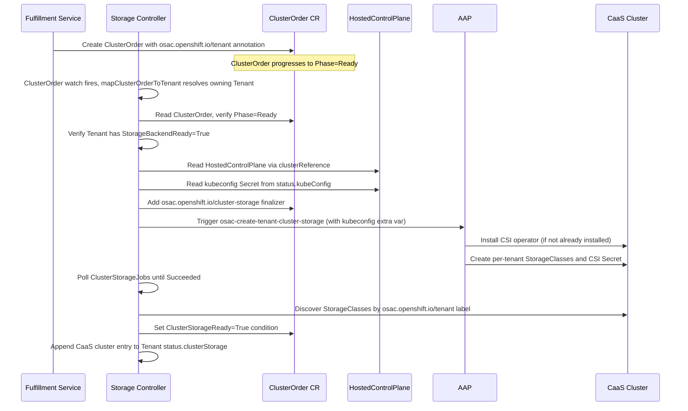
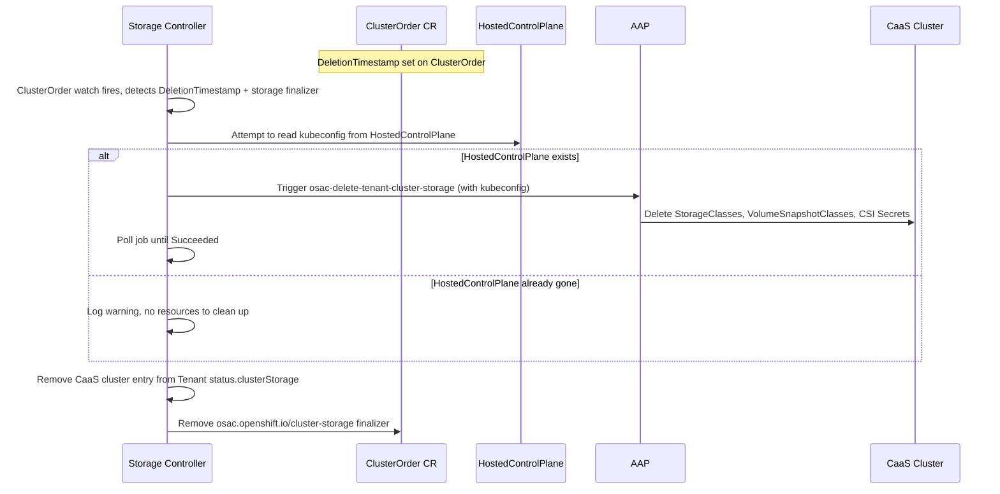

# CaaS Cluster Storage

## Summary

Extend the OSAC Storage Controller to provision persistent storage on CaaS tenant clusters. When a `ClusterOrder` reaches `Phase=Ready`, the storage controller retrieves the cluster's kubeconfig via the HyperShift `HostedControlPlane` API, triggers AAP to install the CSI driver and per-tenant StorageClasses, and tracks readiness as a `ClusterStorageReady` condition on the `ClusterOrder` CR. See [PRD](prd.md) for detailed requirements.

## Motivation

The OSAC Storage Controller ([OSAC-1001](https://redhat.atlassian.net/browse/OSAC-1001)) provisions storage for tenants on a single preconfigured VMaaS target cluster in two stages: backend setup (Stage 1: VAST tenant, views, quotas, credentials) and cluster-side setup (Stage 2: CSI driver, per-tenant StorageClasses). Both stages are triggered when a Tenant CR reaches `Phase=Ready`.

CaaS clusters require three things the current architecture does not provide:

1. **Multiple target clusters.** Each `ClusterOrder` has its own hosted control plane. The controller must obtain a kubeconfig dynamically rather than using a preconfigured target.

2. **Different trigger.** CaaS Stage 2 is triggered by `ClusterOrder.Phase=Ready`, not `Tenant.Phase=Ready`. Stage 1 has already completed during tenant onboarding.

3. **Per-cluster visibility.** Storage readiness must be visible on each `ClusterOrder`, not only aggregated on the Tenant CR.

### Goals

- Extend the existing storage controller rather than introducing a new controller or duplicating provisioning logic. [PRD: In Scope item 1]
- Retrieve the CaaS cluster kubeconfig from `ClusterOrder.status.clusterReference` via the HyperShift `HostedControlPlane` API.
- Track per-`ClusterOrder` storage readiness as a condition (`ClusterStorageReady`) independent of the cluster's compute readiness (`Phase`). [PRD: User Story: Tenant Admin / Tenant User]
- Keep VMaaS storage provisioning unchanged. [PRD: Out of Scope — VMaaS storage changes]

### Non-Goals

- StorageTier API integration ([OSAC-1110](https://redhat.atlassian.net/browse/OSAC-1110), separate epic). [PRD: Out of Scope]
- VAST provider CaaS changes ([OSAC-1122](https://redhat.atlassian.net/browse/OSAC-1122), separate epic). [PRD: Out of Scope — storage provider changes for CaaS support]
- Dynamic tier addition to running CaaS clusters (beyond v0.1).
- Storage UI ([OSAC-1252](https://redhat.atlassian.net/browse/OSAC-1252), backlog). [PRD: Out of Scope — storage UI]
- Storage backend provisioning for a tenant (runs during tenant onboarding, before any cluster is ready). [PRD: Out of Scope]
- Dedicated AAP ServiceAccount with scoped RBAC for storage operations ([OSAC-499](https://redhat.atlassian.net/browse/OSAC-499), stretch goal). The AAP `storage-operations-ig` currently uses the shared `osac-sa`.

## Proposal

1. **Extend the Storage Controller** (`osac-operator`) to provision and tear down cluster-side storage on CaaS clusters, triggered by `ClusterOrder` lifecycle events. The controller retrieves the CaaS cluster kubeconfig and passes it to AAP as an extra variable.

2. **Update AAP storage roles** (`osac-aap`) to pass the resolved kubeconfig to all `kubernetes.core.k8s` calls, so StorageClasses and CSI resources are created on the CaaS cluster rather than the hub. Kubeconfig acceptance and resolution in the playbooks is handled by [OSAC-1327](https://redhat.atlassian.net/browse/OSAC-1327).

No new controllers, CRDs, or fulfillment-service changes are required.

### Changes Per Repository

| Repository | Changes |
|---|---|
| **osac-operator** | Extend storage controller: implement `mapClusterOrderToTenant`, add CaaS reconciliation loop, add kubeconfig retrieval, add `ClusterStorageReady` condition, add `osac.openshift.io/cluster-storage` finalizer to `ClusterOrder` CRD, expand ClusterRole RBAC for `clusterorders/status`, `clusterorders/finalizers`, and `hostedcontrolplanes`. |
| **osac-aap** | Add `kubeconfig: "{{ _remote_kubeconfig \| default(omit) }}"` parameter to all `kubernetes.core.k8s` calls in `ensure_storage_class.yaml` and `teardown_cluster_storage.yaml`. Kubeconfig resolution and `vmaas`-only guard removal handled by [OSAC-1327](https://redhat.atlassian.net/browse/OSAC-1327) (PR [#377](https://github.com/osac-project/osac-aap/pull/377)). |
| **fulfillment-service** | None. The `osac.openshift.io/tenant` annotation is already set on `ClusterOrder` CRs by the cluster reconciler. |
| **osac-installer** | Update RBAC manifests to reflect the storage controller's expanded permissions. |

### Workflow Description

#### Personas

- **Cloud Provider Admin:** Registers storage backends, creates Tenant CRs, monitors storage readiness across all tenant clusters.
- **Tenant Admin / Tenant User:** Orders CaaS clusters, consumes persistent storage via PVCs against per-tenant StorageClasses.

#### Components

- **Storage Controller (osac-operator):** Reconciles storage state on Tenant and `ClusterOrder` CRs.
- **AAP (osac-aap):** Executes cluster-side storage provisioning and teardown playbooks against each CaaS cluster.
- **HyperShift HostedControlPlane:** Provides the kubeconfig Secret reference used to reach the CaaS cluster.

#### Prerequisites

1. Tenant CR has `StorageBackendReady=True` (Stage 1 completed during tenant onboarding).
2. `ClusterOrder` has `osac.openshift.io/tenant=<tenantName>` annotation and `Phase=Ready`.
3. `ClusterOrder.status.clusterReference` points to a HostedCluster with a populated `status.kubeConfig`.

#### CaaS Storage Provisioning



When a `ClusterOrder` changes, the storage controller resolves the owning Tenant via the `osac.openshift.io/tenant` annotation. It then iterates all Ready `ClusterOrder` objects for that tenant that do not yet have `ClusterStorageReady=True`, retrieves each cluster's kubeconfig, triggers the AAP provisioning job, and sets the condition on success. [PRD: In Scope item 1, User Story: Tenant Admin / Tenant User]

#### CaaS Storage Teardown



The storage finalizer (`osac.openshift.io/cluster-storage`) blocks `ClusterOrder` deletion until teardown completes. If the `HostedControlPlane` or kubeconfig Secret is already gone (the HostedCluster was deleted outside OSAC's control), the controller logs a warning, removes the `status.clusterStorage` entry, and removes the finalizer. Backend teardown (Stage 1 reverse) is **not** triggered by `ClusterOrder` deletion — backend resources are shared across a tenant's clusters and are torn down only when the Tenant itself is deleted. [PRD: In Scope item 3, User Story: Tenant Admin / Tenant User]

### API Extensions

#### ClusterOrder CRD

**New condition type:**

```go
// ClusterOrderConditionClusterStorageReady is True when the CSI driver
// and per-tenant StorageClasses have been installed on the CaaS cluster.
ClusterOrderConditionClusterStorageReady ClusterOrderConditionType = "ClusterStorageReady"
```

Owned exclusively by the storage controller. A `ClusterOrder` can reach `Phase=Ready` without `ClusterStorageReady=True`; compute and storage readiness are independent. [PRD: User Story: Cloud Provider Admin]

Condition reasons:

| Reason | Type | Description |
|---|---|---|
| `KubeConfigNotAvailable` | False | `HostedControlPlane.status.kubeConfig` not yet populated. |
| `ProvisionFailed` | False | AAP provisioning job returned a failure. |
| `MultipleFound` | False | Duplicate StorageClasses detected for the same tier. |
| `ClusterStorageProvisioned` | True | CSI driver and StorageClasses successfully installed. |

**New finalizer:** `osac.openshift.io/cluster-storage` — added when provisioning begins, removed only after teardown completes.

`ClusterStorageJobs []JobStatus` already exists in `ClusterOrderStatus` and accommodates the new jobs without schema changes.

#### Tenant CRD

No schema changes required. The existing `status.clusterStorage []ClusterStorageStatus` list (keyed by `clusterName`) accommodates CaaS entries alongside VMaaS. For CaaS, `clusterName` is the `ClusterOrder` name.

#### RBAC

New permissions added to the storage controller's `ClusterRole`:

```go
// +kubebuilder:rbac:groups=osac.openshift.io,resources=clusterorders/status,verbs=get;update;patch
// +kubebuilder:rbac:groups=osac.openshift.io,resources=clusterorders/finalizers,verbs=update
```

To read the kubeconfig, the controller needs access to `hostedcontrolplanes` and `secrets` in HostedCluster namespaces on the hub cluster. The existing `hub-access-hosted-clusters` ClusterRole (in osac-installer) grants `get` on `hostedclusters` and `secrets`. Two additions required:

1. Add `hostedcontrolplanes: get` to the `hub-access-hosted-clusters` ClusterRole.
2. Add the storage controller's ServiceAccount to the per-namespace RoleBinding.

All additions are to the existing `osac-operator-controller-manager` ClusterRole and existing per-namespace bindings.

## UX Alignment

N/A — This enhancement adds a new condition (`ClusterStorageReady`) on the `ClusterOrder` CR that is visible via `kubectl describe`. The PRD explicitly places a Storage UI out of scope ([PRD: Out of Scope — Storage UI]); no `osac-ux` TypeScript API file is involved.

### Implementation Details/Notes/Constraints

#### Kubeconfig Retrieval

Three-step lookup: [Codebase: osac-operator/controllers/storage_controller.go]

1. `ClusterOrder.status.clusterReference` provides the HostedCluster namespace and name.
2. Read the `HostedControlPlane` resource in that namespace (`hypershift.openshift.io/v1beta1`).
3. Read the Secret at the reference returned by `HostedControlPlane.status.kubeConfig` (name and key).

The kubeconfig value is used to construct a `client.Client` for StorageClass discovery and is passed to AAP as the `admin_kubeconfig` field in the `ansible_eda.event` extra-vars payload, matching the convention established by OSAC-1327 / PR #377.

A new `WithAdminKubeconfig(kubeconfig string)` function is added to `extra_vars_context.go` following the existing builder pattern.

#### Reconciliation Flow

`mapClusterOrderToTenant` currently stubs out and returns `nil`. This function will be implemented to:
1. Read the `osac.openshift.io/tenant` annotation from the incoming `ClusterOrder`.
2. Look up the owning Tenant by name.
3. Return a reconcile request for that Tenant.

`handleUpdate` is extended with a CaaS provisioning loop after existing VMaaS logic. For each Ready `ClusterOrder` without `ClusterStorageReady=True`:

1. Add the `osac.openshift.io/cluster-storage` finalizer.
2. Retrieve the kubeconfig (three-step lookup above).
3. Trigger or poll the AAP job tracked in `ClusterOrder.Status.ClusterStorageJobs`.
4. On success, discover StorageClasses on the CaaS cluster by the `osac.openshift.io/tenant` label and set `ClusterStorageReady=True`.
5. Append an entry to the Tenant's `status.clusterStorage`.

Any `ClusterOrder` with a `DeletionTimestamp` and the storage finalizer bypasses provisioning and enters teardown.

#### AAP Changes: Target Cluster Kubeconfig

For VMaaS, storage roles run `kubernetes.core.k8s` calls against the AAP pod's default cluster context. For CaaS, each cluster has a different kubeconfig that must be passed per-job.

[OSAC-1327](https://redhat.atlassian.net/browse/OSAC-1327) (PR #377, WIP) handles kubeconfig resolution: accepts `ansible_eda.event.admin_kubeconfig`, writes it to a temp file, removes `vmaas`-only guards, and adds cluster-name discovery. The gap this design closes: the `kubernetes.core.k8s` calls in `ensure_storage_class.yaml` and `teardown_cluster_storage.yaml` must add:

```yaml
kubeconfig: "{{ _remote_kubeconfig | default(omit) }}"
```

When `_remote_kubeconfig` is not set (VMaaS), `omit` preserves the existing in-cluster context. When set (CaaS), it directs all K8s calls to the CaaS cluster.

#### StorageClass Properties

CaaS clusters use the same StorageClass properties as VMaaS (same AAP role, same values): [Assumption — StorageTier API OSAC-1110 not yet available]

| Property | NFS | Block |
|---|---|---|
| `reclaimPolicy` | `Delete` | `Delete` |
| `volumeBindingMode` | `Immediate` | `WaitForFirstConsumer` |
| Provisioner | `csi.vastdata.com` | `blockcsi.vastdata.com` |

For NFS, `Delete` means the backing VAST view/export is removed when the PVC is deleted. For block, the backing volume is removed. This behavior is consistent across VMaaS and CaaS.

Labels applied to all StorageClasses on the CaaS cluster:
- `osac.openshift.io/tenant=<tenantName>`
- `osac.openshift.io/storage-tier=<tier>`
- `osac.openshift.io/storage-protocol=<nfs|block>`
- `app.kubernetes.io/managed-by=osac-aap`

The `storage_tier_resolution.go` algorithm is reused without modification; the only change is which cluster it runs against.

#### Extension Point: Tier API

When the Tier API ([OSAC-1110](https://redhat.atlassian.net/browse/OSAC-1110)) is available, the storage controller will query it for available tiers and pass them to AAP as extra variables. The tier resolution algorithm on the target cluster remains unchanged.

### Security Considerations

CaaS cluster storage inherits the existing security model without new OPA policies:

- **Kubeconfig handling:** The storage controller reads the kubeconfig Secret from the hub cluster and passes it to AAP as an extra variable in memory only — it is not persisted anywhere outside the AAP job payload. On the AAP side, all playbook tasks that handle the kubeconfig use `no_log: true` to prevent it from appearing in job output or structured logs.
- **Tenant isolation:** StorageClasses are scoped to tenants via the `osac.openshift.io/tenant` label. The tier resolution algorithm returns only StorageClasses matching the active tenant. CSI credentials are scoped per-tenant via VAST RBAC Realms ([OSAC-1326](https://redhat.atlassian.net/browse/OSAC-1326)).
- **API-level authorization:** No new OPA policies are required. Storage provisioning is triggered by the platform (storage controller watch), not by a tenant API call, so there is no tenant-facing authorization surface to extend.
- **Hub cluster permissions:** The storage controller is granted only `get` on `hostedcontrolplanes` and named Secrets in HostedCluster namespaces — no broader read or write access to hub namespaces is introduced.

### Failure Handling and Recovery

| Failure Mode | Behavior | Recovery | User Observes |
|---|---|---|---|
| Kubeconfig not available (`HostedControlPlane.status.kubeConfig` empty) | `ClusterStorageReady=False`, reason `KubeConfigNotAvailable`. No retry timer; waits for resource change. | Automatic when `HostedControlPlane` populates `status.kubeConfig` and a watch event fires. | `ClusterOrder` shows `Phase=Ready` but `ClusterStorageReady=False`; condition message explains the reason. |
| AAP provisioning job fails | `ClusterStorageReady=False`, reason `ProvisionFailed`. Job reference stored in `ClusterStorageJobs`. | Retries when the `ClusterOrder` or a related resource (Tenant, HostedControlPlane) changes. | `kubectl describe clusterorder <name>` shows job failure message and `ClusterStorageJobs` history. |
| AAP teardown job fails | Finalizer remains on `ClusterOrder`. `ClusterOrder` stays in Deleting state. | Retries on next reconciliation trigger. | `ClusterOrder` stuck in Deleting; `kubectl describe` shows teardown job failure. |
| `HostedControlPlane` gone during teardown | No cluster resources to clean up. Controller skips AAP call. | Controller removes `status.clusterStorage` entry and the `osac.openshift.io/cluster-storage` finalizer immediately. | `ClusterOrder` deletion proceeds; Warning event `HostedControlPlaneGone` logged on the CR. |
| Storage controller down | `ClusterStorageReady` condition stale; `Phase=Ready` unaffected. Finalizers block deletion until controller recovers. | Automatic on controller restart — the controller re-evaluates all Tenants and `ClusterOrder` objects from current state. | New clusters show `Phase=Ready` without storage condition until controller recovers. |
| Duplicate StorageClasses per tier on the CaaS cluster | Warning event `DuplicateStorageClass` on Tenant CR; `ClusterStorageReady=False`, reason `MultipleFound`. | Cloud Provider Admin manually resolves duplicates on the CaaS cluster. | Warning event and condition on `ClusterOrder`. |
| Controller restarts mid-provisioning (AAP job in-flight) | Controller reads `ClusterStorageJobs` from status and resumes polling the in-flight job — no duplicate job launch. | Automatic; idempotent AAP job polling. | No user-visible disruption. |
| Race: `ClusterOrder` deleted while provisioning in progress | Finalizer already added at provisioning start; deletion is blocked. Controller detects `DeletionTimestamp` on next reconcile and transitions to teardown. | Automatic. | `ClusterOrder` enters Deleting state and waits for teardown completion. |

### RBAC / Tenancy

No tenant-facing RBAC changes. Storage provisioning is platform-managed; Tenant Admins and Tenant Users consume storage through standard Kubernetes PVC APIs without any new OSAC API calls.

Tenant isolation is enforced at two layers:
1. **Label filtering** — `storage_tier_resolution.go` returns only StorageClasses labeled `osac.openshift.io/tenant=<tenantName>`.
2. **CSI credential scoping** — VAST RBAC Realms restrict each tenant's CSI credentials to their own VAST views ([OSAC-1326](https://redhat.atlassian.net/browse/OSAC-1326)).

Controller-level isolation: The storage controller uses the `osac.openshift.io/tenant` annotation to map `ClusterOrder` objects to their owning Tenant and will not process a `ClusterOrder` without this annotation.

Required `osac.openshift.io/tenant` annotation is already enforced by the fulfillment-service cluster reconciler — no new enforcement point is introduced.

### Observability and Monitoring

New Kubernetes events emitted on `ClusterOrder` and Tenant CRs:

| Resource | Event Type | Reason | When |
|---|---|---|---|
| ClusterOrder | Normal | `ClusterStorageProvisioned` | Provisioning succeeded and StorageClasses discovered. |
| ClusterOrder | Warning | `ClusterStorageProvisionFailed` | AAP provisioning job failed. |
| ClusterOrder | Warning | `KubeConfigNotAvailable` | Cannot retrieve kubeconfig for the CaaS cluster. |
| Tenant | Warning | `DuplicateStorageClass` | Multiple StorageClasses for the same tier detected on a CaaS cluster. |
| ClusterOrder | Warning | `HostedControlPlaneGone` | HostedControlPlane absent during teardown; skipping AAP teardown call. |

Structured log entries at each significant reconciliation step include fields: `clusterOrder`, `tenant`, `clusterName`, `phase`, `storageReady`.

No new Prometheus metrics or Grafana dashboards are introduced. [PRD: Out of Scope — no observability requirement stated]

### Risks and Mitigations

| Risk | Mitigation |
|---|---|
| Kubeconfig Secret rotates while an AAP job is in flight | Job fails with an authentication error (`ProvisionFailed`). On the next reconciliation the controller reads the rotated kubeconfig and retries. |
| `ClusterOrder` count per tenant grows large | Acceptable for v0.1 (single-digit clusters per tenant expected). If scale increases, split to a dedicated CaaS storage controller — the provisioning logic is already isolated in the CaaS loop in `handleUpdate`. [Assumption] |
| HyperShift API version changes break kubeconfig path | Import HyperShift API types as a versioned Go module (`hypershift.openshift.io/v1beta1`) for compile-time checking. Track HyperShift releases. |
| `ClusterOrder` deleted while provisioning is in progress | Finalizer added at provisioning start prevents premature deletion. Controller transitions to teardown on `DeletionTimestamp` detection. |
| OSAC-1327 not merged before this feature ships | Version-skew safe: if AAP templates are not updated, the controller triggers jobs that fail, records `ProvisionFailed`, and retries once OSAC-1327 lands. No data corruption. |

### Drawbacks

The storage controller now writes conditions and finalizers on both Tenant and `ClusterOrder` CRs, increasing its surface area and coupling. A dedicated CaaS storage controller would be simpler in isolation but would duplicate all provisioning lifecycle logic (job triggering, polling, status updates, finalizer management) and create dual-writer conflicts on `Tenant.status.clusterStorage`. The chosen approach accepts higher storage-controller complexity in exchange for a single source of truth for all storage provisioning.

## Alternatives (Not Implemented)

### 1. Separate `CaaSStorageReconciler`

A standalone controller reconciling `ClusterOrder` objects directly, independent of the existing storage controller.

**Pros:** Clean separation of VMaaS and CaaS concerns; each controller owns a narrower surface.
**Cons:** Duplicates provisioning lifecycle logic (AAP job triggering, polling, status, finalizer). Two controllers writing to `Tenant.status.clusterStorage` introduces ordering ambiguity.
**Rejected:** Provisioning logic (AAP integration, polling, condition setting, finalizer lifecycle) is identical for VMaaS and CaaS. Maintaining two copies and coordinating two writers on Tenant status is costlier than the added complexity in a single controller. [PRD: In Scope item 1]

### 2. `ClusterOrder` Controller Owns Storage Provisioning

The ClusterOrder controller triggers CSI installation and StorageClass creation when a cluster reaches `Phase=Ready`.

**Pros:** No cross-resource condition writes from the storage controller.
**Cons:** Mixes storage concerns into the cluster lifecycle controller. Reverses the storage/compute separation introduced by [OSAC-1001](https://redhat.atlassian.net/browse/OSAC-1001).
**Rejected:** Storage logic belongs in the storage controller. Coupling storage to the cluster controller makes future changes to either domain harder to reason about.

### 3. Storage Readiness Gates `ClusterOrder Phase=Ready`

Require `ClusterStorageReady=True` before a `ClusterOrder` can transition to `Phase=Ready`.

**Pros:** Tenants never observe a Ready cluster that lacks storage.
**Cons:** Blocks compute availability on storage provisioning. Stateless workloads have no storage dependency. Extends the ClusterOrder controller's responsibility.
**Rejected:** Compute and storage readiness are independent concerns. The standalone `ClusterStorageReady` condition provides full visibility without coupling cluster availability to storage. [PRD: User Story: Cloud Provider Admin]

## Open Questions

1. **OSAC-1327 merge timeline.** This design depends on PR #377 landing before or concurrently. If it slips, the version-skew strategy applies (controller retries on job failure) but no E2E pass is possible until both land. What is the target merge date for OSAC-1327?

2. **StorageTier API (OSAC-1110).** When the Tier API is available, tier-to-StorageClass mapping moves out of the AAP role and into a fulfillment-service resource. How will the controller pass tier parameters — as IDs or as resolved names — to the `osac-create-tenant-cluster-storage` template?

3. **`ClusterStorageJobs` reuse.** The `ClusterStorageJobs` field exists in `ClusterOrderStatus` but its usage semantics (append-only vs. replace-on-retry) for CaaS jobs should be confirmed with the ClusterOrder controller team to avoid index collisions.

## Test Plan

### Unit Tests

Controller tests using `envtest` for the Kubernetes API and mock provisioning providers for AAP, following the existing pattern in `storage_controller_test.go`: [Codebase: osac-operator/controllers/storage_controller_test.go]

- **`mapClusterOrderToTenant`:** Verify correct Tenant lookup from `osac.openshift.io/tenant` annotation. Cover: annotation missing (return nil), annotation present but Tenant not found (return nil + log warning), annotation present and Tenant found (return reconcile request).
- **Kubeconfig retrieval:** Cover: missing `clusterReference` in `ClusterOrderStatus`, `HostedControlPlane` resource not found (`NOT_FOUND` → `KubeConfigNotAvailable`), Secret not found, Secret key missing.
- **CaaS provisioning — happy path:** Create Tenant with `StorageBackendReady=True` and `ClusterOrder` with `Phase=Ready`. Verify: finalizer added, AAP job triggered with correct extra-vars (including `admin_kubeconfig`), `ClusterStorageReady=True` set on `ClusterOrder`, `status.clusterStorage` entry added on Tenant.
- **CaaS provisioning — Tenant not storage-ready:** `ClusterOrder Phase=Ready` but Tenant `StorageBackendReady=False`. Verify: no AAP job triggered, no finalizer added, no condition set.
- **CaaS teardown — happy path:** Set `DeletionTimestamp` on `ClusterOrder` with storage finalizer. Verify: teardown AAP job triggered, finalizer removed after job success, `status.clusterStorage` entry removed from Tenant.
- **CaaS teardown — `HostedControlPlane` gone:** `DeletionTimestamp` set; `HostedControlPlane` absent. Verify: no AAP job triggered, warning event emitted, finalizer removed, `status.clusterStorage` entry removed.
- **Duplicate StorageClass detection:** Inject two StorageClasses for the same tier and tenant label. Verify `DuplicateStorageClass` warning event emitted and `ClusterStorageReady=False` with reason `MultipleFound`.
- **VMaaS regression:** Verify VMaaS provisioning flow completes without modification when CaaS `ClusterOrder` objects exist alongside VMaaS targets.
- **Controller restart mid-provisioning:** Pre-populate `ClusterStorageJobs` with an in-flight job reference. Verify controller resumes polling rather than launching a duplicate job.

### Integration Tests

Using a `kind` cluster with HyperShift CRDs installed:

- Create a Tenant CR + `ClusterOrder` CR with a mocked `HostedControlPlane` (Secret pre-created). Verify the storage controller reconciles, reads the kubeconfig Secret, and sets `ClusterStorageReady=False/True` through the expected condition transitions.
- Simulate AAP job failure (mock returns error). Verify `ProvisionFailed` condition set and finalizer held.
- Delete `ClusterOrder` with storage finalizer present. Verify finalizer blocks deletion and is removed after mock teardown completes.
- Verify `mapClusterOrderToTenant` correctly propagates reconcile requests to the owning Tenant.

### E2E Tests

Via `osac-test-infra` ([OSAC-1329](https://redhat.atlassian.net/browse/OSAC-1329)), against a live VAST cluster:

- **Storage provisioning:** Provision a CaaS cluster end-to-end, verify that StorageClasses are installed on the CaaS cluster and that a PVC bound to a VAST-backed PV can be created and written to.
- **Storage cleanup on deletion:** Delete a CaaS cluster (`ClusterOrder`), verify that StorageClasses, VolumeSnapshotClasses, and CSI Secrets are removed from the CaaS cluster, and that the `ClusterOrder` deletion unblocks after finalizer removal.
- **Tenant isolation:** Two tenants each with one CaaS cluster. Verify StorageClasses on Tenant A's cluster are not visible on Tenant B's cluster (different `osac.openshift.io/tenant` label values).
- **Storage readiness visibility:** Verify `ClusterStorageReady` condition is observable via `kubectl get clusterorder -o wide` and `kubectl describe clusterorder`.

Tricky testing areas: kubeconfig Secret retrieval against live HyperShift, concurrent `ClusterOrder` provisioning for multiple clusters of the same tenant, and AAP job coordination during controller restarts.

## Graduation Criteria

N/A. OSAC is in active development and has not been released to customers. Graduation criteria will be defined when the project targets a release.

## Upgrade / Downgrade Strategy

Pre-GA change. This enhancement adds a new condition type (`ClusterStorageReady`) and a new finalizer (`osac.openshift.io/cluster-storage`) to `ClusterOrder`. No existing fields are modified and no data migration is required.

**Upgrade:** Existing `ClusterOrder` objects that already have `Phase=Ready` but no `ClusterStorageReady` condition will be picked up by the storage controller on its first reconciliation pass after upgrade and storage provisioning will be triggered automatically. [Assumption — no manual intervention required for in-flight clusters]

**Downgrade:** Removing the new controller code leaves `ClusterStorageReady` conditions orphaned on `ClusterOrder` objects and leaves the `osac.openshift.io/cluster-storage` finalizer in place on any clusters that were mid-provisioning. Documented manual step: remove the finalizer with `kubectl patch clusterorder <name> -p '{"metadata":{"finalizers":[]}}' --type=merge` before attempting to delete affected `ClusterOrder` objects.

## Version Skew Strategy

No fulfillment-service changes are required. The storage controller (`osac-operator`) and AAP roles (`osac-aap`) can be deployed independently:

- **Operator ahead of AAP:** Controller triggers `osac-create-tenant-cluster-storage` templates that don't yet pass `kubeconfig`. AAP executes against the hub cluster (no-op or incorrect target). Controller records `ProvisionFailed` and retries once AAP is updated. No data corruption.
- **AAP ahead of operator:** AAP roles accept `kubeconfig` but the controller does not pass it. AAP falls back to in-cluster context (same VMaaS behavior). No regression for existing VMaaS tenants.
- **OSAC-1327 not yet merged:** Same as operator-ahead-of-AAP case above.

## Support Procedures

**Detecting failures:**

- `kubectl get clusterorder -o wide` — the `ClusterStorageReady` condition is displayed as a priority-1 column.
- `kubectl describe clusterorder <name>` — shows conditions (including `ClusterStorageReady` reason and message), events (`ClusterStorageProvisioned`, `ClusterStorageProvisionFailed`, `KubeConfigNotAvailable`, `DuplicateStorageClass`), and `ClusterStorageJobs` history.
- `kubectl get tenant <name> -o wide` — shows aggregate storage status including `status.clusterStorage` entries for all CaaS clusters.
- Controller logs (osac-operator pod): filter by `clusterOrder=<name>` and `tenant=<name>` structured fields.

**Disabling the feature:** Remove the storage controller's `ClusterRole` binding for `clusterorders/status` and `clusterorders/finalizers`. Effect: existing finalizers remain in place (deletion blocked); new `ClusterOrder` objects will not have storage provisioned. Resume by restoring the binding; the controller will re-evaluate all `ClusterOrder` objects.

**Consistency on re-enable:** The controller is fully event-driven and re-derives all state from current CR status on reconciliation. No in-memory state is lost. Resuming the controller after downtime does not risk double-provisioning (idempotent AAP job check via `ClusterStorageJobs`).

## Infrastructure Needed

None. This enhancement uses existing AAP infrastructure, the existing VAST storage backend, and the existing `osac-operator` deployment. No new repositories, test infrastructure, or cloud resources are required beyond what [OSAC-1329](https://redhat.atlassian.net/browse/OSAC-1329) provisions for E2E testing.